# Authentic Bazaar

A demo e-commerce storefront for handcrafted Turkish goods — built entirely with vanilla HTML, CSS, and JavaScript, with no framework and no build step.

🇹🇷 [Türkçe versiyonu için tıklayın](README.tr.md)

> **Try it live:** <https://authenticbazaar.furkantekkartal.com>
>
> No account needed — browse the collections and fill the cart freely. **Checkout is a demo** (it shows an alert instead of a real payment page).

Authentic Bazaar is a portfolio project, not a real shop. It sells nothing. The catalogue of 22 products (mosaic lamps, ceramics, evil-eye charms, and cotton towels) is based on real listings scraped from an Australian store, istanbulgrandbazaar.com.au, so the content looks and feels like a real storefront.

## Features

- **Hero slideshow** on the home page with rotating promotional slides
- **Collection pages** for 4 product categories plus a dedicated Sale collection
- **Filtering and sorting** — colour swatches, price ranges, "On Sale Only" checkbox, and a sort dropdown (featured, price, rating, name)
- **Product detail pages** with an image gallery, colour variants, quantity stepper, accordions, and related products
- **Quick View modal** — inspect a product and add it to the cart without leaving the grid
- **Persistent cart** stored in the browser's localStorage, with a free-shipping progress indicator (A$50 threshold)
- **Add-to-cart toast** notifications and a live cart-count badge in the header
- **Fully responsive** mobile layout with a hamburger drawer menu

## Tech stack

The whole point of this project is the **deliberate zero-dependency approach**: everything a framework would normally provide is written by hand in plain JavaScript.

| Layer | Choice |
|---|---|
| Frontend | Vanilla HTML, CSS, and JavaScript — no framework, no libraries |
| Routing | Custom hash-based router (`#/collections/...`, `#/products/...`, `#/cart`) written from scratch |
| Components | Hand-written JS modules (hero slideshow, filter sidebar, quick view, cart, toast) that render into the page |
| State | Product data hardcoded in a JS file; cart state in `localStorage` |
| Build | None — no bundler, no transpiler, no `package.json` |
| Backend | None — no server code, no database, no login |
| Hosting | A single `nginx:alpine` Docker container serving static files |

## Screens

### Home

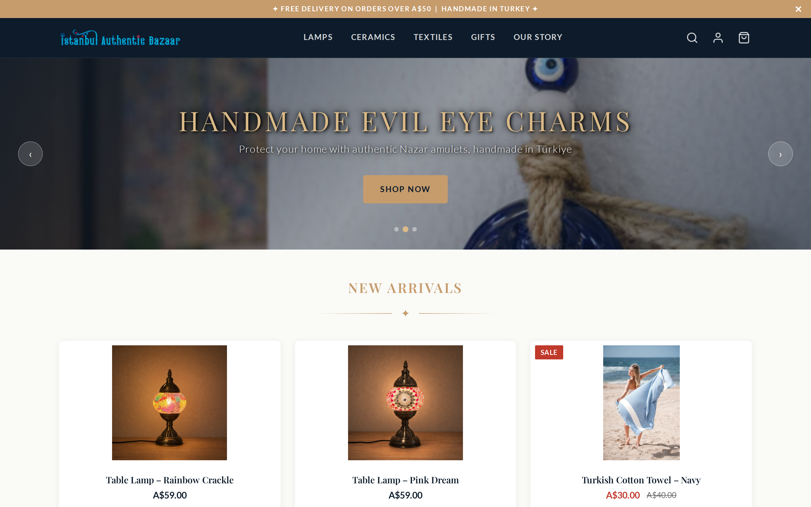

- Promo bar at the top ("Free delivery on orders over A$50 | Handmade in Turkey") with a close button
- Dark navy header with the shop logo, category navigation, and search / account / cart icons
- Hero slideshow with three slides, arrow controls, and dot indicators
- "New Arrivals" product grid with prices in Australian dollars, star ratings, and red SALE badges — handmade mosaic lamps photographed lit, next to beach-shot towels

The full page tour, from hero to footer:

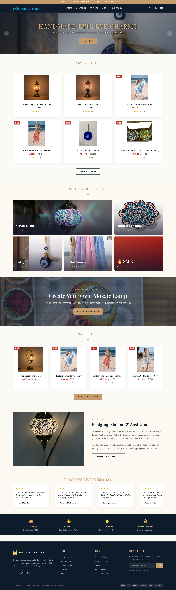

- "Shop by Collection" tiles for Mosaic Lamps, Turkish Ceramics, Evil Eye, Cotton Towels, and SALE
- "Create Your Own Mosaic Lamp" workshop banner and a "Sale Picks" grid
- "Bridging Istanbul & Australia" story block and a customer reviews strip
- Trust strip (free shipping, handmade, rating, secure checkout) and a footer with newsletter signup and payment icons

### Collection page

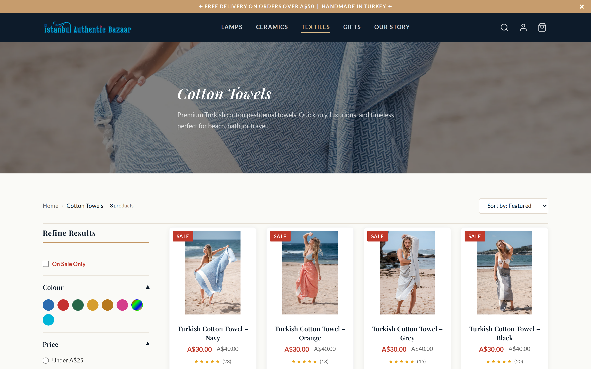

- Category hero banner with a title, description, and a full-width photo
- Breadcrumb navigation and a product count ("8 products" for Cotton Towels)
- "Refine Results" sidebar: colour swatches, price ranges, and an "On Sale Only" checkbox
- "Sort by" dropdown in the top-right corner
- Product cards with SALE badges, crossed-out old prices, and star ratings with review counts

### Sale collection

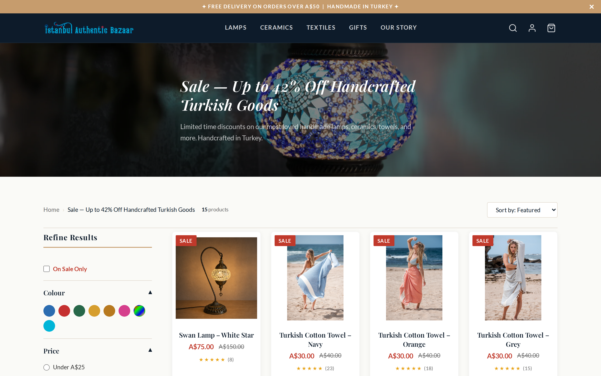

- Dedicated sale landing at `#/collections/sales` with a red-themed hero: "Sale — Up to 42% Off Handcrafted Turkish Goods"
- Collects every discounted product from all categories in one grid (15 products)
- Each card shows the sale price next to the original crossed-out price
- The same filter sidebar and sort controls work here too

### Product detail

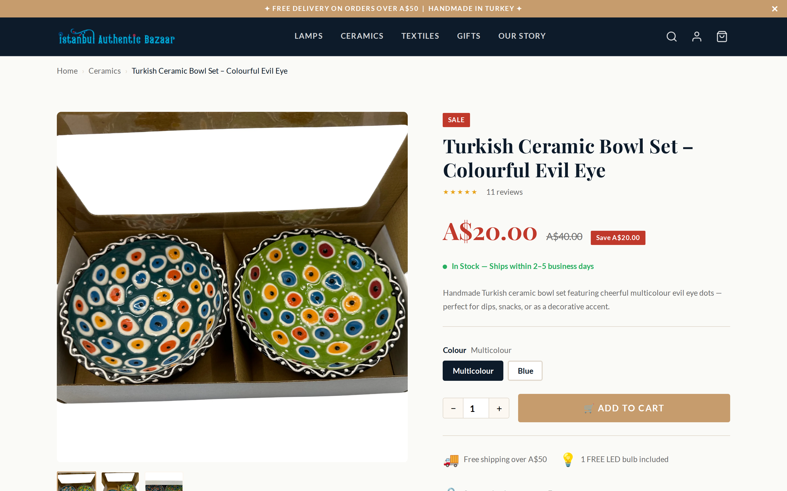

- Large image gallery with thumbnails below the main photo
- SALE badge, discounted price with the original price and a "Save A$20.00" tag
- Star rating with review count and a green stock status line ("In Stock — Ships within 2–5 business days")
- Colour variant buttons (Multicolour / Blue in this example)
- Quantity stepper next to a prominent "Add to Cart" button
- Perk icons below the button: free shipping over A$50, free LED bulb included

### Add to cart toast

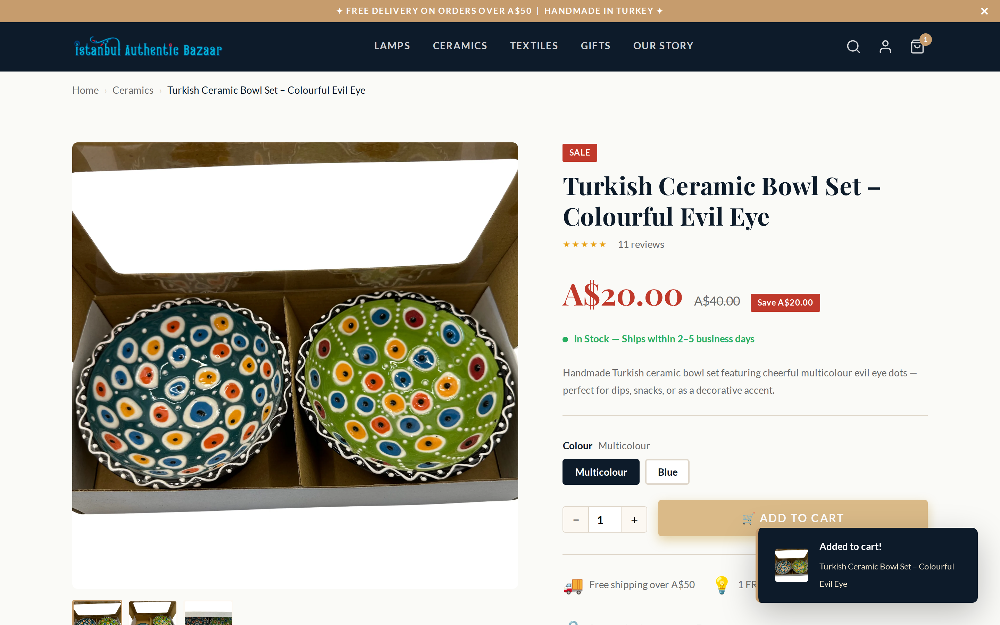

- Clicking "Add to Cart" shows a dark toast in the bottom-right corner: "Added to cart!" with the product's thumbnail and name
- The cart icon in the header updates instantly with an item-count badge
- No page reload — the cart state is written straight to localStorage

### Quick View

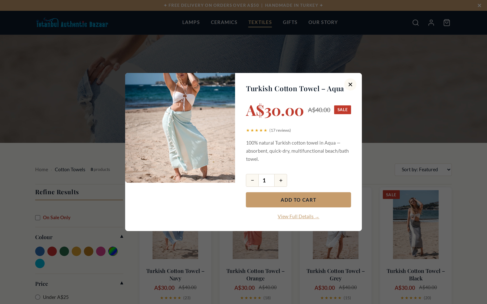

- Every product card in a grid has a Quick View action that opens a modal
- The modal shows the product image, price, rating, and a short description in a split-pane layout
- A quantity stepper and "Add to Cart" button let you buy without leaving the page
- A "View Full Details" link jumps to the full product page

### Cart — empty

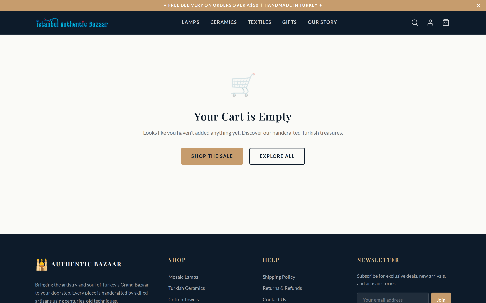

- Friendly empty state with a cart illustration: "Your Cart is Empty"
- Two clear calls to action: "Shop the Sale" and "Explore All"
- The footer stays visible, so navigation is never a dead end

### Cart — filled

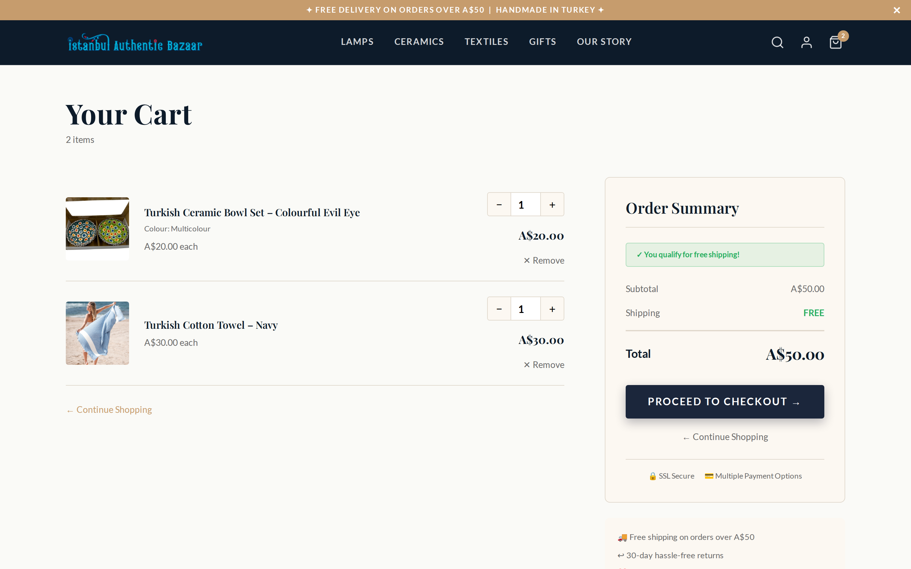

- Item list with thumbnails, chosen colour variants, per-item quantity steppers, and Remove links
- Order Summary card with subtotal, shipping, and total
- Free-shipping logic in action: at A$50 the banner turns green — "You qualify for free shipping!" — and shipping becomes FREE
- "Proceed to Checkout" button — as a demo, it only shows a browser alert explaining that a real store would redirect to a secure checkout
- Trust badges (SSL Secure, Multiple Payment Options) under the summary

### Mobile view

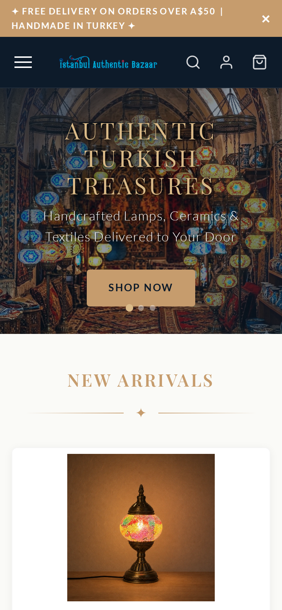

- The layout adapts to phone screens: single-column product grid and a compact header
- The hero slideshow and promo bar keep working at small widths
- Navigation collapses into a hamburger icon on the left

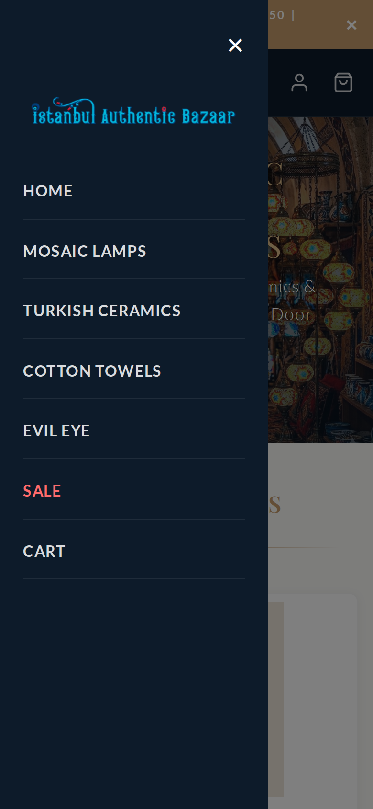

- The hamburger opens a slide-in drawer over the page
- Direct links to Home, all four collections, SALE (highlighted in red), and the Cart
- A large close button and the shop logo at the top of the drawer

## Architecture

```
Browser
  └─ index.html  ─ loads plain JS modules (no bundler)
       ├─ router.js        hash-based router: reads location.hash
       │                   (#/, #/collections/<slug>, #/products/<slug>, #/cart)
       │                   and renders the matching page; unknown routes
       │                   fall back to the home page
       ├─ components       hand-written modules: heroSlideshow, filterSidebar,
       │                   quickView, toast, cart page, product page ...
       ├─ js/data/products.js   22 hardcoded products in 4 collections
       └─ cart.js          cart state in localStorage (key: igb_cart_v1)

Server side
  └─ nginx:alpine Docker container (static files only)
       └─ sits behind the ecosystem's central reverse proxy (ftcom-nginx),
          which routes authenticbazaar.furkantekkartal.com to it
```

- **Hash router:** navigation changes only `location.hash`, so the browser never reloads the page. The router listens for `hashchange`, parses the slug, and renders the right view. This gives SPA behaviour with zero routing libraries.
- **Components:** each UI piece (slideshow, filter sidebar, quick-view modal, toast) is a small standalone JS module. There is no virtual DOM — the modules build and update real DOM elements directly.
- **Cart:** a thin module around `localStorage`. Add, remove, and quantity changes are saved immediately, so the cart survives page reloads and browser restarts. The free-shipping progress is computed from the same state.
- **Deployment:** the whole site is one `nginx:alpine` container that serves static files. It runs inside the ecosystem's shared Docker network, and the central reverse proxy terminates the public domain and forwards traffic to it. No backend process, no database.

---

🇹🇷 [Türkçe versiyonu için tıklayın](README.tr.md)

*This README is part of the [ProjectReadmes](../) collection — portfolio documentation for the projects of Furkan Tekkartal.*
