# Dükkanım

Türk oto tamir dükkânları için yönetim uygulaması — araçlar, servis kayıtları, randevular, cari hesaplar ve dükkân finansı tek yerde.

🇬🇧 English version: [README.md](README.md)

---

> ### 🚀 Canlı deneyin
>
> **URL:** [https://dukkanim.furkantekkartal.com](https://dukkanim.furkantekkartal.com)
>
> **Demo giriş:** kullanıcı adı `demo` · şifre `demo1234`
>
> Demo hesabı sahip rolündedir (**Yönetici**), yani dokuz sekmenin tamamını görür. Kayıt olmak mümkündür ancak dükkân sahibinden alınan bir yetki şifresi gerektirir — lütfen demo hesabını kullanın.

---

Uygulama, Türkiye'deki sanayi tamircileri için geliştirildiği için arayüzün tamamı Türkçedir.

## Özellikler

- **Fotoğraflı araç kaydı** — araç eklerken plaka alanı mevcut cari kayıtlarından otomatik tamamlanır; marka / model / motor bilgisi yerleşik araç veritabanından gelir.
- **Servis kayıtları** — her araç tarihli servis kayıtları tutar; işlemler hazır şablonlardan seçilir ve kalem kalem (işçilik + malzeme) %18 KDV ile fiyatlandırılır.
- **Randevu takvimi** — gün / hafta / ay görünümleri; saat ızgarası dükkânın çalışma saatleri ayarını takip eder.
- **Cari hesaplar** — her müşteri ve plaka için bir hesap; bakiye, işlemler ve ödemelerden hesaplanır.
- **Sarf malzeme kataloğu** — kategorili, stok ve fiyat bilgili malzeme ve işçilik listesi, arama ile.
- **Gider takibi** — otomatik eklenen sabit giderler ve kategori dağılım çubuğu ile aylık zaman çizelgesi.
- **Muhasebe özeti** — her işlemin ödeme durumu: ödenmiş, ödenmemiş veya vadesi geçmiş.
- **Personel yönetimi** — her tamirci için tamamlanan / toplam sayaçlı günlük iş kaydı.
- **Rol bazlı erişim** — sahip (*usta*) her şeyi görür; tamirci yalnızca araç ekranlarını ve kendi profilini görür.

## Teknolojiler

| Katman | Teknoloji |
|---|---|
| Frontend | React 19, Vite, Tailwind CSS 4 |
| Backend | Node.js, Express (~55 REST uç noktası) |
| Veritabanı | PostgreSQL 16 |
| Kimlik doğrulama | JWT (kullanıcı adı + şifre, bcrypt hash) |
| Yüklemeler | Araç ve dükkân fotoğrafları için multer + sharp |
| Dağıtım | Nginx reverse proxy arkasında Docker Compose (dev/prod) |

## Ekranlar

Tüm ekran görüntüleri canlı uygulamadan, masaüstü görünümünde (1440 px) alınmıştır. Demo dükkân **"Arya Mekanik Garaj"**, gerçekçi verilerle hazır gelir: gerçek fotoğraflı 13 araç, servis kayıtları, cari hesaplar, randevular ve giderler.

## Giriş

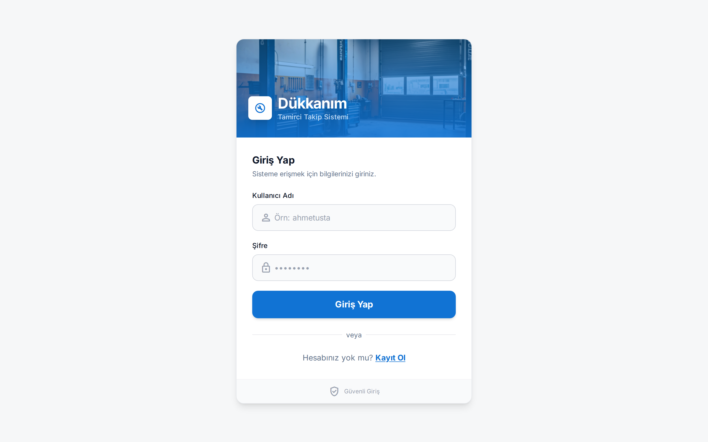

- Garaj fotoğraflı bir başlık görseli ve uygulamanın alt başlığıyla tek bir giriş kartı: *Tamirci Takip Sistemi*.
- Kullanıcı adı ve şifre ile giriş — e-posta gerekmez.
- Alttaki *Kayıt Ol* bağlantısı kayıt ekranına götürür.

## Kayıt

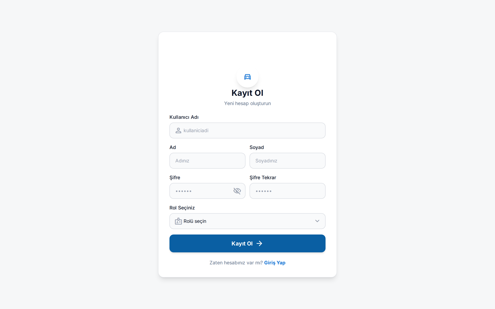

- Form kullanıcı adı, ad, soyad ve onaylı şifre ister (göster/gizle düğmesiyle).
- *Rol Seçiniz* alanı iki rolü sunar: yönetici veya personel.
- Rol seçildikten sonra form, yalnızca dükkân sahibinin paylaşabileceği bir *Yetki Şifresi* ister — böylece kayıt yabancılara kapalı kalır; ziyaretçiler demo hesabını kullanmalıdır.

## Araç Listesi (Araçlar)

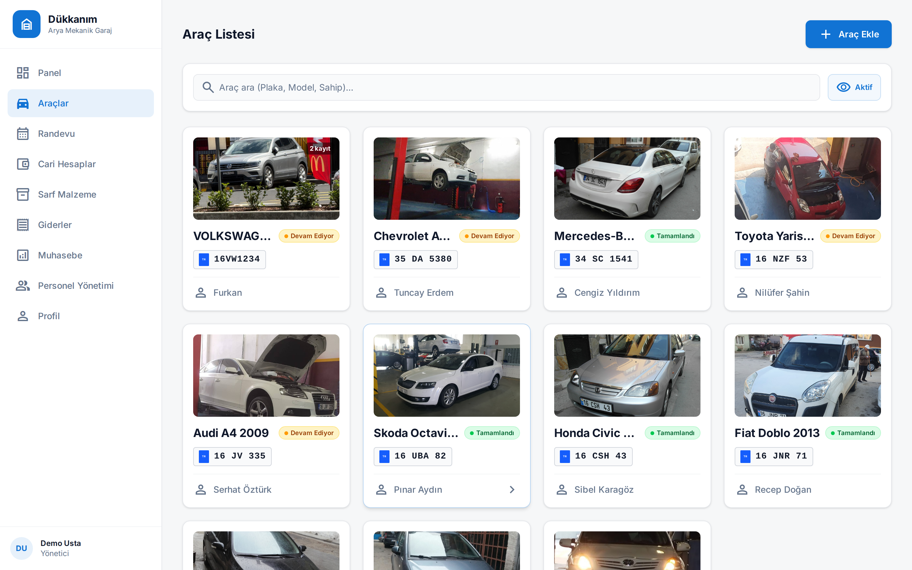

- Girişten sonra açılan sekme ve her rolün görebildiği tek ekran.
- Her kartta aracın gerçek fotoğrafı, modeli, Türk tipi plaka rozeti, sahibinin adı ve bir durum rozeti bulunur — sarı *Devam Ediyor* veya yeşil *Tamamlandı*.
- Aynı araca birden fazla kayıt açıldığında köşede küçük bir rozet (ör. *2 kayıt*) görünür.
- Arama çubuğu plaka, model veya sahibe göre filtreler; *Aktif* düğmesi pasif araçları gizler; *Araç Ekle* ekleme formunu açar — plaka cari kayıtlarından otomatik tamamlanır, marka / model / motor yerleşik araç veritabanından gelir.

## Araç Detay

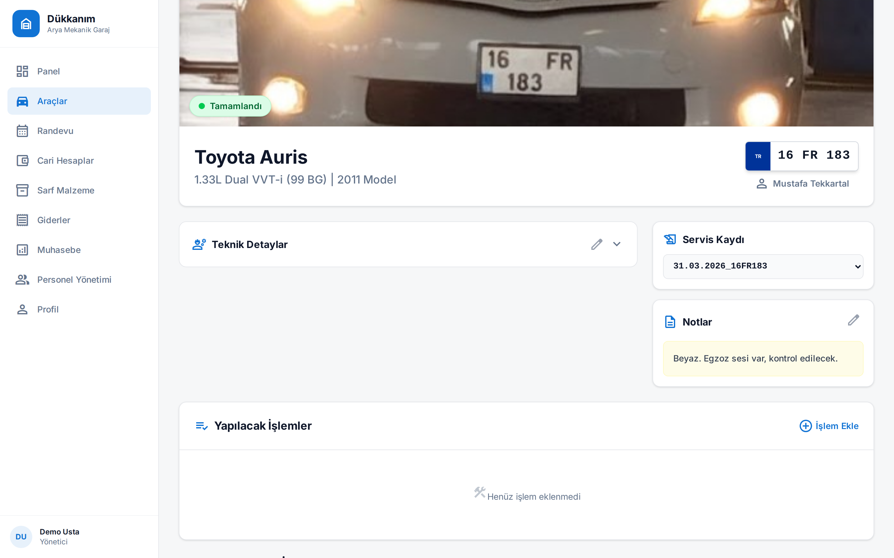

- Uygulamanın çekirdek ekranı. Güncel durum rozetli büyük fotoğraf ve aracın tam kimliği — *Toyota Auris, 1.33L Dual VVT-i (99 BG), 2011 Model* — ayrıca plaka ve sahibi.
- *Teknik Detaylar*, aracın özelliklerini içeren açılır bir paneldir.
- *Servis Kaydı* seçicisi tarihli kayıtlar arasında geçiş yapar — her kayıt tarih ve plakayla adlandırılır (ör. `31.03.2026_16FR183`).
- *Notlar* kartı araca dair serbest notları tutar ("Beyaz. Egzoz sesi var, kontrol edilecek").
- Aşağıda *Yapılacak İşlemler*, seçili kaydın işlemlerini listeler; yeni işlemler şablon kataloğundan eklenir.

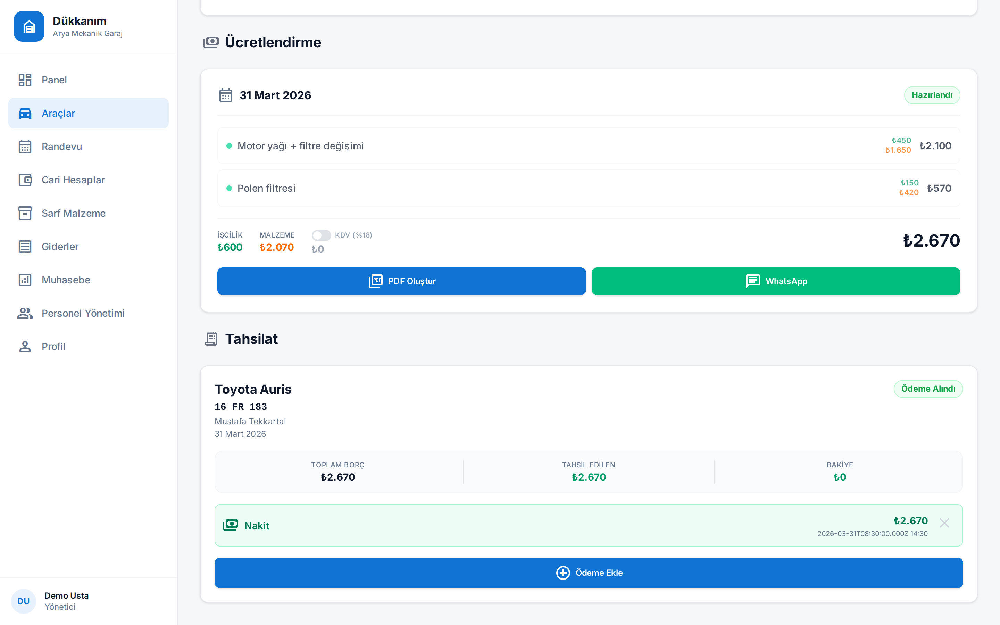

- Aşağı inince servis kaydının para tarafına ulaşılır. **Ücretlendirme**, her işlem kalemini işçilik ve malzeme tutarlarıyla ayrı ayrı gösterir; %18 KDV anahtarı ve genel toplam buradadır.
- Tek dokunuşla teklif **PDF**'e dönüşür veya müşteriye **WhatsApp** üzerinden gönderilir.
- **Tahsilat**, kaydın toplam borcunu, tahsil edileni ve kalan bakiyeyi takip eder; her ödeme yöntemiyle listelenir (burada: nakit, ₺2.670) — kayıt *Ödeme Alındı* rozetini taşır.

## Randevu

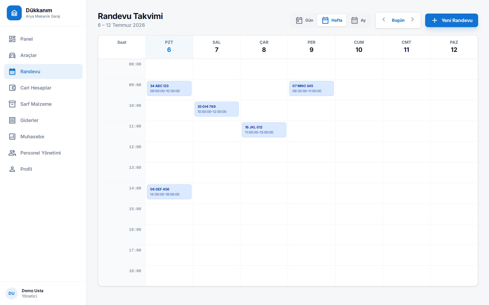

- Hafta görünümü: 08:00–18:00 ızgarası (saatler dükkânın çalışma saatleri ayarını izler) ve plaka ile saat aralığı yazan renkli randevu blokları.
- Üst çubuk *Gün / Hafta / Ay* arasında geçiş yapar; *Yeni Randevu* yeni kayıt oluşturur.

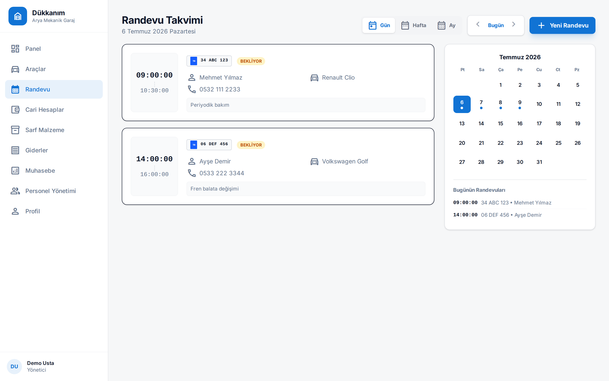

- Gün görünümü her randevuyu bir kart olarak gösterir: saat aralığı, plaka, müşteri adı ve telefonu, araç, planlanan iş (ör. *Periyodik bakım*) ve *BEKLİYOR* rozeti.
- Sağda mini ay takvimi dolu günleri noktayla işaretler; *Bugünün Randevuları* günü tek bakışta listeler.

## Cari Hesaplar

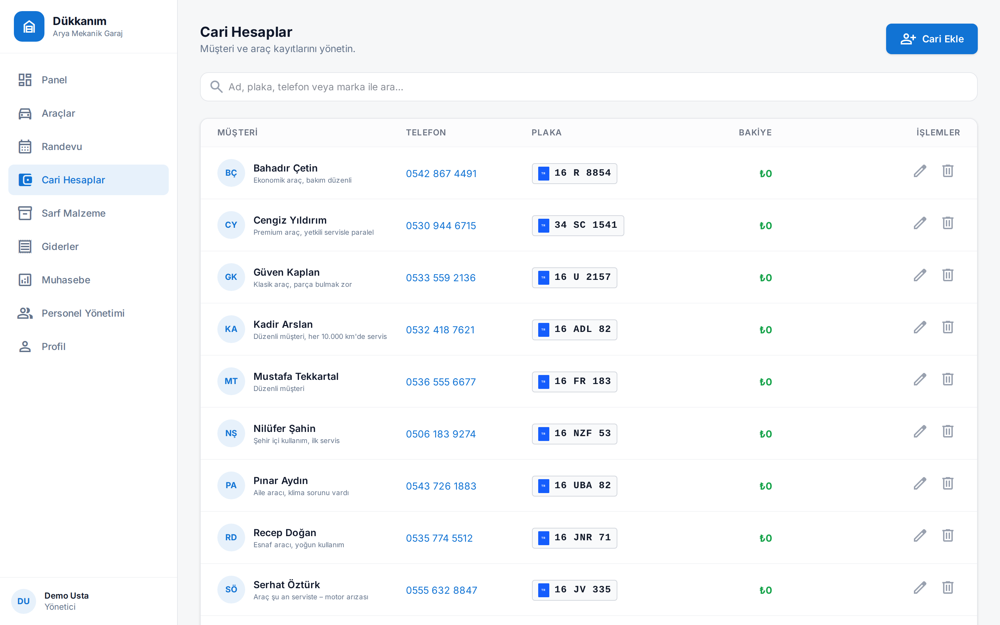

- Her müşteri için bir satır: baş harfli avatar, ad, kısa bir not (ör. *"Düzenli müşteri"*), telefon numarası, plaka rozeti ve hesap bakiyesi (*Bakiye*).
- Bakiye plaka bazında izlenir; müşterinin işlemlerinden ve kaydedilen ödemelerinden hesaplanır — demo dükkânda tüm hesaplar ₺0 ile kapalıdır.
- Arama ad, plaka, telefon ve marka üzerinde çalışır; *Cari Ekle* yeni müşteri ekler, her satırda düzenle / sil işlemleri vardır.

## Sarf Malzeme

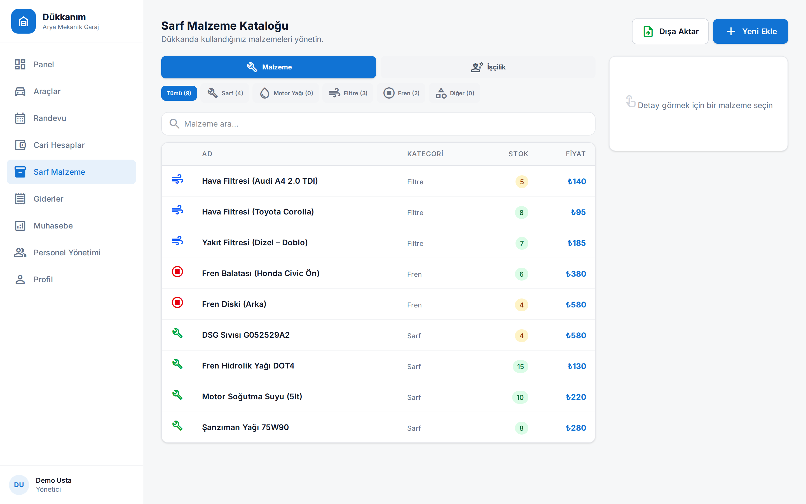

- Dükkânın fiyat ve stok kataloğu, iki ana gruba ayrılır: *Malzeme* ve *İşçilik*.
- Canlı sayaçlı kategori sekmeleri listeyi filtreler: *Sarf*, *Motor Yağı*, *Filtre*, *Fren*, *Diğer*.
- Tablo her kalemi kategorisi, stok adedi ve fiyatıyla listeler; yan panel seçilen malzemenin detayını gösterir.
- *Yeni Ekle* kalem oluşturur, *Dışa Aktar* kataloğu dışa aktarır.

## Giderler

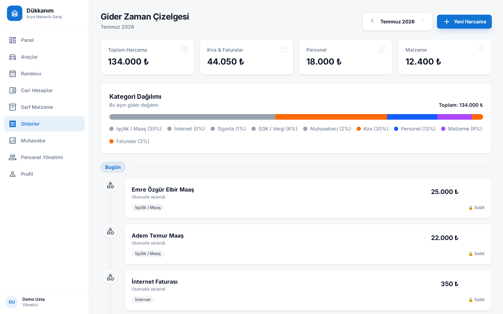

- *Gider Zaman Çizelgesi* ayları oklarla gezerek bir seferde bir ay gösterir.
- Üstte özet kartlar: toplam harcama (demo ayında ₺134.000), kira & faturalar, personel ve malzeme.
- *Kategori Dağılımı*, ayı yüzde etiketli tek bir yığılmış çubuk olarak çizer — maaş %35, kira %30, personel %13, malzeme %9 ve devamı.
- Aşağıda giderler bir zaman çizelgesinde sıralanır; maaş ve internet faturası gibi tekrarlayan kalemler otomatik eklenir ve *Sabit* olarak işaretlenir.

## Muhasebe

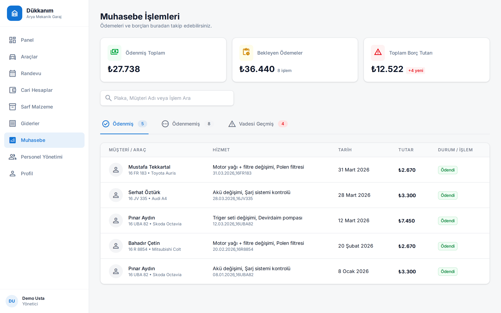

- Tüm servis işlemlerinin para tarafı: *Ödenmiş Toplam* (₺27.738), *Bekleyen Ödemeler* (8 işlemde ₺36.440) ve *Toplam Borç Tutarı*.
- Durum sekmeleri işlemleri *Ödenmiş*, *Ödenmemiş* ve *Vadesi Geçmiş* olarak ayırır; arama çubuğu plaka, müşteri veya hizmete göre bulur.
- Tabloda müşteri / araç, hizmet kalemleri, tarih, tutar ve her satırda durum rozeti vardır (ekran görüntüsünde *Ödendi*).

## Personel Yönetimi

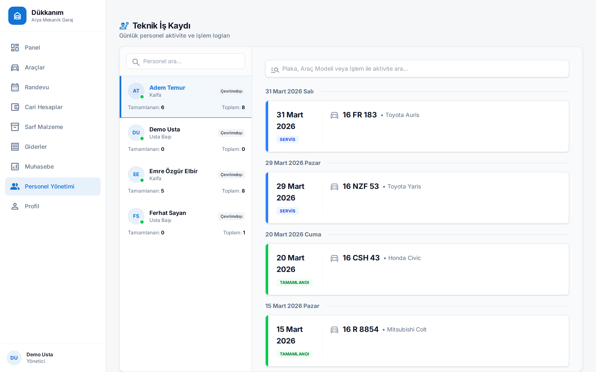

- *Teknik İş Kaydı* — ekibin günlük aktivitesi.
- Sol panel personeli rolüyle (*Usta Başı*, *Kalfa*), çevrimiçi durumuyla ve sayaçlarla listeler: tamamlanan / toplam iş.
- Bir kişi seçilince sağda tarihe göre gruplanmış iş geçmişi açılır — her kayıtta plaka, araç modeli ve durum rozeti (*SERVİS* / *TAMAMLANDI*) bulunur.
- İki bağımsız arama vardır: biri kişi için, biri plaka, model veya işleme göre aktivite için.

## Profil ve Dükkan Ayarları (Profil)

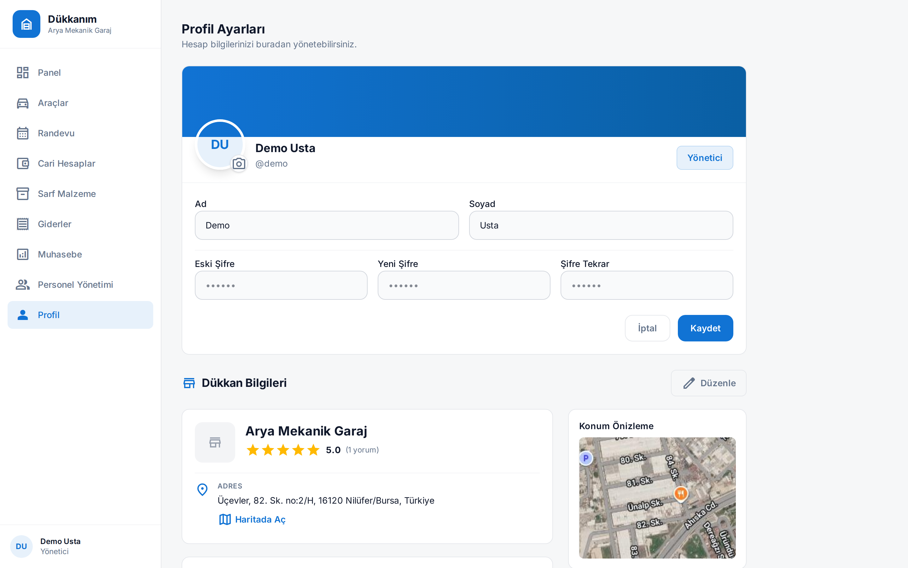

- Üstte kişisel kart: fotoğraf yüklenebilen avatar, `@demo` kullanıcı adı, rol rozeti (*Yönetici*), ad soyad alanları ve şifre değiştirme formu.
- *Dükkan Bilgileri* sahibine aittir: dükkân adı, puan (5.0, 1 yorum), *Haritada Aç* bağlantılı adres ve konum önizlemesi.
- Dükkan ayarları uygulamanın geri kalanını besler — kenar çubuğundaki marka ve randevu takviminin çalışma saatleri buradan gelir.

*Kenar çubuğundaki ilk sekme olan **Panel** henüz yapım aşamasındadır — bir sonraki adım olarak dükkân geneli özet istatistikler planlanmaktadır.*

## Mimari

- **Durum tabanlı SPA** — masaüstü kenar çubuklu tek bir React tek sayfa uygulaması; ekranlar tek URL altında sekmeler ve üst üste açılan görünümlerdir, URL yönlendiricisi yoktur.
- **REST API** — Express backend yaklaşık 55 JSON uç noktası sunar; frontend JWT ile doğrulanmış isteklerle konuşur.
- **Rol bazlı arayüz** — sahip (*usta*) dokuz sekmenin tamamını görür; tamirci yalnızca araçlar ve profilden oluşan daraltılmış bir arayüz görür.
- **Ortak PostgreSQL** — veriler ortak bir Postgres 16 örneğinde, dev ve prod için ayrı veritabanlarında tutulur; SQL migration'ları backend açılışında otomatik çalışır.
- **Docker + reverse proxy** — frontend ve backend, ayrı dev ve prod yığınları hâlinde konteyner olarak çalışır; bir Nginx ağ geçidi `dukkanim.furkantekkartal.com` adresini doğru konteynerlere yönlendirir.

---

🇬🇧 English version: [README.md](README.md)

*Bu doküman [ProjectReadmes](../) portföy koleksiyonunun bir parçasıdır.*
