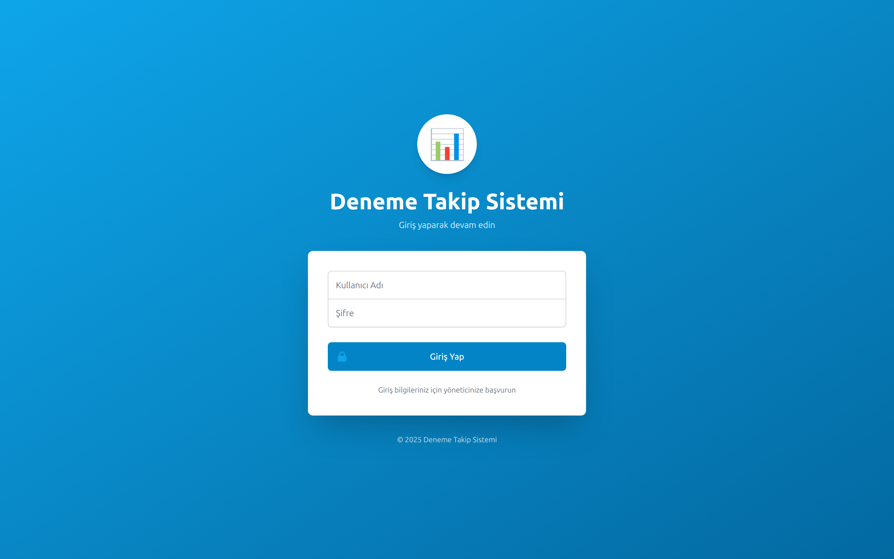
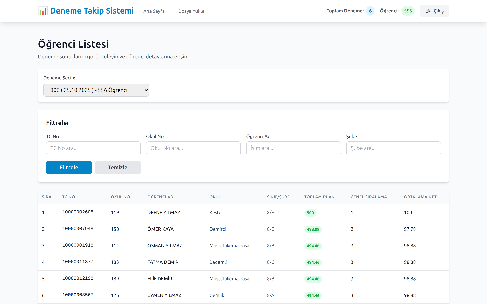
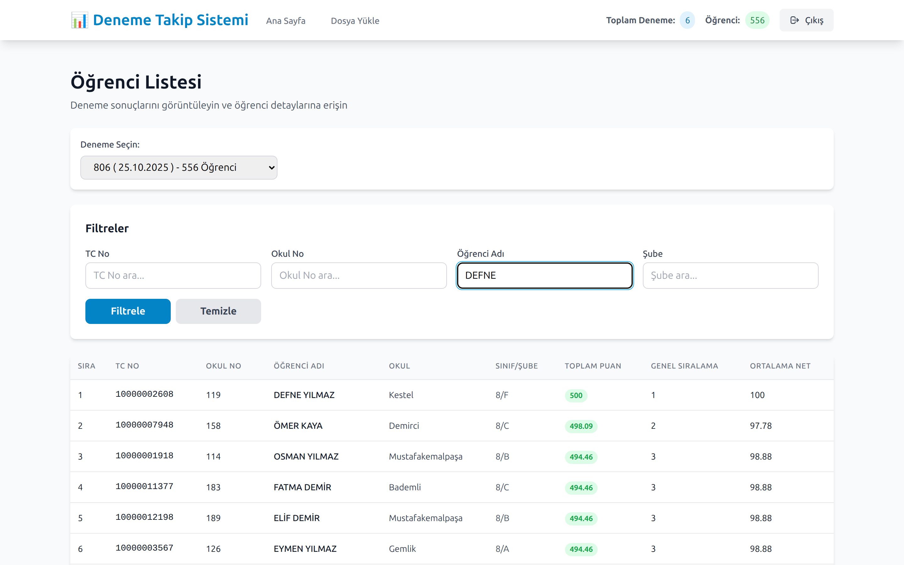
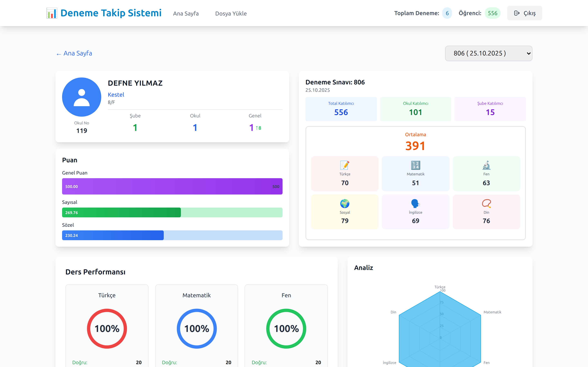
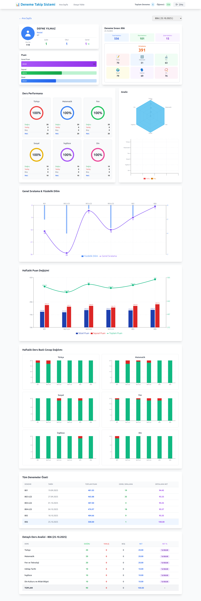
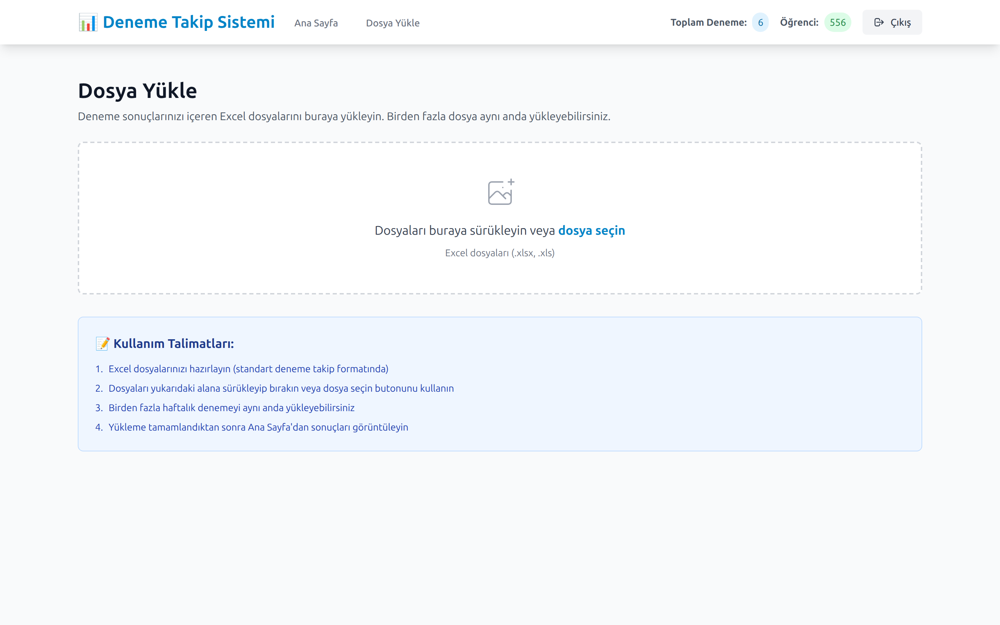
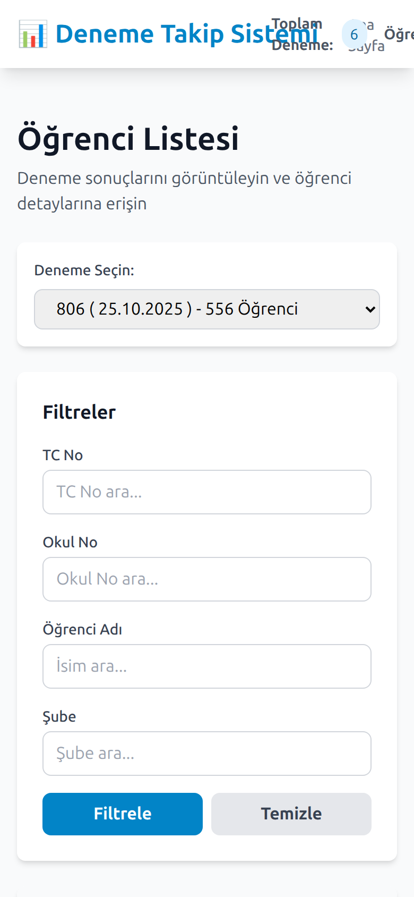
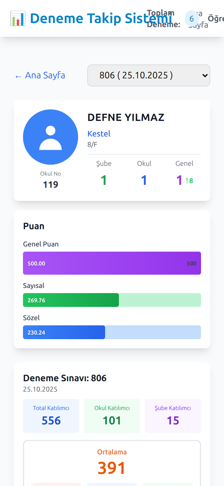

# Deneme Takip Sistemi (Exam Visualizer)

Öğrencilerin deneme sınavı sonuçlarını takip eden web uygulaması: sınav şirketlerinin ürettiği Excel sonuç dosyalarını yükleyin; öğrenci bazında puan trendleri, ders bazında analizler ve okul/şube sıralamalarını denemeler boyunca izleyin.

🇬🇧 English version: [README.md](README.md)

---

> ### 🚀 Canlı uygulama
>
> **URL:** [http://examvisualizer.furkantekkartal.com](http://examvisualizer.furkantekkartal.com)
>
> **Giriş korumalı.** Uygulama gerçek öğrenci verisi (isim, TC kimlik numarası, fotoğraf) barındırdığı için herkese açık demo hesabı yoktur — tüm API uçları ve öğrenci fotoğrafları oturum doğrulaması gerektirir.
>
> Aşağıdaki tüm ekran görüntüleri **anonimleştirilmiş demo veriyle** (sahte isim ve kimlik numaraları) çalışan bir kopyadan alınmıştır; bu dokümanda gerçek öğrenci bilgisi yoktur.

---

## Özellikler

- **Sürükle-bırak Excel yükleme** — `.xlsx` sonuç dosyalarını doğrudan uygulamaya bırakın; dosyalar sunucuda saklanır ve yeniden başlatmada otomatik yüklenir.
- **Filtreli öğrenci listesi** — deneme bazında TC no, okul no, isim veya sınıf/şubeye göre arama.
- **Öğrenci dashboard'u** — puan çubukları (genel / sayısal / sözel), yön göstergeli sınıf–okul–genel sıralamaları, katılımcı sayıları, ders puan kartları.
- **Denemeler arası gelişim** — her öğrencinin deneme serisi boyunca ders bazında trendini gösteren çizgi, bar, radar ve bileşik grafikler (Recharts).
- **Ders analizi** — Türkçe, Matematik, Fen, İnkılap, İngilizce ve Din için doğru / yanlış / boş / net dağılımları.
- **Okul & şube ayrıştırma** — `OZL 8/D`, `8-E KZY` gibi serbest biçimli şube etiketleri otomatik olarak okul, sınıf ve şubeye ayrıştırılır.
- **Öğrenci fotoğrafları** — kimlik numarasıyla eşleşen fotoğraf varsa öğrenci sayfasında gösterilir (auth korumalı uç).
- **Kullanım loglama** — oturum ve aksiyonların sunucu tarafında takibi, CSV/JSON dışa aktarım, opsiyonel Telegram bildirimleri.
- **Tek girişli erişim kontrolü** — ortam değişkenlerinde SHA-256 hash'li kimlik bilgileri; tek giriş kalıcı bir oturum token'ı verir ve tüm API rotalarını korur.

## Teknolojiler

| Katman | Teknoloji |
|---|---|
| Frontend | React 18 (CRA), React Router 6, Recharts, Tailwind CSS |
| Backend | Node.js, Express 4, multer yükleme, SheetJS (xlsx) ayrıştırma |
| Depolama | Dosya tabanlı: Excel dosyaları + fotoğraflar kalıcı Docker volume'unda (veritabanı yok) |
| Auth | SHA-256 hash'li kimlik bilgileri, kalıcı oturum token'ı, tüm uçlar korumalı |
| Dağıtım | Nginx ters proxy arkasında Docker (çok aşamalı build) |

## Ekranlar

Masaüstü görüntüleri 1440 px, mobil 390 px. **Gösterilen tüm veriler anonim demo verisidir.**

### Giriş

Tüm uygulama bu ekranın arkasında — geçerli oturum olmadan her API çağrısı (öğrenci fotoğrafları dahil) 401 döner.

### Öğrenci listesi

Deneme seçin; TC / okul no / isim / şube ile filtreleyin ve istediğiniz öğrencinin sayfasına geçin.

İsme göre filtreleme:

### Öğrenci dashboard'u

Sıralama değişimi, puan çubukları, denemenin katılım istatistikleri ve ders ortalamaları tek bakışta:

Sayfanın tamamında ders bazında performans halkaları, radar grafiği ve zaman içindeki gelişim grafikleri de var:

### Excel yükleme

### Mobil

## Mimari notlar

- Backend, yüklenen her çalışma kitabını bir kez ayrıştırır ve işlenmiş deneme verisini bellekte tutar; orijinal dosyalar `storage/excel` altında kalır ve açılışta yeniden ayrıştırılır.
- İki konteyner olarak çalışır (`examvisualizer-backend`, `examvisualizer-frontend`); frontend Nginx'i `/api` ve `/images`'ı backend'e proxy'ler, ortak gateway ise `examvisualizer.` alt alan adını buraya yönlendirir.
- Depolama, yüklemeler ve loglar ortak altyapı veri klasöründeki host volume'larında durur; konteynerler veri kaybı olmadan yeniden inşa edilebilir.
