# HealthNHabits

Yemek, su, adım ve kilo takibi için mobil öncelikli bir web uygulaması — yemeğinizin fotoğrafını kaloriye ve makrolara çeviren yapay zekâ destekli yemek tarayıcısıyla.

🇬🇧 English version: [README.md](README.md)

---

> ### 🚀 Canlı deneyin
>
> **URL:** [https://healthnhabits.furkantekkartal.com](https://healthnhabits.furkantekkartal.com)
>
> **Demo giriş:** kullanıcı adı `demo` · şifre `demo1234`
>
> Kendi hesabınızı da oluşturabilirsiniz — kayıt herkese açıktır.

---

## Özellikler

- **Yapay zekâ ile yemek analizi** — yemeğinizin fotoğrafını çekin (veya sadece metinle tarif edin); yapay zekâ yiyecekleri tanır, porsiyonları tahmin eder, kalori ve makroları hesaplar.
- Yakılan ve alınan kalorileri interaktif bir terazi görseliyle gösteren **günlük özet paneli (dashboard)**.
- **Yiyecek kataloğu** — her ürün için kalori ve makro bilgisi tutan kişisel bir kütüphane; öğün tipine göre tek dokunuşla kayıt.
- Her biri kendi hedefi ve ilerleme ekranıyla **su, adım ve kilo takibi**.
- **Enerji açığı analizi** — günlük kalori açığı/fazlası (BMR + aktivite vs. yenen) ve haftalık tahmini kilo değişimi.
- **İlerleme raporları** — 7 / 14 / 30 günlük dönemlerde enerji açığı, su, adım ve kilo grafikleri.
- Vücut bilgileri, aktivite seviyesi ve günlük hedefleri besleyen otomatik BMR / TDEE hesaplamasıyla **kişisel profil**.

## Teknolojiler

| Katman | Teknoloji |
|---|---|
| Frontend | React 19, Vite, Tailwind CSS 4, React Router 7 |
| Backend | Node.js, Express 5, Sequelize ORM |
| Veritabanı | PostgreSQL |
| Kimlik doğrulama | JWT (kullanıcı adı + şifre, bcrypt hash) |
| Yapay zekâ | Yemek fotoğrafı / metin analizi için OpenRouter AI |
| Dağıtım | Nginx reverse proxy arkasında Docker Compose |

## Ekranlar

Tüm ekran görüntüleri canlı uygulamadan, mobil görünümde (390 px) alınmıştır — arayüz mobil öncelikli tasarlanmıştır.

## Giriş

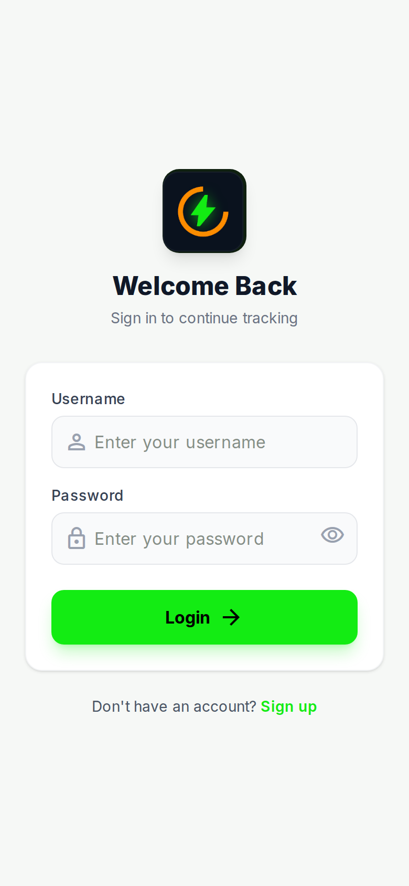

- Kullanıcı adı ve şifre ile basit giriş — e-posta gerekmez.
- Şifre alanında göster/gizle düğmesi.
- Uygulama logosu ve kısa "Sign in to continue tracking" mesajıyla sade bir ekran.
- Alttaki "Sign up" bağlantısı açık kayıt sayfasına götürür.

## Kayıt

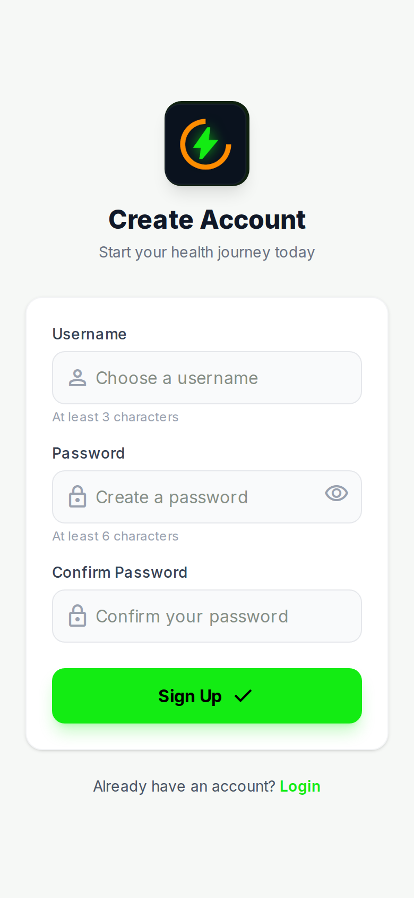

- Herkes hesap oluşturabilir: kullanıcı adı, şifre ve şifre onayı.
- Kurallar alan altındaki ipuçlarında yazar: kullanıcı adı en az 3, şifre en az 6 karakter.
- Başarılı kayıttan sonra uygulama otomatik olarak giriş yapar.
- "Login" bağlantısı mevcut kullanıcıları giriş sayfasına döndürür.

## Dashboard

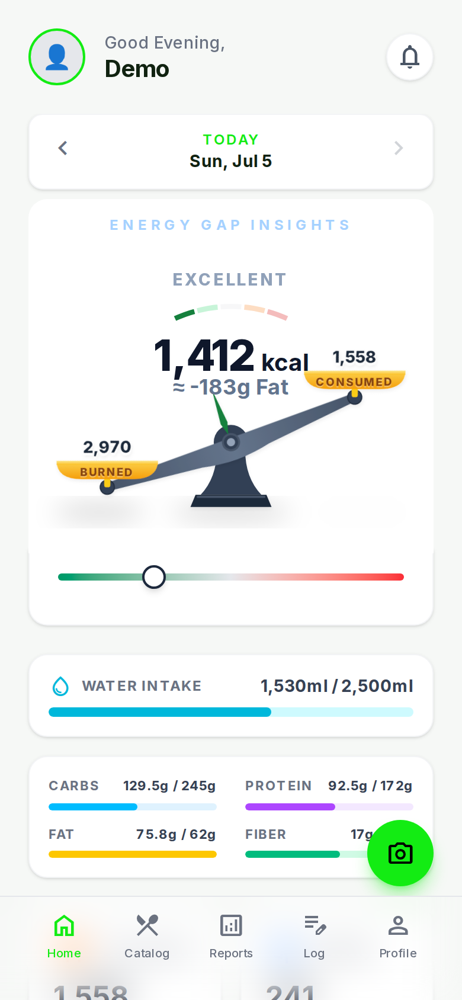

- Ana ekran kullanıcıyı adıyla karşılar ve bir günü tek bakışta gösterir.
- Üstteki tarih gezgini ile geçmiş günlere dönülebilir.
- Ekranın merkezi **Energy Gap Insights** kartıdır: yakılan kaloriyi (2.970) alınan kaloriyle (1.558) tartan animasyonlu bir terazi; net farkı (1.412 kcal ≈ −183 g yağ) ve durum etiketini ("Excellent") gösterir.
- Su alımı çubuğu günlük hedefe ilerlemeyi gösterir (1.530 / 2.500 ml).
- Makro çubukları karbonhidrat, protein, yağ ve lifi kişisel hedeflere göre takip eder.
- Sayfanın devamında kalori, adım ve kilo özet kartları vardır; yüzen kamera düğmesi her yerden yapay zekâ yemek tarayıcısını açar.

## Yapay Zekâ ile Yemek Analizi

Uygulamanın öne çıkan özelliği. Fotoğraf, metin veya ikisini birden verirsiniz — uygulama tek dokunuşla kaydedebileceğiniz tam bir besin dökümü döndürür.

### 1. Girdi

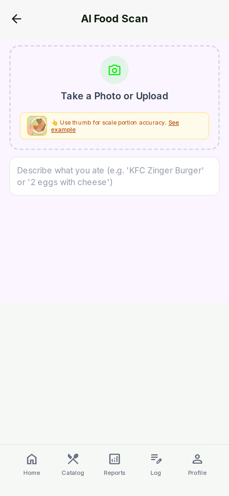

- **AI Food Scan** sayfası kameradan fotoğraf çekmeyi veya resim yüklemeyi kabul eder.
- Küçük bir ipucu bandı pratik bir hile anlatır: porsiyon tahmini daha isabetli olsun diye fotoğrafa ölçek olarak başparmağınızı ekleyin.
- Fotoğrafı atlayıp ne yediğinizi yazmanız da yeterli (ör. "KFC Zinger Burger" veya "2 eggs with cheese").

### 2. Analize hazır

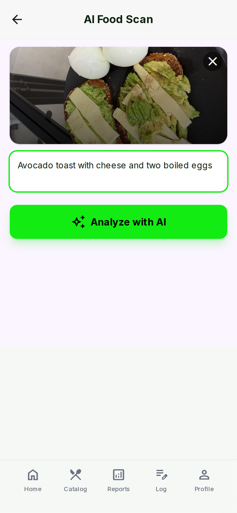

- Eklenen fotoğraf (peynirli avokadolu tost ve haşlanmış yumurta) önizleme olarak görünür; X ile kaldırılabilir.
- Analizden önce metin açıklaması düzenlenerek yapay zekâya ek bağlam verilebilir.
- **Analyze with AI** düğmesine tek dokunuş, resmi ve metni birlikte backend'e gönderir.

### 3. Sonuç

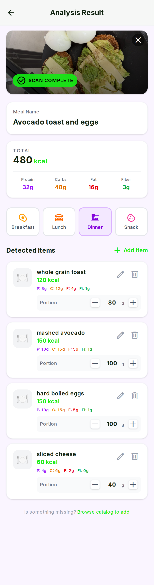

- Fotoğrafın üzerinde "Scan complete" rozeti belirir ve yapay zekâ bir öğün adı önerir ("Avocado toast and eggs").
- Toplam kartı özeti verir: 480 kcal, 32 g protein, 48 g karbonhidrat, 16 g yağ, 3 g lif.
- **Detected Items** her yiyeceği ayrı listeler — tam tahıllı tost, avokado ezmesi, haşlanmış yumurta, dilim peynir — her birinin kendi kalorisi, makroları ve gram bazlı ayarlanabilir porsiyon düğmeleri vardır.
- Her öğe düzenlenebilir veya silinebilir; eksik yiyecekler katalogdan eklenebilir.
- Öğün tipini seçip (kahvaltı / öğle / akşam / atıştırma) **Save as Meal** ile kaydedersiniz.

## Ürün Kataloğu

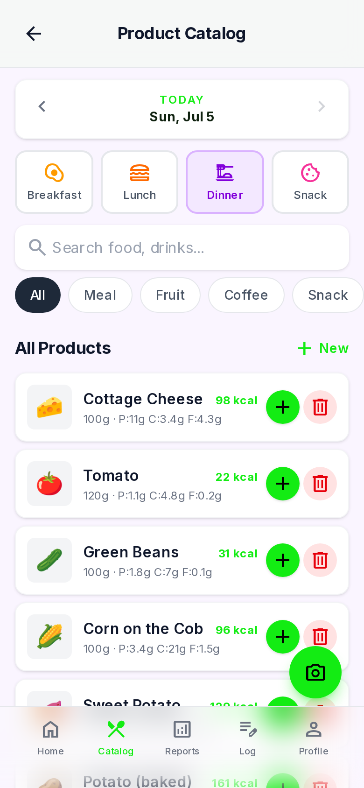

- Kişisel bir yiyecek kütüphanesi: her ürün porsiyon boyutunu, kalorisini ve P/K/Y makrolarını gösterir.
- Üstteki öğün seçici, yiyeceğin hangi öğüne kaydedileceğini belirler (kahvaltı, öğle, akşam, atıştırma).
- Arama ve kategori etiketleri (Meal, Fruit, Coffee, Snack…) ile öğeler hızla bulunur.
- Yeşil **+** düğmesi ürünü seçili güne ve öğüne tek dokunuşla ekler.
- **+ New** yeni ürün oluşturur; kamera düğmesi yapay zekâ tarayıcısına geçer.

## Öğün Detayı / Düzenleme

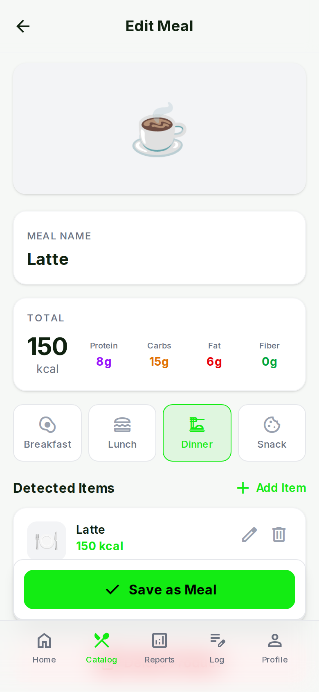

- Kaydedilmiş bir öğün (burada: latte) resmi, adı ve toplamlarıyla düzenleme görünümünde açılır.
- Toplam kartı 150 kcal ile protein, karbonhidrat, yağ ve lif değerlerini gösterir.
- Öğün tipi aynı dört düğmeli seçiciyle değiştirilebilir.
- Öğünün içindeki öğeler düzenlenebilir, silinebilir veya **Add Item** ile genişletilebilir.
- **Save as Meal** değişiklikleri kayda geri yazar.

## Ürün Ekleme

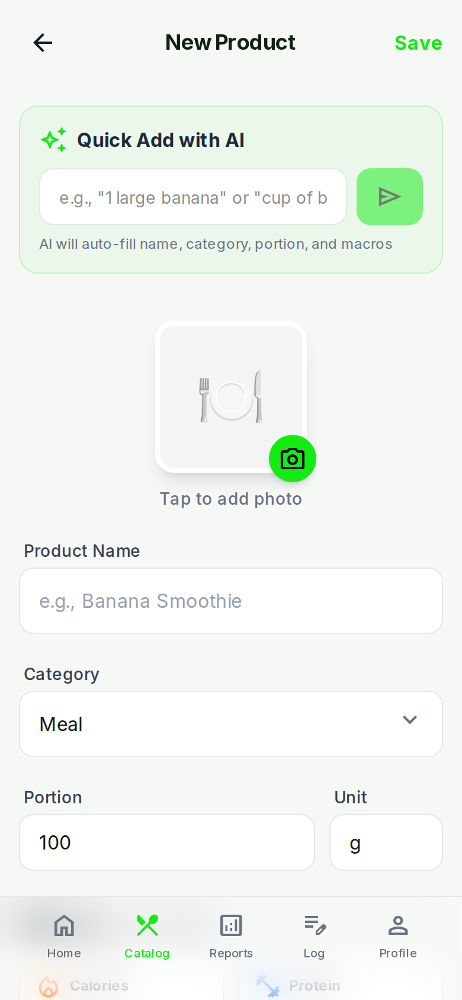

- Yeni katalog öğeleri elle veya yapay zekâ yardımıyla oluşturulabilir.
- **Quick Add with AI**: "1 large banana" gibi bir şey yazın; yapay zekâ adı, kategoriyi, porsiyonu ve makroları otomatik doldurur.
- Ürüne fotoğraf eklenebilir.
- Manuel alanlar ürün adı, kategori, porsiyon ve birimi kapsar; kalori ve makro alanları devamında gelir.

## Su Takibi

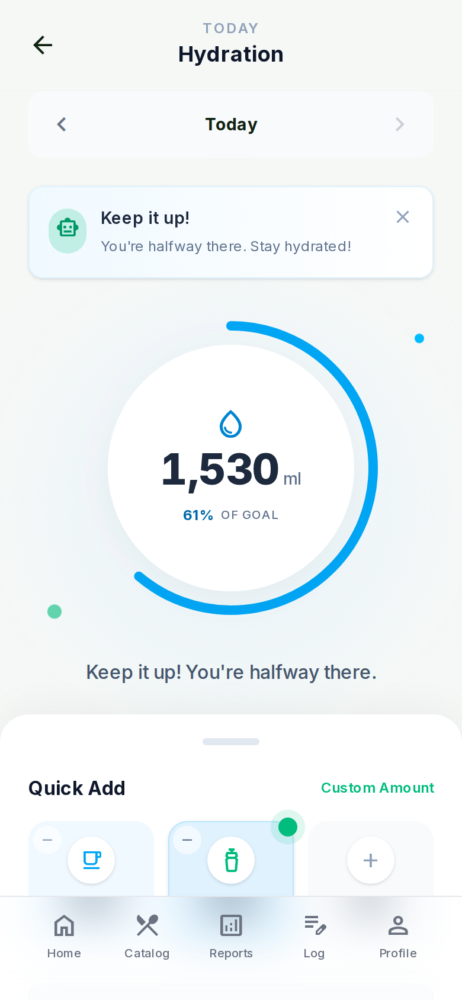

- Büyük bir ilerleme halkası günün su alımını gösterir: 1.530 ml, hedefin %61'i.
- Motivasyon mesajları ilerlemeye göre değişir ("Keep it up! You're halfway there.").
- Hızlı ekleme kartları bir bardağı veya şişeyi tek dokunuşla kaydeder; özel miktar girişi gerisini halleder.
- Kartlardaki küçük eksi düğmeleri yanlış dokunuşu geri alır; tarih çubuğuyla geçmiş günler kontrol edilebilir.

## Adımlar

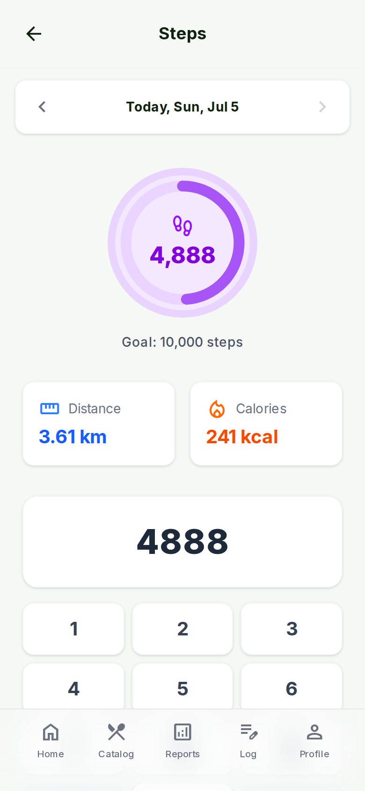

- İlerleme halkası günlük 10.000 hedefine karşı 4.888 adımı gösterir.
- Uygulama adım sayısından mesafe (3,61 km) ve yakılan kalori (241 kcal) tahmini yapar.
- Adımlar büyük ekran tuş takımıyla elle girilir.
- Üstteki tarih çubuğuyla önceki günlere adım kaydedilebilir.

## Kilo Girişi

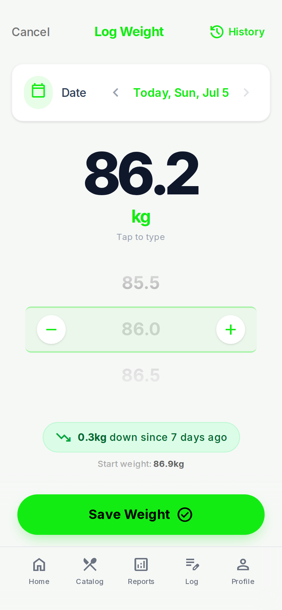

- Büyük ve okunaklı bir gösterge mevcut girişi gösterir (86,2 kg); üzerine dokunarak doğrudan yazılabilir.
- Artı/eksi düğmeli kaydırmalı seçici kiloyu 0,1 kg adımlarla ayarlar.
- Trend etiketi anında geri bildirim verir: "0.3 kg down since 7 days ago"; altında başlangıç kilosu yazar.
- Tarih seçici geçmişe dönük giriş yapılmasını sağlar; **History** bağlantısı tüm kayıtları açar.

## Kilo Geçmişi

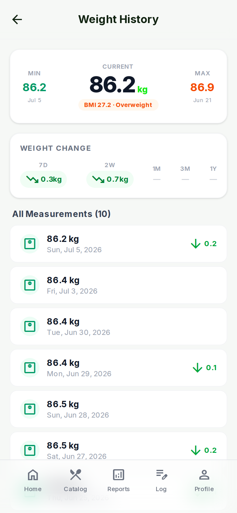

- Özet kartı minimum, güncel ve maksimum kiloyu, ayrıca kategorisiyle birlikte canlı BMI değerini gösterir (BMI 27.2 · Overweight).
- **Weight Change** etiketleri 7 gün, 2 hafta, 1/3 ay ve 1 yıllık trendi özetler.
- Her ölçüm, tarihi ve bir önceki girişe göre farkıyla listelenir.

## Aktivite Günlüğü

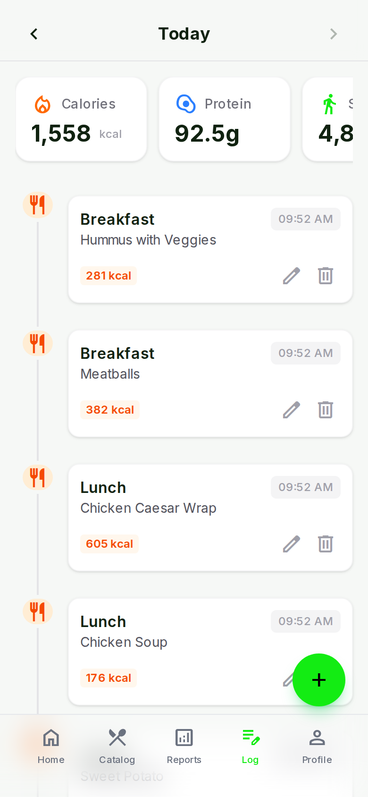

- Seçili günde kaydedilen her şeyin kronolojik zaman çizelgesi.
- Üstteki kaydırılabilir istatistik kartları günü özetler: kalori (1.558 kcal), protein (92,5 g), adım.
- Yemek girişleri öğün tipini, ürün adını, kaloriyi ve saati gösterir.
- Su, adım ve kilo girişleri aynı zaman çizelgesinde aşağıda görünür.
- Her giriş yerinde düzenlenebilir veya silinebilir; **+** düğmesi yeni giriş ekler.

## Enerji Açığı Analizi

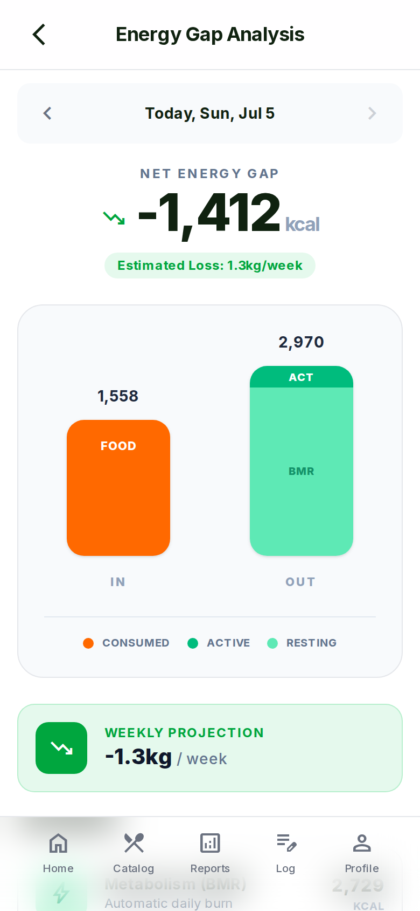

- Günün enerji dengesine odaklanmış bir görünüm: −1.412 kcal net açık.
- Tahmin pratik bir dile çevrilir: "Estimated Loss: 1.3 kg/week".
- IN vs. OUT çubuk grafiği yemekle alınanı (1.558 kcal), dinlenme metabolizması (BMR) ve aktiviteye bölünmüş toplam yakımla (2.970 kcal) karşılaştırır.
- **Weekly Projection** kartı haftalık beklenen kilo değişimini tekrarlar.

## İlerleme Raporları

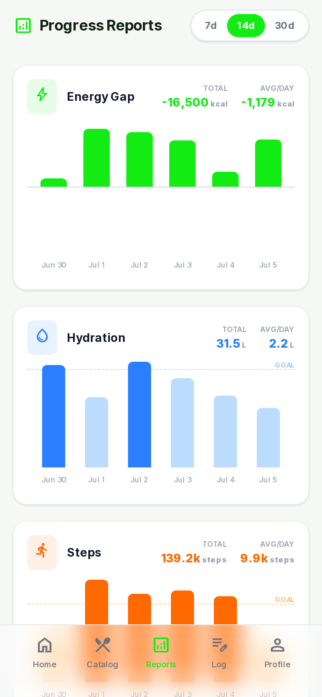

- 7g / 14g / 30g dönem anahtarıyla çok günlük grafikler.
- **Energy Gap**: dönem toplamı (−16.500 kcal) ve günlük ortalamayla (−1.179 kcal) günlük açık/fazla çubukları.
- **Hydration**: hedef çizgisine karşı günlük çubuklar; toplam (31,5 L) ve ortalama (2,2 L) — hedefi tutturan günler vurgulanır.
- **Steps**: aynı düzen adımlar için (toplam 139,2k, günlük ortalama 9,9k).
- Sayfanın devamında kilo trend grafiği yer alır.

## Profil Ayarları

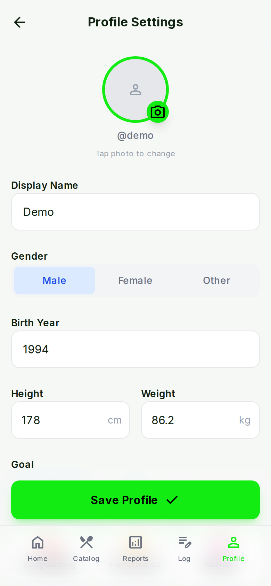

- Tüm hesaplamaları besleyen kişisel bilgiler: görünen ad, cinsiyet, doğum yılı, boy ve kilo.
- Profil fotoğrafı yüklenebilir ve kırpılabilir.
- Sayfanın devamında: aktivite seviyesi seçici (Sedentary ×1.2'den Very Active ×1.7'ye) ve hesabı açıklayan otomatik **TDEE kartı** — BMR 1.820 kcal × aktivite katsayısı = 2.730 kcal günlük enerji.
- Şifre değiştirme ve çıkış aynı sayfanın en altındadır.

## Mimari

- **Mobil öncelikli SPA** — ortalanmış, telefon genişliğinde bir düzen ve alt sekme çubuğuyla React tek sayfa uygulaması.
- **REST API** — Express backend JSON uç noktaları sunar; frontend JWT ile doğrulanmış isteklerle konuşur.
- **Ortak PostgreSQL** — veriler ortak bir Postgres örneğinde tutulur; dev ve prod için ayrı veritabanları vardır.
- **Docker konteynerleri** — frontend ve backend, ayrı dev ve prod yığınları hâlinde konteyner olarak çalışır.
- **Reverse proxy** — bir Nginx ağ geçidi alt alan adlarını (`healthnhabits.furkantekkartal.com` prod, `healthnhabits-dev...` dev) doğru konteynerlere yönlendirir.

---

🇬🇧 English version: [README.md](README.md)

*Bu doküman [ProjectReadmes](../) portföy koleksiyonunun bir parçasıdır.*
