# HomeMadeKahoot

Kahoot tarzı bir İngilizce öğrenme platformu: quizleri elle veya yapay zekâ ile oluşturun, oyuncuların 4 haneli PIN ile katıldığı canlı çok oyunculu oturumlar düzenleyin; kelime kartları, yazım alıştırması ve 13.000+ kelimelik İngilizce–Türkçe veritabanıyla kelime çalışın.

🇬🇧 English version: [README.md](README.md)

---

> ### 🚀 Canlı deneyin
>
> **URL:** [https://homemadekahoot.furkantekkartal.com](https://homemadekahoot.furkantekkartal.com)
>
> **Demo giriş:** kullanıcı adı `demo` · şifre `demo1234`
>
> Kendi hesabınızı da oluşturabilirsiniz — kayıt herkese açıktır (yalnızca kullanıcı adı + şifre, e-posta gerekmez).
>
> Oyuncuların hesaba hiç ihtiyacı yok: canlı bir quize katılmak için 4 haneli PIN ve bir takma ad yeterli.

---

## Özellikler

- **Canlı çok oyunculu quizler** — öne çıkan özellik. Quiz sahibi (host) 4 haneli PIN'li bir lobi açar, oyuncular herhangi bir cihazdan misafir olarak katılır; sorular Socket.IO üzerinden geri sayım, puanlar ve final skor tablosuyla gerçek zamanlı akar.
- **Yapay zekâ destekli quiz oluşturucu** — soruları elle yazın ya da bir PDF'ten, altyazı dosyasından (SRT/TXT) veya web sayfası/YouTube URL'sinden otomatik üretin. Soru görselleri de otomatik oluşturulabilir.
- **Kendi hızında mod** — her quiz, host olmadan tek başına da çözülebilir.
- **Kelime veritabanı** — Oxford-3000 listesine dayanan 13.000+ İngilizce–Türkçe kayıt; kelime türü, CEFR seviyesi, kategoriler, içe/dışa aktarma ve kelime bazında öğrenme durumu.
- **Kelime kartı desteleri** — İngilizce kelime, Türkçe anlam, örnek cümle, ses düğmeleri ve fotoğraf içeren çevrilebilir kartlar; her kelime Learning veya Known olarak işaretlenir.
- **Yazım alıştırması** — Türkçe kelimeyi görün, İngilizcesini yazın; ilerleme deste bazında takip edilir.
- **Telaffuz değerlendirmesi** — Azure Speech ile konuşma puanlama; analizlerde ortalama telaffuz puanı gösterilir.
- **Panolar ve analizler** — seviyeler, rozetler, çalışma süresi ve öğrenci bazında quiz performansı, Recharts ile görselleştirilmiş.

## Teknolojiler

| Katman | Teknoloji |
|---|---|
| Frontend | React 18 (CRA), React Router v6, Recharts, socket.io-client |
| Backend | Node.js, Express, Socket.IO |
| Veritabanı | PostgreSQL, Sequelize ORM |
| Kimlik doğrulama | JWT (kullanıcı adı + şifre, bcrypt hash) |
| Gerçek zamanlı | 4 haneli PIN'li Socket.IO oyun oturumları |
| Yapay zekâ ve içerik | OpenRouter / Gemini (quiz üretimi), Unsplash (soru görselleri), Firecrawl (web sayfası çıkarma), Azure Speech (telaffuz) |
| Dağıtım | Nginx reverse proxy arkasında Docker Compose |

## Ekranlar

Tüm ekran görüntüleri canlı uygulamadan, masaüstü görünümde (1440 px) ve yeni oluşturulmuş bir demo hesabıyla alınmıştır. Demo içerik bilerek küçük tutuldu: 10 kelimelik bir deste ("Basic English A1"), 5 soruluk bir quiz ("English Basics Quiz") ve bir oynanmış canlı oturum — bu yüzden bazı sayaçlar hâlâ sıfır gösteriyor.

## Ana Sayfa (Misafir)

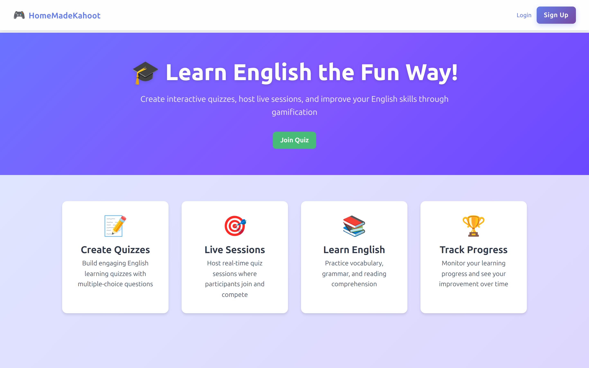

- Herkese açık karşılama sayfası: "Learn English the Fun Way!" başlıklı hero alanı; quizler, canlı oturumlar ve oyunlaştırma hakkında kısa bir tanıtım.
- Yeşil **Join Quiz** düğmesi ana eylem çağrısıdır — ziyaretçiler doğrudan canlı bir oyuna atlayabilir.
- Dört özellik kartı platformu özetler: Create Quizzes, Live Sessions, Learn English ve Track Progress.
- Login ve Sign Up sağ üst köşededir.

## Giriş

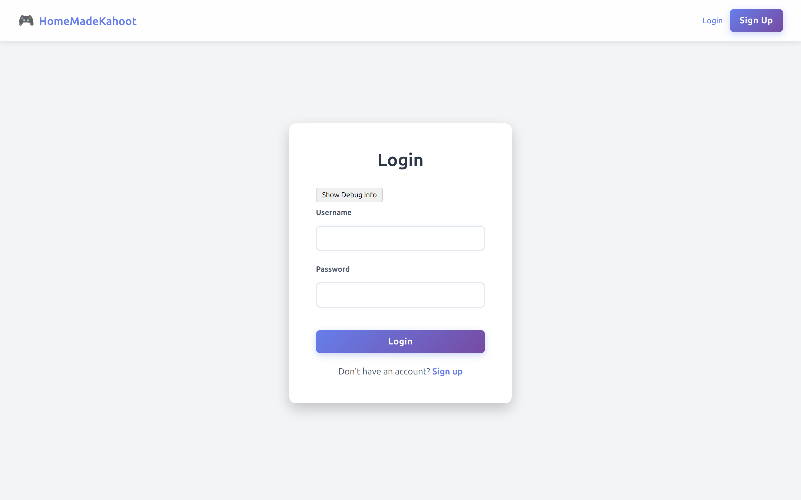

- Kullanıcı adı ve şifre ile basit giriş — e-posta gerekmez.
- Formun altındaki "Sign up" bağlantısı açık kayıt sayfasına götürür.

## Kayıt

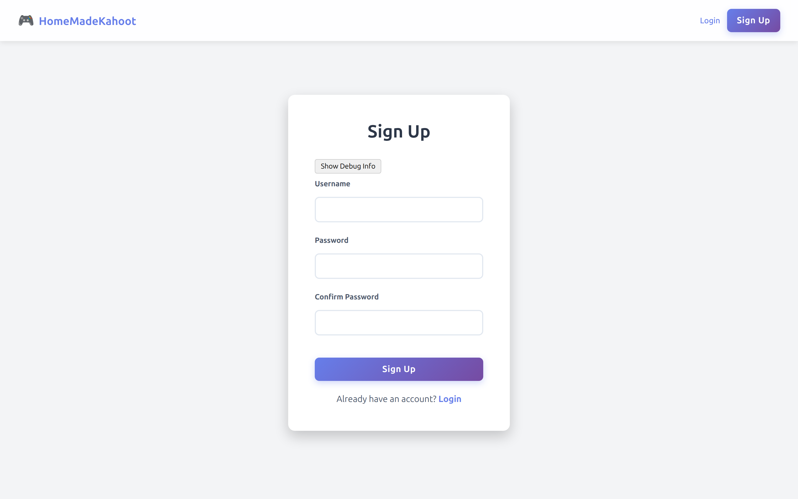

- Herkes hesap oluşturabilir: kullanıcı adı, şifre ve şifre onayı.
- Kayıttan sonra tüm araç seti açılır — desteler, quizler, oturum yönetimi ve analizler.

## Dashboard

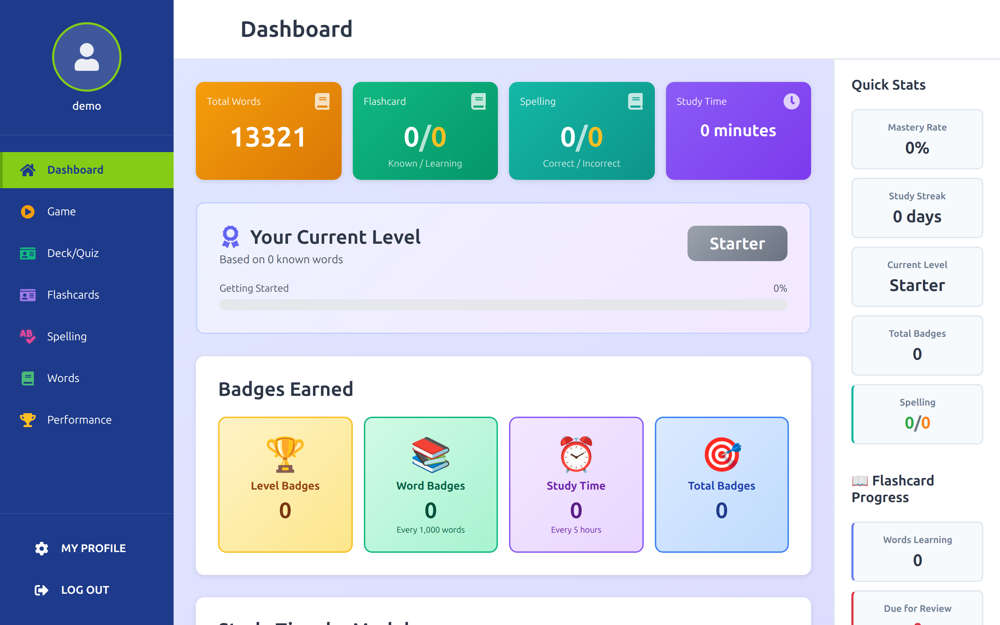

- Giriş yapınca açılan ana ekran: Total Words (ortak veritabanında 13.321), kelime kartı ilerlemesi (Known/Learning), yazım sonuçları ve çalışma süresi için istatistik kartları.
- **Your Current Level** bilinen kelime sayısına dayalı bir seviye rozeti (yeni hesapta "Starter") ve ilerleme çubuğu gösterir.
- **Badges Earned** oyunlaştırma rozetlerini sergiler: seviye rozetleri, kelime rozetleri (her 1.000 kelimede bir), çalışma süresi rozetleri (her 5 saatte bir) ve toplam.
- Sağdaki **Quick Stats** şeridi ustalık oranını, çalışma serisini, mevcut seviyeyi, rozetleri ve kelime kartı ilerlemesini özetler.
- Kenar çubuğu tüm modüllere erişim verir: Game, Deck/Quiz, Flashcards, Spelling, Words ve Performance.

## Deste / Quiz Merkezi

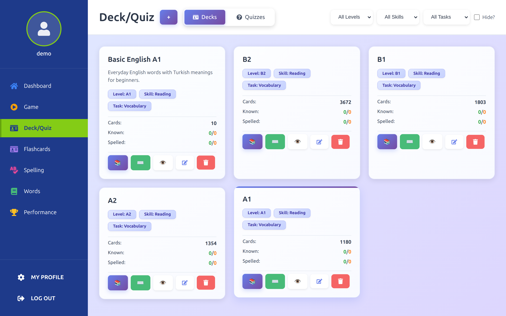

- İçerik merkezi iki sekmeli — **Decks** ve **Quizzes** — artı yenilerini oluşturmak için bir **+** düğmesi.
- Demo deste **Basic English A1** (10 kart, "Everyday English words with Turkish meanings for beginners"), CEFR seviyesine göre hazır Oxford destelerinin yanında durur: her biri 1.180 ile 3.672 kart arasında A1, A2, B1 ve B2.
- Her kartta Level / Skill / Task etiketleri ile kart, bilinen ve yazılan kelime sayaçları görünür.
- Destelerin üzerindeki eylem düğmeleri kelime kartlarını veya yazım alıştırmasını açar; desteyi görüntüler, düzenler veya siler.
- Açılır filtreler (seviye, beceri, görev) ve gizleme anahtarı büyük koleksiyonları yönetilebilir kılar.

## Quiz Oluşturma

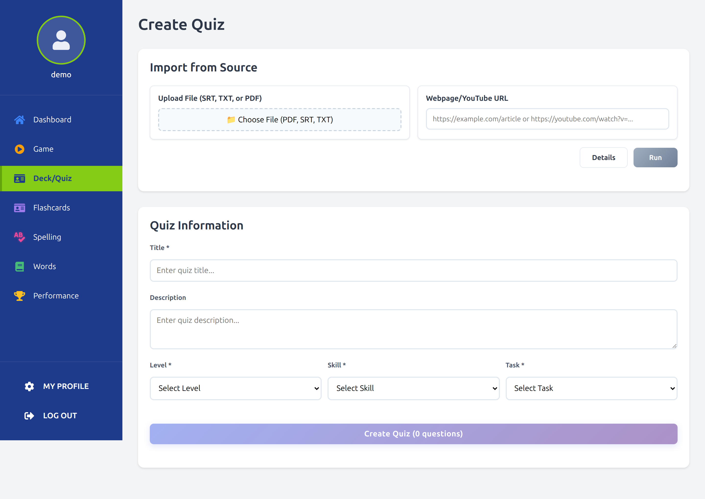

- Quizler aynı sayfada iki şekilde oluşturulabilir.
- **Import from Source** — yapay zekâ paneli: bir PDF, SRT veya TXT dosyası yükleyin ya da bir web sayfası/YouTube URL'si yapıştırın, ardından **Run** ile soruları otomatik üretin.
- **Quiz Information** — manuel yol: başlık, açıklama ve Level / Skill / Task ayarları; sorular tek tek eklenir.
- Oluşturma düğmesi anlık soru sayısını gösterir ("Create Quiz (0 questions)").

## Quiz Düzenleme

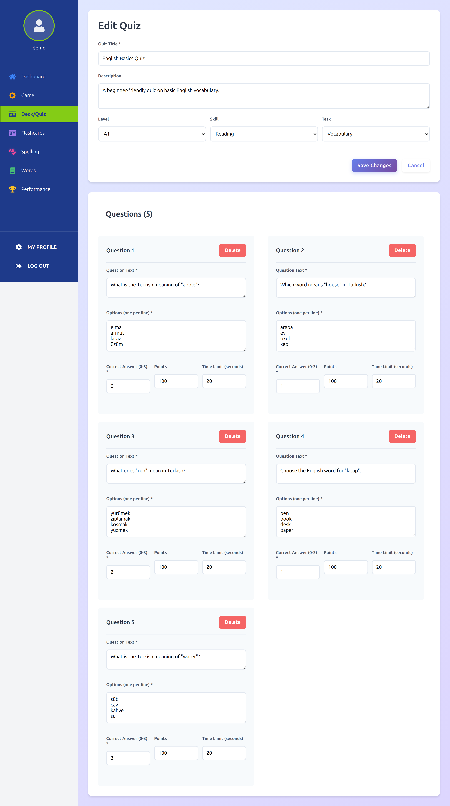

- Editörde açılmış demo quiz: **English Basics Quiz** ("A beginner-friendly quiz on basic English vocabulary", seviye A1).
- Quiz üst bilgileri (başlık, açıklama, seviye, beceri, görev) sayfanın başında düzenlenir ve tek düğmeyle kaydedilir.
- 5 sorunun tamamı yerinde düzenlenebilir: soru metni, dört seçenek (her satıra bir tane), doğru cevap indeksi, puan (100) ve soru başına süre sınırı (20 saniye).
- Sorular iki yönde de gider — İngilizce kelimenin Türkçe anlamı ("apple" → elma) ve Türkçe kelimenin İngilizcesi ("kitap" → book).

## Canlı Çok Oyunculu Quiz

Öne çıkan özellik. Host bir oturum başlatır ve bir PIN alır; oyuncular hesap gerekmeden kendi cihazlarından katılır ve skor tablosu Socket.IO üzerinden güncellenirken gerçek zamanlı cevap verir.

### 1. Host lobiyi açar

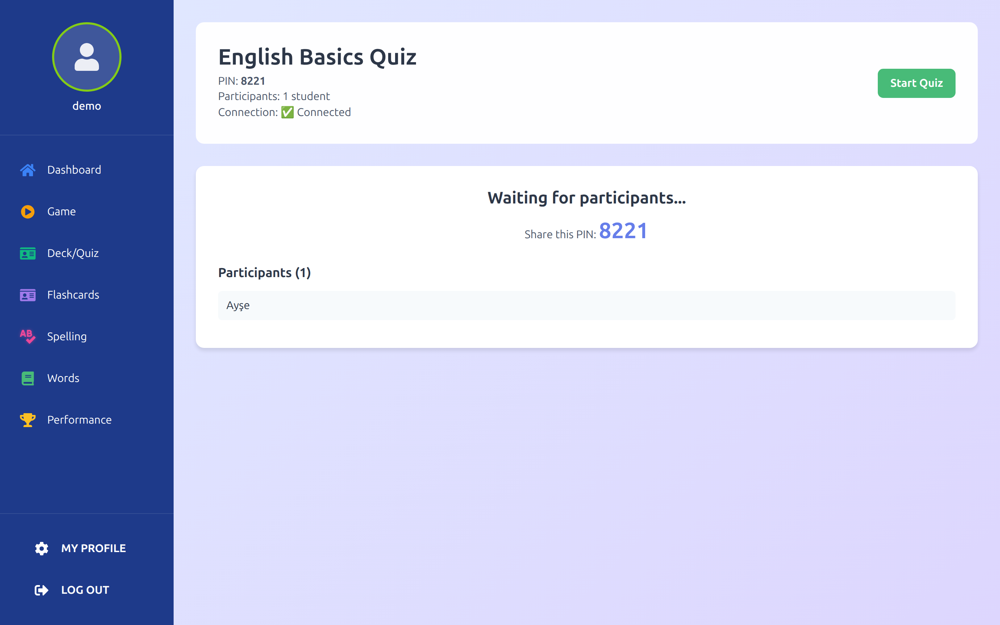

- "English Basics Quiz" için oturum açmak, oyun PIN'i (**8221**) ve canlı bağlantı göstergesi olan bir oturum oluşturur.
- Lobi "Waiting for participants…" mesajını ve grupla paylaşılacak PIN'i gösterir.
- Katılan oyuncular katılımcı listesinde gerçek zamanlı belirir — burada misafir oyuncu **Ayşe** gelmiş durumda.
- Host oyunu **Start Quiz** ile başlatır.

### 2. Oyuncu oyun odasında bekler

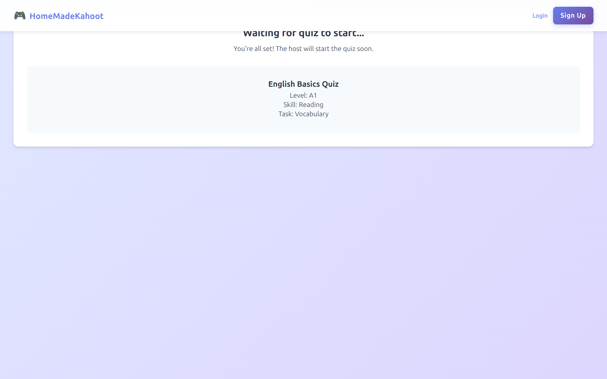

- PIN'i girdikten sonra oyuncu bekleme odasına düşer: "You're all set! The host will start the quiz soon."
- Quiz bilgi kartı sırada ne olduğunu gösterir: English Basics Quiz, Level A1, Skill Reading, Task Vocabulary.
- Misafir gezinme çubuğuna dikkat — bu oyuncu hiç hesap açmadan katıldı.

### 3. Oyuncular canlı cevaplıyor

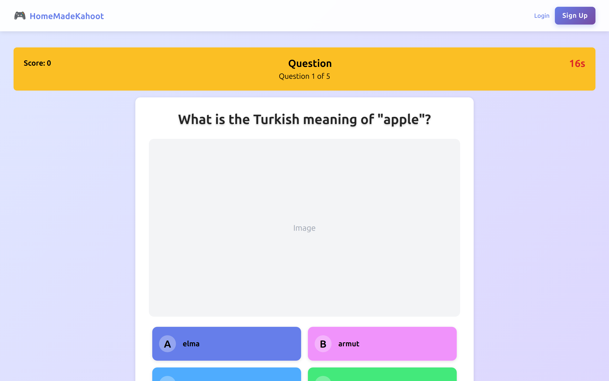

- Host başlattığında sorular tüm oyuncuların ekranında aynı anda belirir.
- Durum çubuğu anlık skoru, soru numarasını (1 / 5) ve kırmızı geri sayımı (20 saniyelik sınırdan kalan 16 sn) gösterir.
- Cevaplar Kahoot tarzı renkli düğmelerle verilir (A/B/C/D); daha hızlı doğru cevaplar daha çok puan kazandırır.
- Her sorunun bir resim alanı vardır — demo soruları yalnızca metin olduğu için burada boş.

### 4. Host soruları takip eder

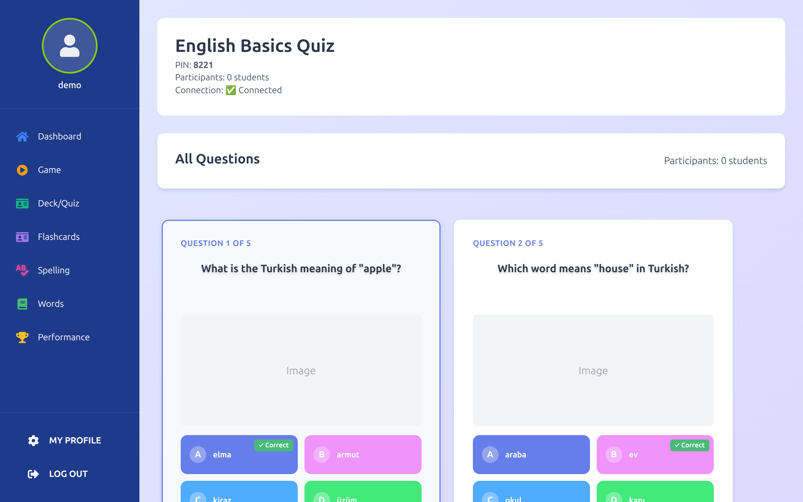

- Host konsolu, çalışan oturumun tüm sorularını, doğru seçenek yeşil **Correct** rozetiyle işaretlenmiş hâlde listeler.
- Oyuncular kendi ekranlarında yarışırken bu görünüm host'un cevap anahtarı işlevini görür.
- Oturum başlığı PIN'i ve bağlantı durumunu süreç boyunca görünür tutar.

### 5. Final skor tablosu

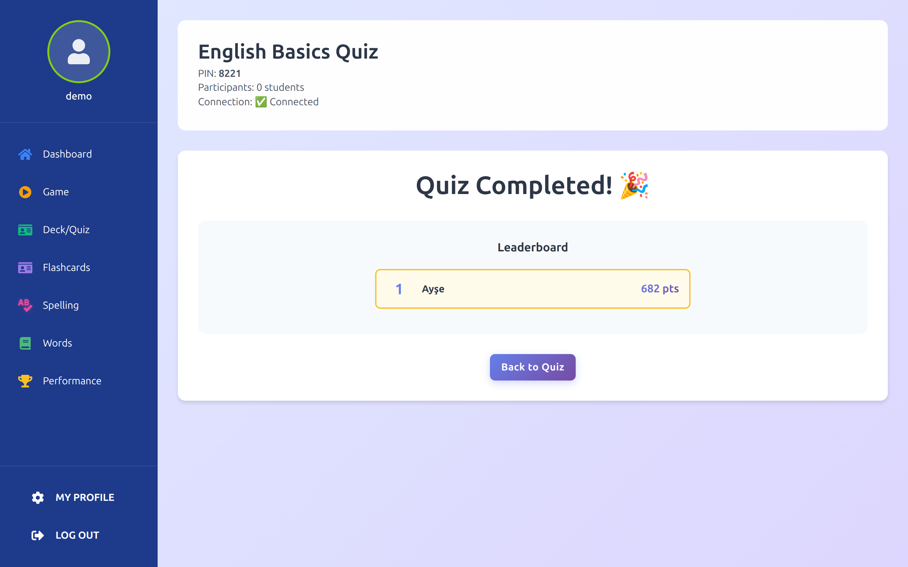

- Son soru kapandığında host ekranı kutlama yapar: "Quiz Completed! 🎉".
- Skor tablosu tüm oyuncuları puana göre sıralar — bu tek oyunculu demo oturumunda **#1 Ayşe, 682 puan**.
- **Back to Quiz** yeni bir tur düzenlemek için quiz sayfasına döner.

## Quize Katılma

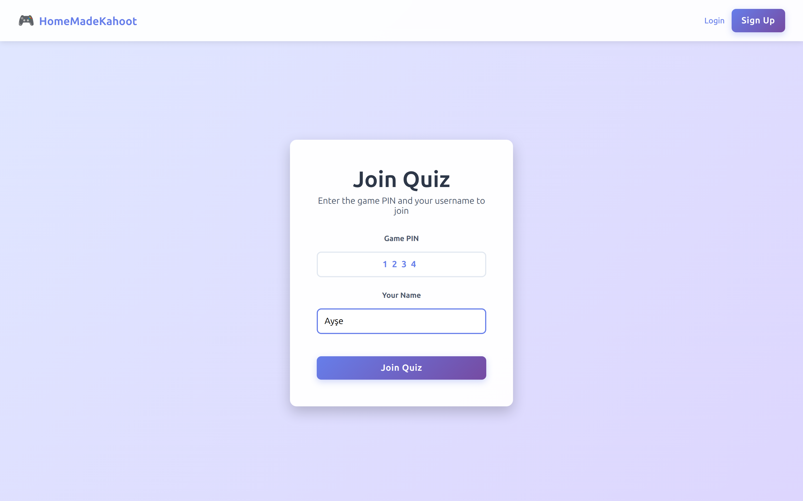

- Oyuncular için herkese açık giriş noktası: oyun PIN'ini ve bir takma ad girin, **Join Quiz**'e basın — hepsi bu.
- Misafirler ve giriş yapmış kullanıcılar için aynı şekilde çalışır; burada "Ayşe" bir PIN ile katılmak üzere.

## Kendi Hızında Quiz

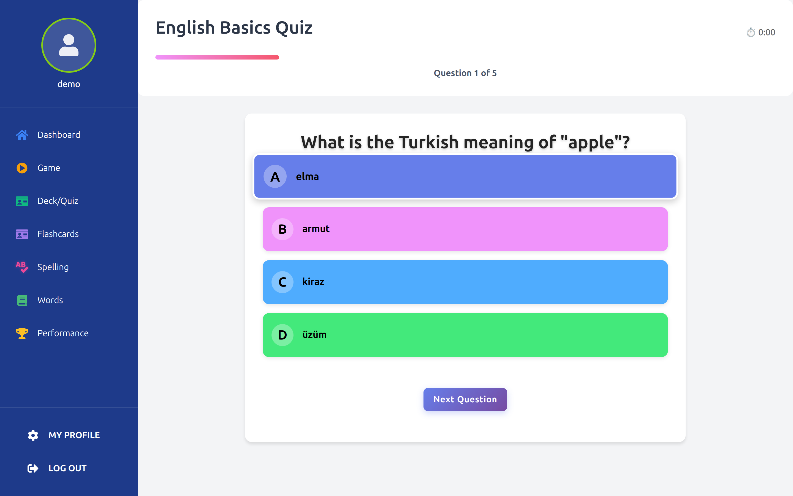

- Aynı quizler host veya başka oyuncular olmadan tek başına da oynanabilir.
- Ekran başına bir soru, tanıdık renkli seçeneklerle — burada **A (elma)** seçeneği seçili.
- **Next Question** düğmesi quizde kendi hızınızda ilerletir; ilerleme ("Question 1 of 5") üstte gösterilir.

## Kelime Veritabanı

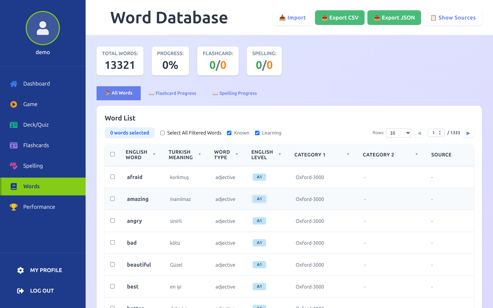

- Kelime çalışmasının omurgası: **13.321 İngilizce–Türkçe kayıt**, 1.333 sayfada gezilebilir.
- Her satır İngilizce kelimeyi, Türkçe anlamı, kelime türünü, CEFR seviye etiketini ve kaynağı gösterir — temel içerik **Oxford-3000** listesinden gelir.
- Sekmeler All Words, Flashcard Progress ve Spelling Progress arasında geçiş yapar; kelimeler Known / Learning durumuna göre filtrelenebilir ve toplu seçilebilir.
- Import, Export CSV ve Export JSON düğmeleri tüm veritabanını taşınabilir kılar.

## Kelime Kartları

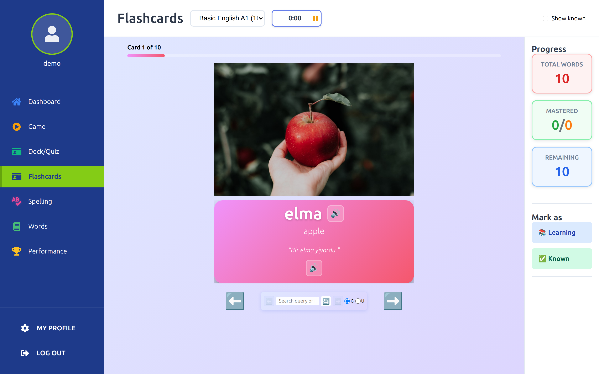

- "Basic English A1" destesi çalışılıyor: 10 kartın 1.si, ilerleme çubuğu ve isteğe bağlı zamanlayıcıyla.
- Çevrilmiş kart **elma / apple** çiftini, bir örnek cümleyi ("Bir elma yiyordu.") ve telaffuz için ses düğmelerini gösterir.
- Kartın üzerindeki fotoğraf kelimeyi resimler — "elma" için kırmızı bir elma.
- Sağ şerit toplam, öğrenilmiş ve kalan kelimeleri takip eder; **Mark as Learning / Known** düğmeleri pano istatistiklerini besler.

## Yazım

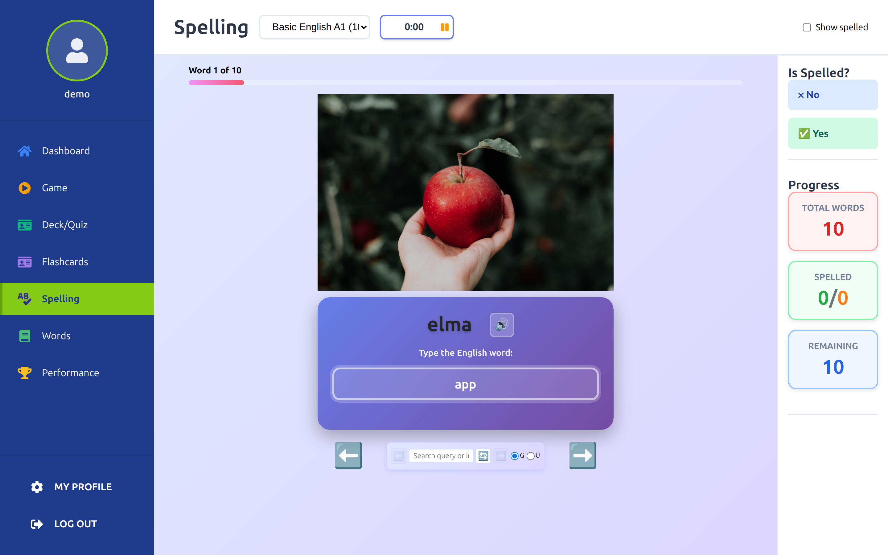

- Aynı deste için yazım modu: uygulama Türkçe kelimeyi gösterir (**elma**, sesli) ve İngilizcesini yazmanızı ister.
- Cevap alanında devam eden kısmi bir deneme görünüyor ("app").
- Resim görsel ipucu verir; sağ şerit deste için yazılan ve kalan kelimeleri takip eder.

## Öğrenci Performansı

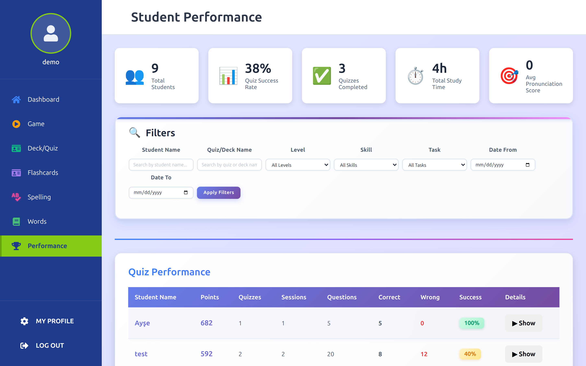

- Analiz sayfası istatistik kartlarıyla açılır: 9 toplam öğrenci, %38 quiz başarı oranı, 3 tamamlanmış quiz, 4 saat toplam çalışma süresi ve ortalama telaffuz puanı.
- **Filters** paneli sonuçları öğrenci, quiz/deste, seviye, beceri, görev ve tarih aralığına göre daraltır.
- **Quiz Performance** tablosu sonuçları oyuncu bazında döker: puanlar, quizler, oturumlar, sorular, doğru/yanlış sayıları ve başarı yüzdesi — Ayşe'nin canlı oturumu %100, "test" öğrencisi %40'ta.
- Her satır **Show** düğmesiyle ayrıntılara açılır.

## Profilim

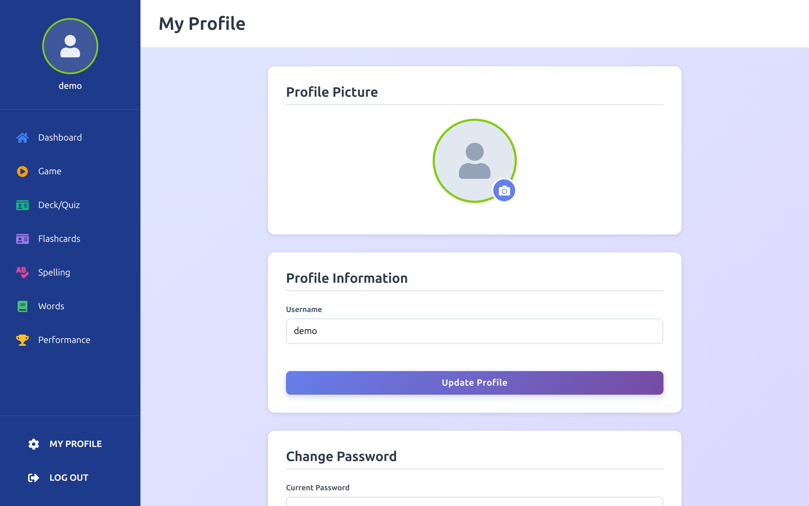

- Üç kartta hesap ayarları: profil fotoğrafı (kamera düğmesiyle yükleme), profil bilgileri (kullanıcı adı) ve şifre değiştirme.
- Bilerek sade tutulmuş — hesap yalnızca bir kullanıcı adı ve şifreden ibaret.

## Mimari

- **SPA + REST + WebSocket** — React tek sayfa uygulaması, Express API ile JWT doğrulamalı JSON istekleri üzerinden konuşur; canlı oyun oturumları aynı backend üzerinde Socket.IO ile çalışır.
- **PIN tabanlı oyun odaları** — her oturum 4 haneli bir PIN alır; oyuncular bir Socket.IO odasına misafir olarak katılır, sunucu soruları yayınlar, cevapları toplar ve puanları gerçek zamanlı hesaplar.
- **Yapay zekâ hattı** — quiz üretimi PDF'leri Markdown'a çevirir ve web sayfalarını Firecrawl ile çıkarır, soruları OpenRouter/Gemini ile kurar; Unsplash soru görsellerini sağlar, Azure Speech telaffuzu puanlar.
- **Ortak PostgreSQL** — veriler ortak bir Postgres örneğinde tutulur; dev ve prod için ayrı veritabanları vardır.
- **Docker konteynerleri** — frontend ve backend, ayrı dev ve prod yığınları hâlinde konteyner olarak çalışır.
- **Reverse proxy** — bir Nginx ağ geçidi alt alan adlarını (`homemadekahoot.furkantekkartal.com` prod, `homemadekahoot-dev...` dev) WebSocket trafiği dâhil doğru konteynerlere yönlendirir.

---

🇬🇧 English version: [README.md](README.md)

*Bu doküman [ProjectReadmes](../) portföy koleksiyonunun bir parçasıdır.*
