# Receiptly

Fiş taramak ve hane giderlerini takip etmek için mobil öncelikli bir web uygulaması — fişin fotoğrafını çekin, yapay zekâ OCR onu düzenlenebilir bir gider kaydına dönüştürsün.

🇬🇧 English version: [README.md](README.md)

---

> ### 🚀 Canlı deneyin
>
> **URL:** [https://receiptly.furkantekkartal.com](https://receiptly.furkantekkartal.com)
>
> **Demo giriş:** kullanıcı adı `demo` · şifre `demo1234`
>
> İkinci hesap `demo2` · `demo1234`, aynı hanenin üyesidir — ortak hane özelliğini görmek için bu hesapla giriş yapabilirsiniz.
>
> Kendi hesabınızı da oluşturabilirsiniz — kayıt herkese açıktır.

---

## Özellikler

- **Yapay zekâ ile fiş tarama** — fişin fotoğrafını çekin veya yükleyin; yapay zekâ OCR hattı (OpenRouter / Gemini vision) mağazayı, tarihi, toplamı ve kalemleri okuyup düzenlenebilir bir forma yerleştirir.
- Haftalık / aylık / yıllık dönem seçici, aylık bütçe ilerleme çubuğu, 6 aylık harcama trendi ve kategori dağılımıyla **özet panel (dashboard)**.
- Arama, tarih aralığı filtresi ve tek dokunuşla CSV dışa aktarma özellikli **fiş listesi**.
- **Normalleştirme** — büyük bir tek seferlik harcamayı istediğiniz gün sayısına (1–365) yayın; tek bir zirve yerine TL/gün günlük ortalama olarak görün.
- **Nötrleme** — borç verdiğiniz parayı takip edin; geri geldiğinde iki fişi birbirine bağlayın, çift harcamalarınızdan düşülsün.
- **Haneler** — giderleri aileyle paylaşın: bir hane oluşturun, diğerleri 4 haneli davet koduyla katılsın.
- **İki dilli arayüz** — varsayılan Türkçe, Profil sayfasında İngilizce seçeneği.
- Kısa ömürlü access token ve refresh token ile **JWT kimlik doğrulama**.

## Teknolojiler

| Katman | Teknoloji |
|---|---|
| Frontend | React 19, Vite 7, React Router 7, i18next (TR/EN) |
| Backend | Node.js, Express 4, multer dosya yükleme |
| Veritabanı | PostgreSQL |
| Kimlik doğrulama | JWT (access + refresh token, kullanıcı adı + şifre) |
| Yapay zekâ | Fiş OCR için OpenRouter / Gemini vision API'leri |
| Dağıtım | Nginx reverse proxy arkasında Docker |

## Ekranlar

Tüm ekran görüntüleri canlı uygulamadan, mobil görünümde (390 px) alınmıştır — arayüz mobil öncelikli tasarlanmıştır. Ekranlar varsayılan dil olan Türkçe arayüzü gösterir; Profil sayfasında İngilizce seçeneği vardır. Para birimi Türk lirasıdır (TL).

## Giriş

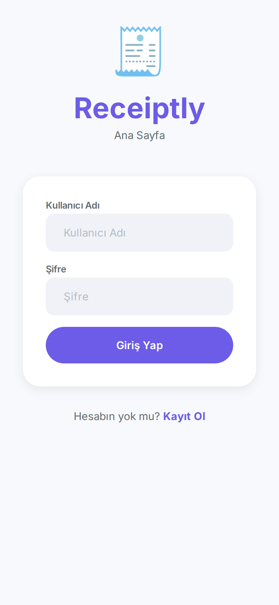

- Kullanıcı adı ve şifre ile basit giriş — giriş kimliği e-posta değil, kullanıcı adıdır.
- Receiptly logosuyla sade, dikkat dağıtmayan bir ekran.
- Alttaki "Kayıt Ol" bağlantısı açık kayıt sayfasına götürür.

## Kayıt

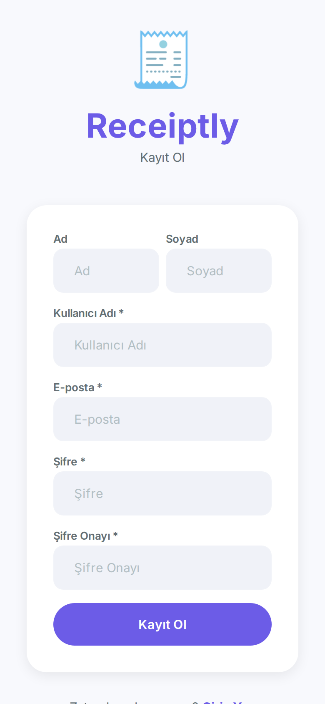

- Herkes hesap oluşturabilir: ad ve soyad isteğe bağlı; kullanıcı adı, e-posta, şifre ve şifre onayı zorunludur.
- Zorunlu alanlar yıldızla işaretlenmiştir.
- Başarılı kayıttan sonra uygulama otomatik olarak giriş yapar.

## Ana Sayfa (Dashboard)

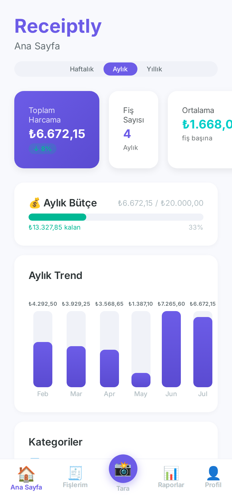

- Ana ekran, seçilen dönemin harcamasını özetler — üstte **haftalık / aylık / yıllık** dönem seçici bulunur.
- Üç özet kart onu izler: toplam harcama (₺6.672,15, önceki döneme göre %8 düşüş rozetiyle), fiş sayısı ve fiş başına ortalama tutar.
- **Aylık Bütçe** kartı, harcamayı Profil sayfasında belirlenen bütçeyle karşılaştırır (₺6.672,15 / ₺20.000,00) — renk kodlu ilerleme çubuğu %33 kullanımı ve kalan ₺13.327,85'i gösterir.
- **Aylık Trend** grafiği son altı ayı, üstlerinde net toplamlar yazan çubuklarla gösterir.
- Sayfanın devamında yüzdeleriyle **kategori dağılımı** ve tam listeye bağlanan **son fişler** bölümü vardır.
- Alt sekme çubuğu (Ana Sayfa / Fişlerim / Tara / Raporlar / Profil) her zaman görünürdür; ortadaki kamera düğmesi tarayıcıyı açar.

## Fiş Tarama (Yapay Zekâ OCR)

Uygulamanın amiral gemisi özelliği. Fişi elle yazmak yerine fotoğrafını çekersiniz, okumayı yapay zekâ yapar. Aşağıdaki tarama, gerçek bir basılı fişin gerçek fotoğrafıyla yapılmıştır.

### 1. Tarama girişi

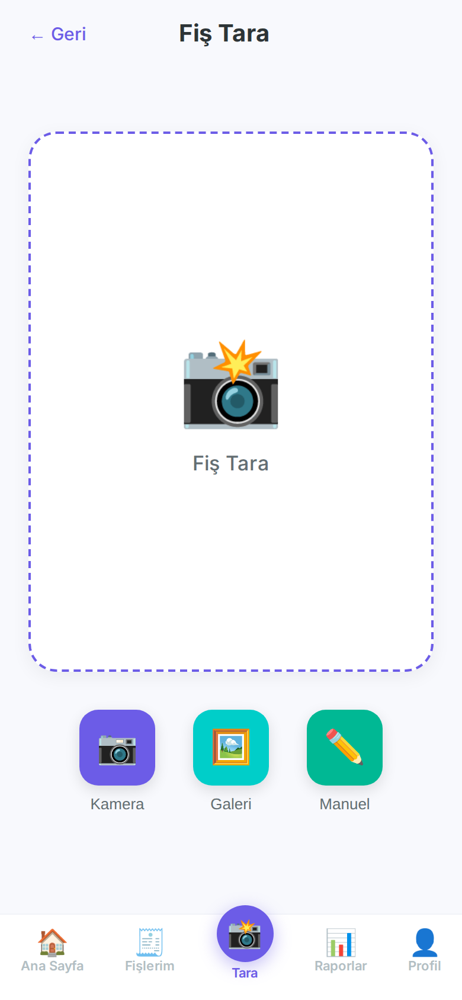

- Tarama sayfası üç yol sunar: **Kamera** (fotoğraf çek), **Galeri** (görsel yükle) ve **Manuel** (OCR'ı atla, fişi kendin yaz).
- Kesikli çizgili büyük alan, yüklemeden önce seçilen görselin ön izlemesini gösterir.

### 2. Tarama sonucu — düzenlenebilir taslak

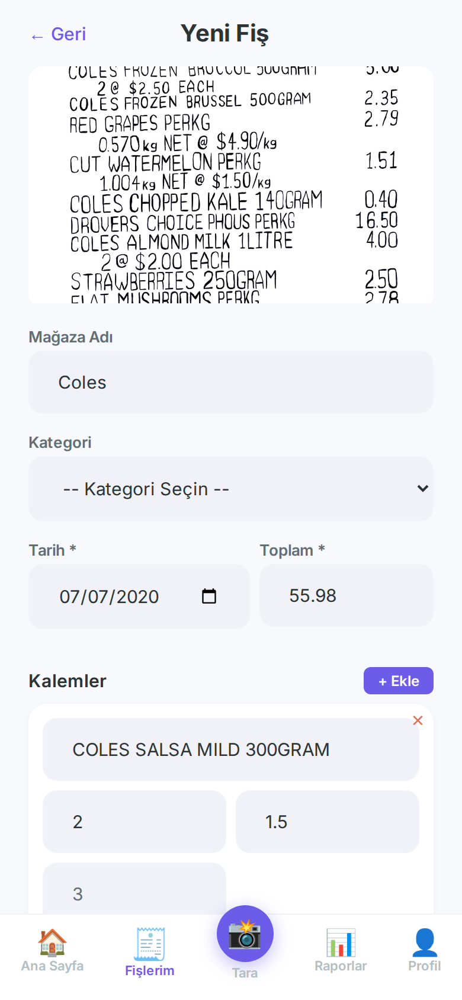

- Yüklemeden sonra yapay zekâ fotoğrafı okur ve **önceden doldurulmuş Yeni Fiş formu** açılır: burada mağazayı ("Coles"), alışveriş tarihini, toplamı (55.98) ve her kalemi adet + birim fiyatıyla çıkardı.
- OCR hattı backend'de çalışır (OpenRouter / Gemini vision modelleri); uzun bir fiş yaklaşık 10-30 saniye sürer.
- Hiçbir şey otomatik kaydedilmez — taslağı gözden geçirir, yapay zekânın yanlış okuduğu alanları düzeltir, kategori seçip **Fişi Kaydet** düğmesine basarsınız.
- Fiş okunamazsa aynı form manuel giriş için kullanılır.

## Fişlerim

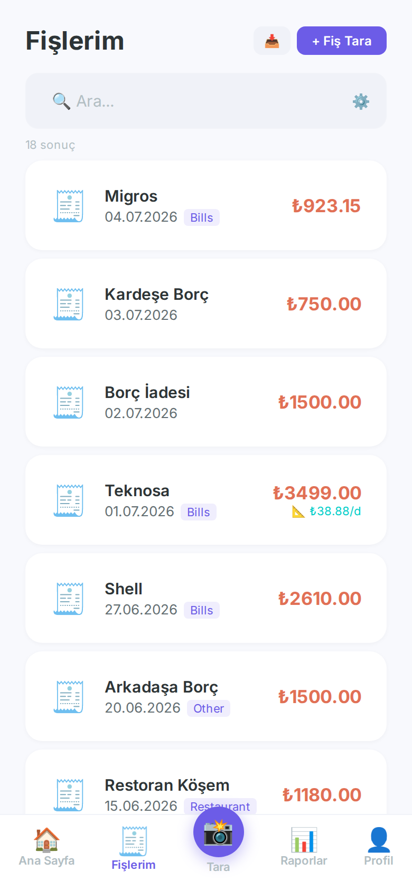

- Tüm fişler tek bir sayfalanmış listede: mağaza adı, tarih, kategori etiketi ve toplam.
- Arama kutusu siz yazarken sonuçları bulur; dişli simgesi açılır bir tarih aralığı filtresi açar.
- **+ Fiş Tara** düğmesinin yanındaki dışa aktarma düğmesi listeyi CSV olarak indirir.
- Normalleştirilmiş fişler günlük ortalamalarını gösteren ek bir rozet taşır — burada Teknosa fişi ₺38,88/gün gösteriyor.

## Fiş Detayı

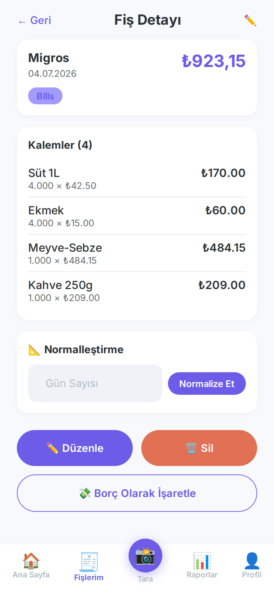

- Tek bir fişin tam görünümü: mağaza (Migros), tarih, kategori ve ₺923,15 toplam.
- **Kalemler** her satırı adet, birim fiyat ve satır toplamıyla listeler — süt, ekmek, meyve-sebze, kahve.
- **Normalleştirme** kartı bir gün sayısı alır ve fişi günlük ortalamaya çevirir.
- Alttaki işlem düğmeleri: **Düzenle**, **Sil** ve fişi nötrleme havuzuna gönderen **Borç Olarak İşaretle**.

## Normalleştirilmiş Fiş

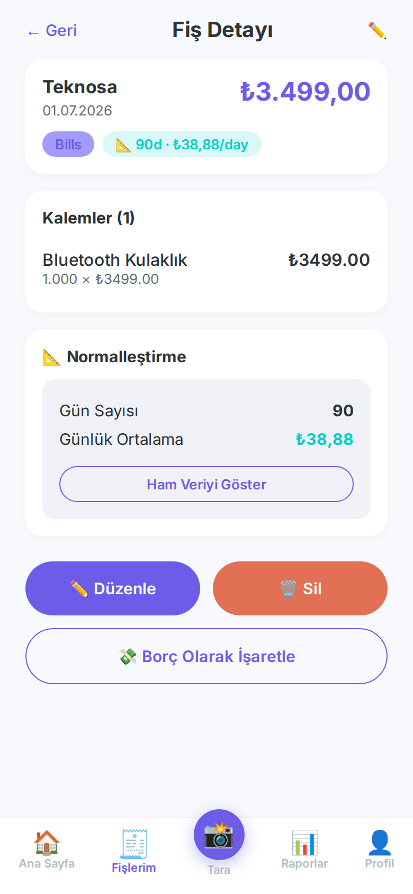

- Teknosa'dan ₺3.499,00'lik bir Bluetooth kulaklık alışverişi, 90 güne yayılmış.
- Başlık artık bir rozet taşıyor: **90d · ₺38,88/day**.
- Normalleştirme kartı gün sayısını ve günlük ortalamayı gösterir; **Ham Veriyi Göster** düğmesi orijinal rakamları açar.
- Böylece büyük bir elektronik alışverişi koca bir ayın istatistiklerini bozmaz.

## Yeni Fiş (manuel form)

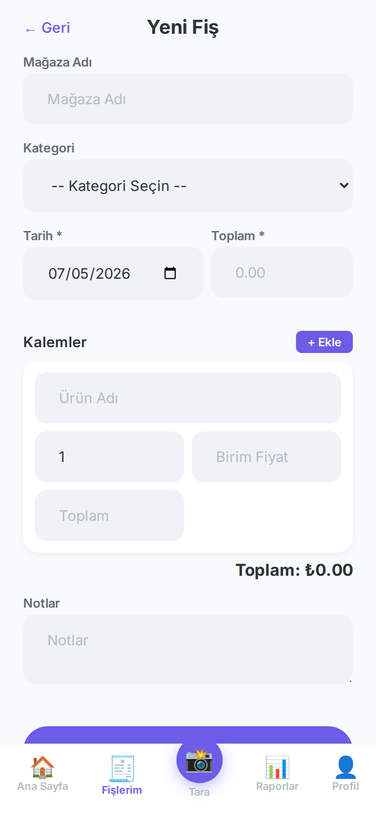

- Tarayıcının kullandığı formun aynısı, manuel giriş için boş başlar.
- Alanlar: mağaza adı, kategori açılır listesi, tarih, toplam ve serbest metin notlar.
- **Kalemler** bölümü **+ Ekle** ile dinamik olarak büyür — her satır ürün adı, adet, birim fiyat ve satır toplamı alır; form anlık genel toplamı gösterir.

## Raporlar

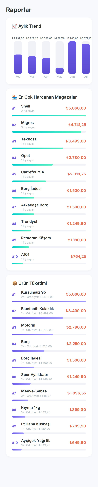

- **Aylık Trend** grafiği, ana sayfadaki 6 aylık harcama çubuklarını tekrarlar.
- **En Çok Harcanan Mağazalar**, en fazla 10 mağazayı toplam harcamaya göre sıralar; fiş sayıları ve ilerleme çubuklarıyla — burada Shell, 2 fişte ₺5.060,00 ile önde.
- **Ürün Tüketimi**, en çok alınan 10 ürünü alım sayısı ve ortalama fiyatla sıralar — paranın gerçekte nereye gittiğini görmek için birebir: yakıttan mutfak alışverişine.

## Nötrlemeler

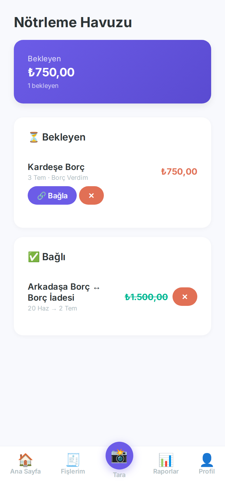

- **Nötrleme Havuzu**, borç verilen parayı takip eder; böylece bu para sonsuza dek gerçek harcama olarak sayılmaz.
- Özet kart bekleyen tutarı gösterir: kardeşe verilen, hâlâ bekleyen ₺750,00.
- Her bekleyen kayıtta bir **Bağla** düğmesi vardır — verilen borcun fişini geri ödeme fişiyle eşleştiren bir seçici açar.
- **Bağlı** bölümü kapanan çiftleri gösterir: "Arkadaşa Borç ↔ Borç İadesi", üstü çizili ₺1.500,00 tutarıyla — çift birbirini götürür.

## Hane

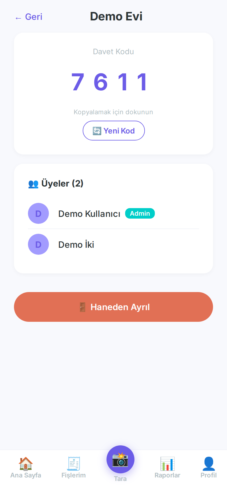

- Bir hane ("Demo Evi") giderleri üyeleri arasında paylaştırır.
- 4 haneli **davet kodu** büyük gösterilir — kopyalamak için dokunun; diğerleri bu kodu girerek katılır.
- Üye listesi avatarları ve rolleri gösterir; kurucu **Admin** rozeti taşır ve **Yeni Kod** ile kodu yenileyebilir.
- Her üye **Haneden Ayrıl** ile ayrılabilir.

## Profil

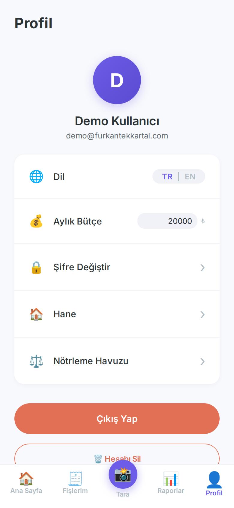

- Hesap özeti: avatar, görünen ad ve e-posta.
- **TR | EN** anahtarı tüm arayüz dilini anında değiştirir.
- **Aylık bütçe** doğrudan burada, satır içinde düzenlenir — ana sayfadaki bütçe çubuğunu besler.
- Gezinme satırları Şifre Değiştir, Hane ve Nötrleme Havuzu'na götürür.
- Çıkış Yap ve çift onaylı Hesabı Sil düğmesi sayfanın altındadır.

## Şifre Değiştir

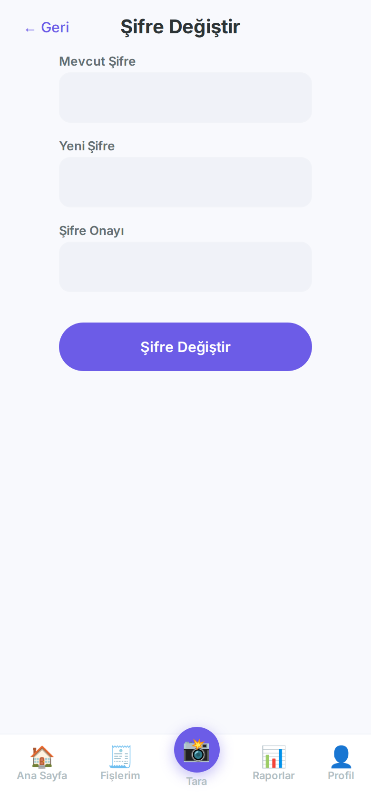

- Odaklı bir form: mevcut şifre, yeni şifre (en az 6 karakter) ve şifre onayı.
- Profil sayfasından ulaşılır ve diğer tüm oturumlu ekranlar gibi korunur.

## Mimari

- **Mobil öncelikli SPA** — telefon genişliğinde yerleşimi ve kalıcı alt sekme çubuğu olan bir React single-page uygulaması.
- **REST API** — Express backend JSON uç noktaları sunar; istekler sunucu tarafında doğrulanır ve JWT ile kimliklendirilir.
- **Token yenileme** — kısa ömürlü access token'lar ve veritabanında saklanan refresh token'lar; bir axios interceptor oturumu sessizce yeniler.
- **Yapay zekâ OCR hattı** — fiş görselleri multer ile yüklenir, OpenRouter / Gemini vision'a gönderilir; yapılandırılmış sonuç fiş formunu önceden doldurur.
- **Ortak PostgreSQL** — veriler ortak bir Postgres örneğinde tutulur; dev ve prod için ayrı veritabanları vardır.
- **i18n** — tüm arayüz metinleri i18next üzerinden geçer; varsayılan dil Türkçe, İngilizce tam çeviridir.
- **Docker + reverse proxy** — frontend ve backend konteyner olarak çalışır; bir Nginx ağ geçidi `receiptly.furkantekkartal.com` (prod) ve `receiptly-dev...` (dev) adreslerini doğru yığınlara yönlendirir.

---

🇬🇧 English version: [README.md](README.md)

*Bu doküman [ProjectReadmes](../) portfolyo koleksiyonunun bir parçasıdır.*
