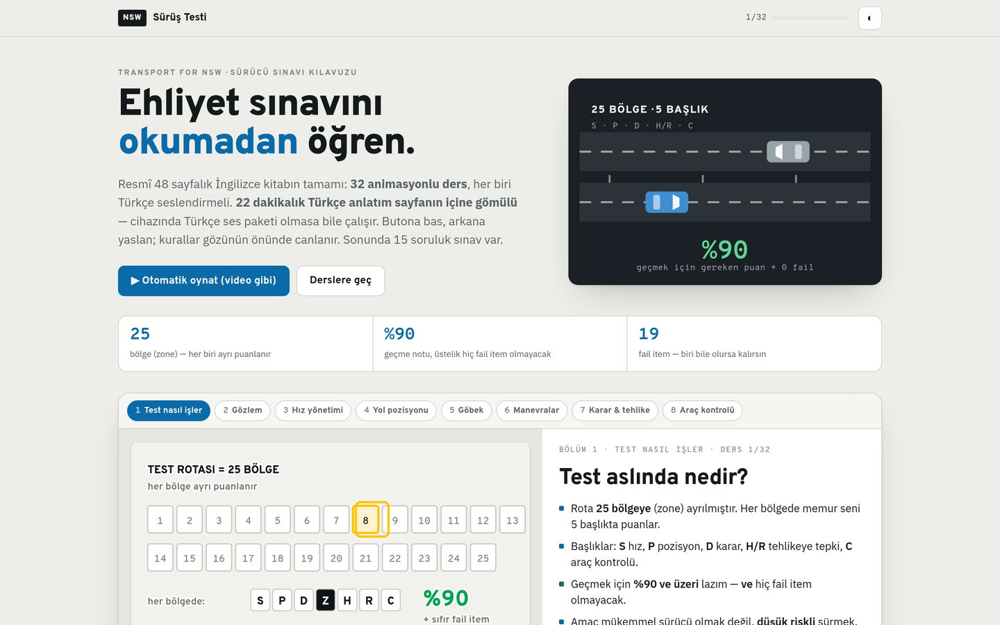
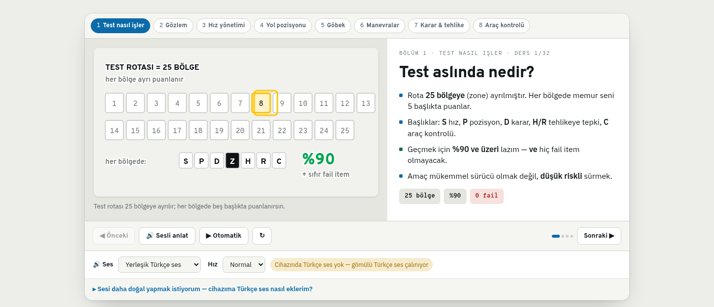
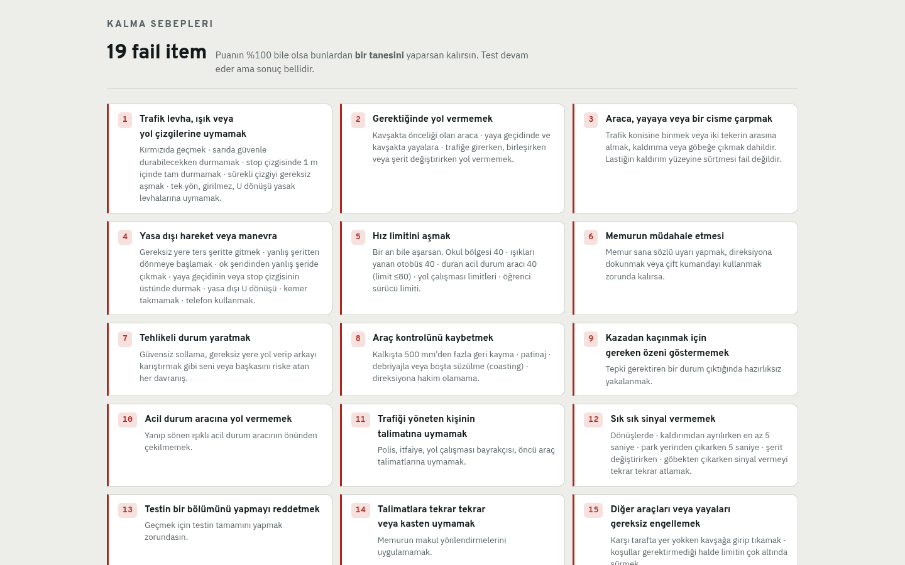
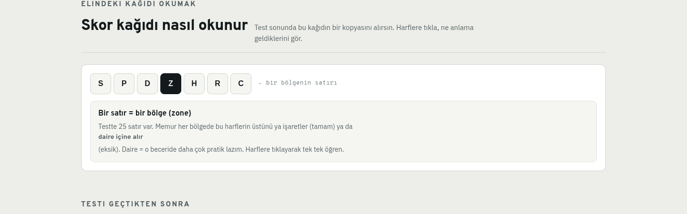
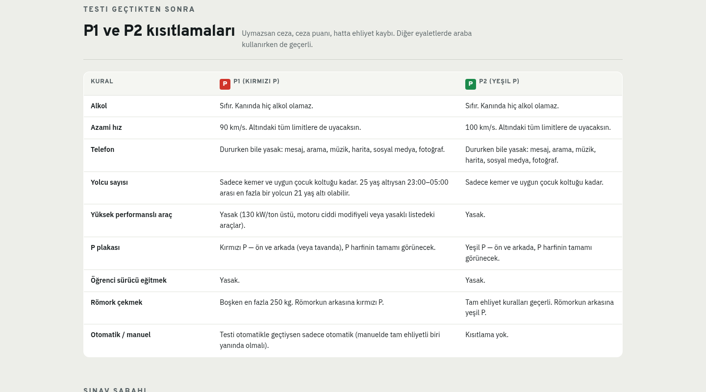
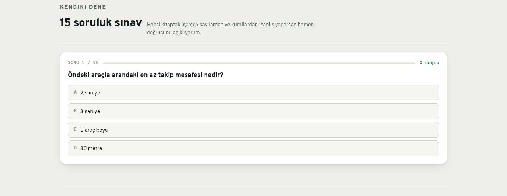
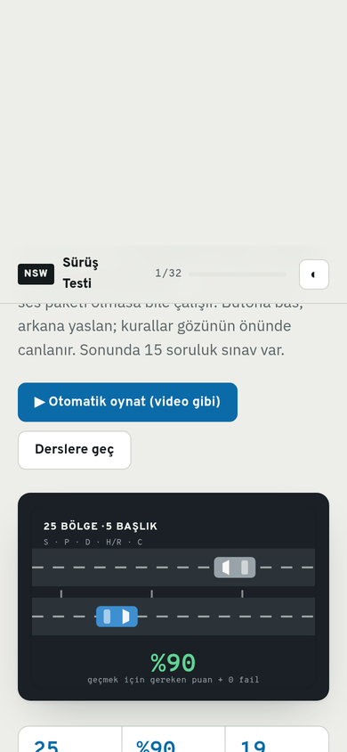

# NSW Sürüş Testi

Transport for NSW's official 48-page **A Guide to the Driving Test** rebuilt as a Turkish, animated single page. 51 lessons: 26 are silent loops cut from Transport for NSW's own videos, 25 are hand-drawn SVG scenes. Every one has Turkish narration, so it speaks even on a device with no Turkish voice installed.

🇹🇷 Türkçe versiyon: [README.tr.md](README.tr.md)

---

> ### 🚀 Try it live
>
> **URL:** [https://surus.furkantekkartal.com](https://surus.furkantekkartal.com)
>
> No login, no account, nothing to install. The whole thing is one HTML file — save it and it still works offline.

---

## Why it exists

The official guide is 48 pages of English prose. Most of what it says is spatial — where to look, how far to stop, which way to turn your head — and prose is the wrong medium for that. This page turns each rule into a small animated scene and reads it out loud in Turkish.

It also answers the question the book never does: *"Which of these 19 things am I weakest on, and what should I practise first?"*

## Features

- **32 animated lessons** — each rule is a small SVG scene: the car creeps, the head checks the blind spot, the indicator blinks, the gap closes. Grouped into 8 chapters, navigable by keyboard (`←` `→`, `Space` to speak).
- **Narration for every lesson** — Turkish audio generated with espeak-ng, one MP3 per lesson. If the device *has* a Turkish voice the browser uses it; if not, the prepared track plays instead.
- **The 19 fail items** — the binary rules that end a test regardless of score, each with the concrete behaviour that triggers it.
- **Termination reasons** — the checks that end the test *before* it starts (unroadworthy car, missing paperwork), which are refunded to nobody.
- **Score sheet reader** — the Class C sheet (Form 1408) is a grid of letters. Tap a letter to learn what the examiner meant by circling it.
- **P1 / P2 restriction table** — what changes once you pass, side by side.
- **Exam-morning checklist** — persists in the browser, so you can tick it the night before.
- **15-question exam** — every question drawn from real numbers in the book, with an explanation on each wrong answer.
- **Light and dark themes** — red, amber and green are *reserved* on this page: they mean on the page what they mean on the road. The accent is Australian information-sign blue instead.

## Tech Stack

| Layer | Technology |
|---|---|
| Page | One static HTML file — no framework, no build step |
| Graphics | Hand-authored inline SVG with CSS keyframe animation |
| Narration | espeak-ng (Turkish), one MP3 per lesson; Web Speech API when a local voice exists |
| Video | 26 silent clips cut with ffmpeg from Transport for NSW's official videos |
| Serving | nginx:alpine in Docker, behind the FTcom nginx gateway |
| Deployment | Docker Compose, production only |

## Screens

### Cover

### Lesson player
Each lesson pairs an animated scene with the rule, the measurements that matter, and — where relevant — the fail item it maps to.

### The 19 fail items

### Score sheet reader

### P1 / P2 restrictions

### 15-question exam

### Mobile

---

## Notes

This page is a Turkish summary of the official guide, **not an official document**. Where rules change, [nsw.gov.au](https://www.nsw.gov.au) and the Road User Handbook are what count.

Source: *Transport for NSW — A Guide to the Driving Test* (Pub. 07.047, 05/2026) and the Class C score sheet (Form 1408, 02/2026).
