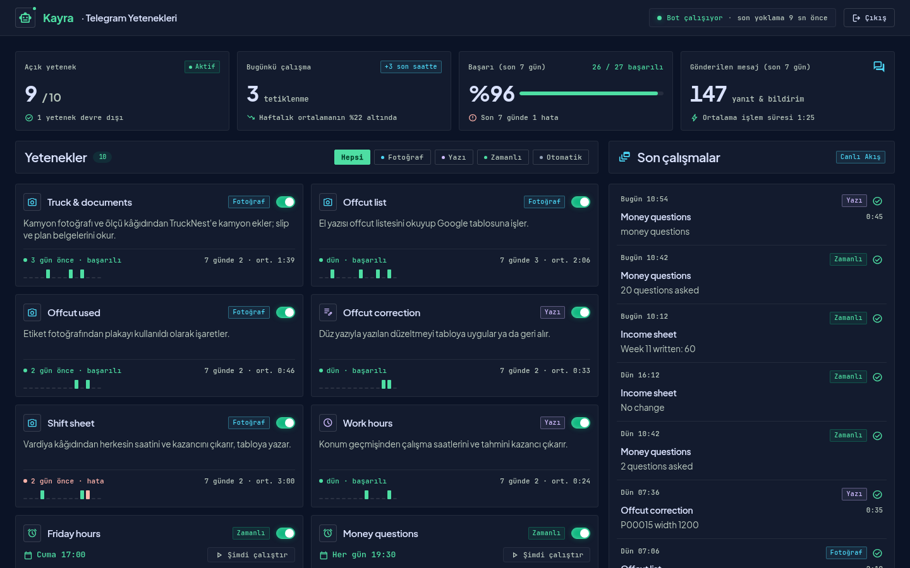
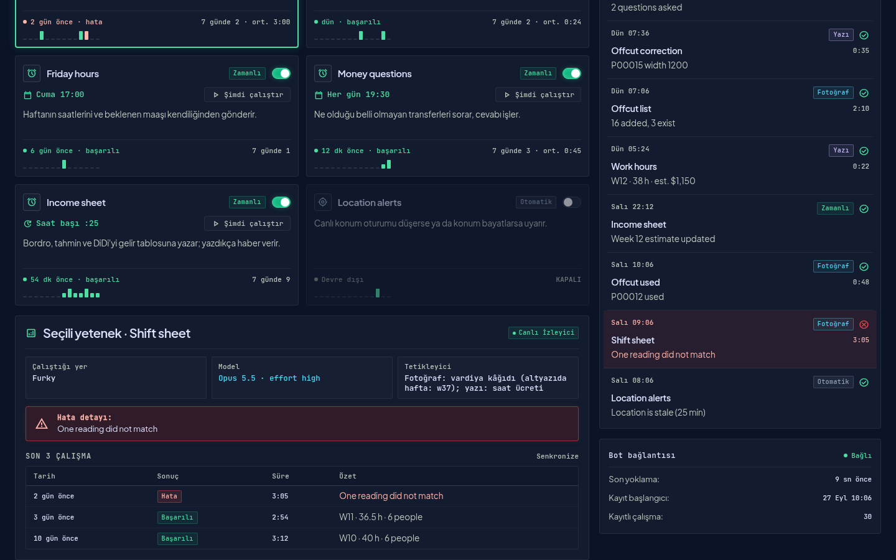
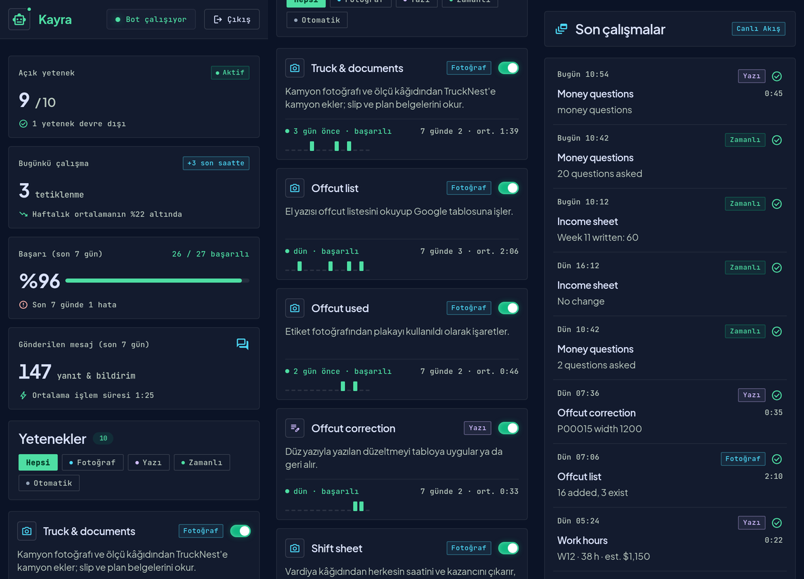
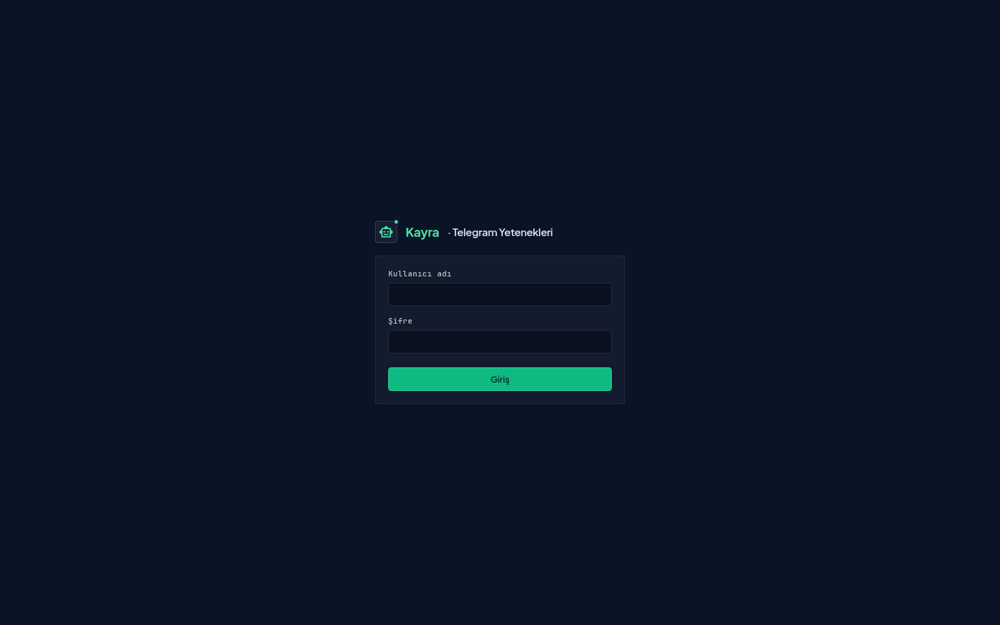

# Telegram Skills

The control room of **Kayra**, my private Telegram assistant bot. A *skill* is one thing the bot does when I send it a photo or a text, or on a schedule. This panel shows every skill as a card (when it last ran, how it went, how often it runs) and lets me switch each one on or off.

🇹🇷 Türkçe versiyon: [README.tr.md](README.tr.md)

---

> ### 🔒 Private
>
> **URL:** [https://skills.furkantekkartal.com](https://skills.furkantekkartal.com) (password protected)
>
> The screenshots below use generated sample data, not real runs.

---

## Why it exists

The bot grew from one job (adding trucks to a loading planner from photos) to ten: reading handwritten lists into a spreadsheet, marking plates as used from their labels, reading a shift sheet and computing pay, reporting work hours from location history, asking what an unexplained bank transfer was, and several scheduled notices. Until now the only way to know whether a skill still worked, or to pause one, was to ask in a terminal. This page is the answer on one screen.

## Features

- **One card per skill** — type (photo, text, scheduled, automatic), last run and its result, runs in the last 7 days, average duration and a 14-day bar strip
- **On / off switch** — a switched-off skill answers "This skill is turned off in the panel." and does nothing; scheduled skills simply skip their turn
- **Run now** — scheduled skills can be triggered from the card
- **Live feed** — every run as it happens: time, skill, trigger, result, duration and a one-line summary. Refreshes every 10 seconds
- **Selected skill** — where it runs, which model reads for it, how it is triggered, the last error and the last five runs
- **Bot heartbeat** — the header shows whether the bot is polling and when it last did

## How it works

The panel never runs a command. It reads three files the bot writes and writes two small files the bot reads:

| File | Written by | Read by | What |
|---|---|---|---|
| `runs.jsonl` | bot and its tools | panel | run events: start, tag and end of a progress card, or a single-line run |
| `heartbeat.json` | bot, every polling round | panel | 90 seconds of silence means "bot is not answering" |
| `telegram.log` | bot | panel | count of messages sent |
| `skills.json` | **panel** | bot and its tools | which skills are enabled; no file means all are on |
| `queue/*.json` | **panel** | a small host-side runner | "run now" requests; the command comes from an allow-list on the host |

Because the bot already shows a live progress card in Telegram for every job, the run log hooks into that card: opening it is the start of a run, its final state is the end. No skill had to be rewritten to be tracked.

## Design

The visual design was generated with **Google Stitch** (design system "Kayra Control Plane": dark slate surfaces, emerald accent, hairline borders, Plus Jakarta Sans with JetBrains Mono). The front end implements that design system; the placeholder numbers Stitch drew are replaced with real data.

## Tech Stack

| Layer | Technology |
|---|---|
| Server | Python standard library only (`http.server`), scrypt password hash, signed session cookie |
| Front end | Plain HTML, CSS and one JavaScript module; no framework, no build step |
| Fonts and icons | Self-hosted Plus Jakarta Sans, JetBrains Mono and a Material Symbols subset |
| Security | Strict Content-Security-Policy (no inline script or style, no third-party requests), read-only container |
| Serving | One Docker container behind the FTcom nginx gateway |
| Deployment | Docker Compose, production only |

