# Wardrobe

An AI-powered digital wardrobe. Photograph your clothes → the AI cuts them out, redraws them on an invisible **ghost mannequin** and auto-tags every piece → build outfits on a sticker canvas → try them on a virtual mannequin (or on your own photo) → ask for outfit ideas in one sentence.

🇹🇷 Türkçe versiyon: [README.tr.md](README.tr.md)

---

> ### 🚀 Try it live
>
> **URL:** [https://wardrobe.furkantekkartal.com](https://wardrobe.furkantekkartal.com)
>
> **Demo login:** username `demo` · password `demo1234`
>
> **Note:** registration is **invite-only**. A new account needs an invite code from the owner, so please use the demo account to explore the app.

---

## Features

- **Ghost mannequin images** — every garment gets an AI-generated "worn by nobody" version: the piece is cut out of the original photo and redrawn with volume and shape, as in a product catalogue. The original photo is never thrown away; one tap switches back to it.
- **AI auto-tagging (Claude)** — one photo is enough: the AI names the garment, picks category and subcategory, detects the main and secondary colours and generates style tags.
- **Bulk import with HEIC support** — drop hundreds of photos at once. iPhone `.HEIC` files are converted to JPEG **in the browser** and shrunk before upload; everything lands in a draft area and only enters the wardrobe once you approve it.
- **Sticker outfit canvas** — compose outfits by dragging the cut-outs: one-finger drag, pinch to scale, layer controls.
- **Virtual try-on with three bases** — try clothes on an invisible **ghost** mannequin, on a **virtual mannequin** (male/female), or on **your own photo**.
- **Outfit ⇄ try-on link** — an outfit can be sent straight into the try-on cabin, and the generated image is written back onto that same outfit. You then pick which one is the cover: the canvas or the mannequin.
- **Natural-language outfit recommender** — write one sentence ("I'm meeting friends for coffee…") and Claude suggests complete outfits from the clothes you actually own, with reasoning and live weather awareness.
- **Per-user AI credit system** — every AI call has a real USD price, charged against the user's balance with a monthly cap.
- **Invite-only access with admin tools** — admins mint single-use invite codes and top up user credits.

## Tech Stack

| Layer | Technology |
|---|---|
| Frontend | React 19, Vite 7, Tailwind CSS 4, React Router |
| Backend | Node.js 20, Express 4, async AI job workers with a concurrency limit |
| Database | PostgreSQL (shared instance, separate dev/prod databases) |
| Auth | JWT, invite-gated registration |
| AI — tagging & outfit ideas | Claude Sonnet |
| AI — ghost mannequin & try-on | Gemini image models (via OpenRouter) |
| AI — background removal | PhotoRoom, with a local IMG.LY fallback |
| Weather | OpenWeather |
| Deployment | Docker Compose behind an Nginx reverse proxy |

## Screens

All screenshots are from the live app in a mobile viewport (390 px) — the UI is mobile-first. The interface is in Turkish; each section translates the key labels.

## Login & Register

 

- Sign in with a username **or** an email address; sessions use JWT tokens.
- *"Hesap Oluştur"* (create account) is invite-only: the first field is the invite code (*Davet Kodu*), checked live against the server. Codes are single-use and only admins can mint them, which keeps the app private.

## Dashboard

- A greeting by time of day, then the two numbers that matter: **68 *parça*** (pieces) and **2 *kombin*** (outfits).
- *"Son Eklenenler"* (recently added) is a grid of the newest pieces — all shown as ghost-mannequin cut-outs.
- *"Kombinler"* (outfits) is a row of saved outfit cards.
- The floating camera button adds a garment from anywhere; the bottom bar has five tabs: *Ana Sayfa* (home), *Gardırop* (wardrobe), *Kombinlerim* (my outfits), *Dene* (try on), *Profil* (profile).

## Wardrobe

- The whole closet as a catalogue-style grid — *"68 / 68 parça"* means every piece is currently shown.
- Search (*"Kıyafet ara…"*) plus category chips with live counts: *Tümü* (all), *Aksesuar* (accessories), *Dış Giyim* (outerwear), *Üst* (tops)… The filter drawer adds tag and colour filters.
- The little cart icon on each card drops the piece into the **try-on cabin**, so you can collect items while browsing and try them all at once.
- Filters and scroll position survive navigation: open a garment, come back, and you are exactly where you left off.

## Clothing Detail

- The garment is shown on a transparent checkerboard — proof of the automatic background removal.
- The toggle under the image switches between *Ghost mannequin* (the AI-redrawn version, used everywhere in the app) and *Orijinal fotoğraf* (the photo you actually took). **The original is always kept.**
- *"Görseli yeniden üret"* (regenerate image) runs the ghost-mannequin generation again if the first result is not good enough.
- Name, category and subcategory come from the AI and are editable inline; *Renk* shows the detected main and secondary colours; below them sit the AI-generated style tags.

## Add Clothing

 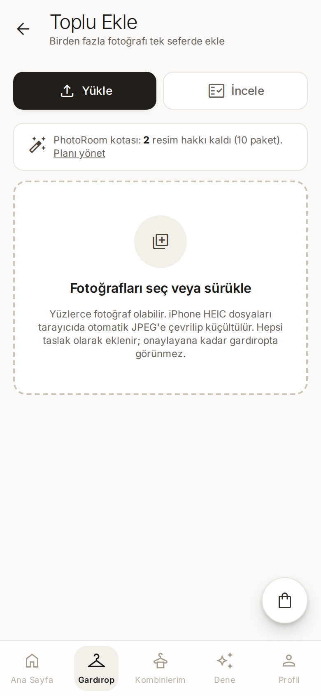

- **Single add** (*"Kıyafet Ekle"*): take a photo or pick one from the gallery. Uploading starts an async pipeline — compression → background removal → ghost mannequin → Claude analysis → tags — and the UI animates through the real server-side stages.
- **Bulk add** (*"Toplu Ekle"*): *"Yüzlerce fotoğraf olabilir. iPhone HEIC dosyaları tarayıcıda otomatik JPEG'e çevrilip küçültülür. Hepsi taslak olarak eklenir; onaylayana kadar gardıropta görünmez."* — hundreds of photos at a time, HEIC converted in the browser, everything queued as drafts.
- The *İncele* (review) tab shows the drafts as a grid. The AI flags cut-outs it is not happy with, so you only hand-check the problematic ones instead of all 200.
- The banner tracks the remaining PhotoRoom quota, because background removal is a paid API.

## Outfit Builder

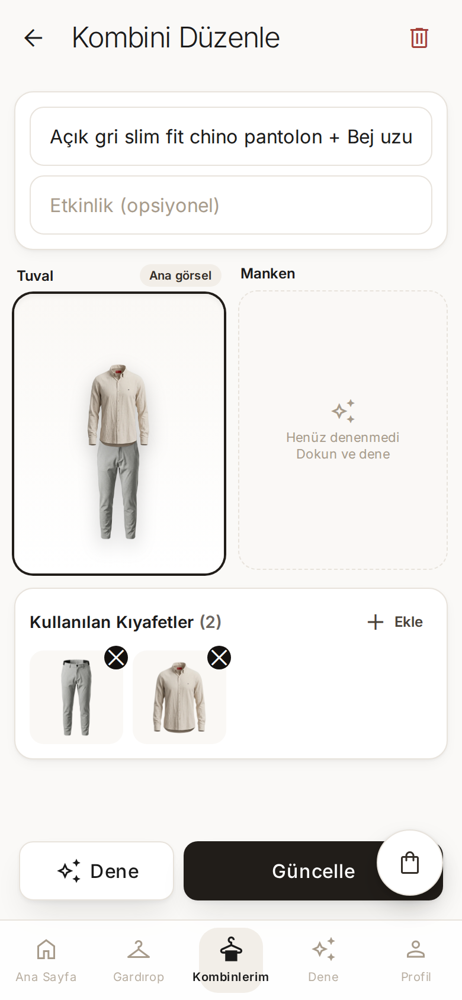 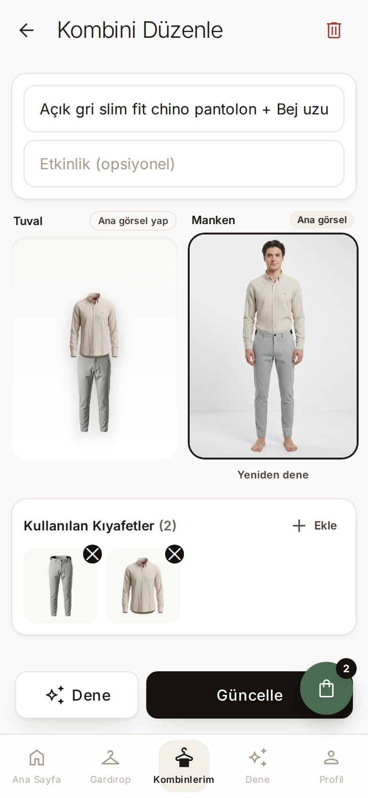

- A 3:4 canvas where the cut-outs behave like stickers: drag with one finger, pinch to resize, reorder layers.
- **Left:** *Tuval* (canvas) is the cover and the *Manken* (mannequin) slot is still empty — *"Henüz denenmedi / Dokun ve dene"* (not tried yet, tap to try).
- **Right:** after a try-on, both versions live side by side and *"Ana görsel yap"* (make it the cover) decides which one represents the outfit in lists. The other one stays visible on this page.
- *"Kullanılan Kıyafetler"* (used pieces) lists the garments with quick remove and an *Ekle* (add) picker.
- The bottom bar has *Dene* (try on) and *Güncelle* (update) — the try-on button carries this exact outfit into the cabin.

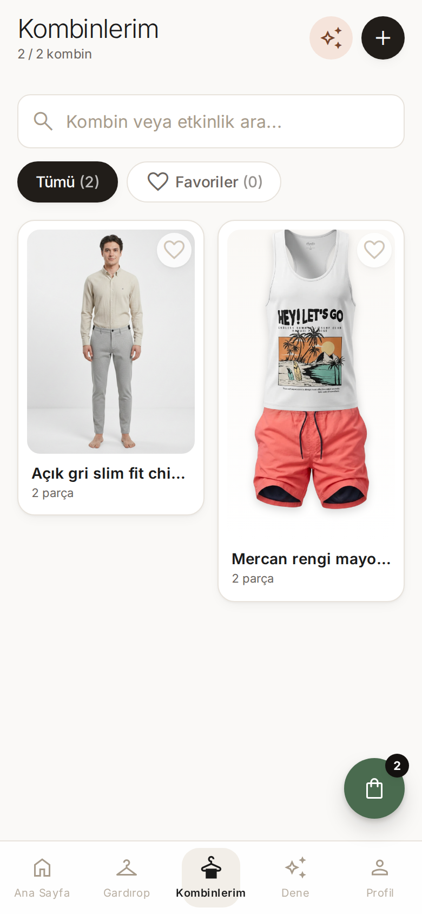

In *Kombinlerim* the two cover types sit next to each other: one outfit shows its mannequin photo, the other its canvas collage.

## Virtual Try-On

Three different bases — this is the heart of the app.

### 1. The cabin

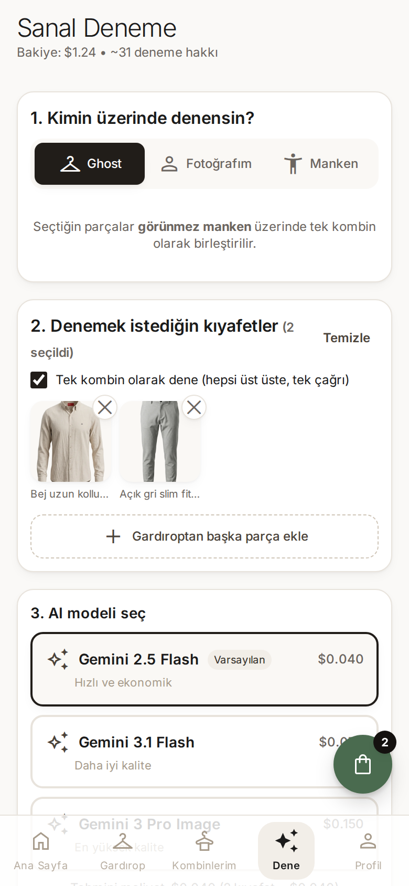

- *"Sanal Deneme"* — the header shows the spendable balance and roughly how many tries are left.
- Step 1, *"Kimin üzerinde denensin?"* (on whom?): **Ghost** (invisible mannequin), **Fotoğrafım** (my photo), **Manken** (virtual mannequin).
- Step 2 lists the garments collected in the cabin; *"Tek kombin olarak dene"* renders them as one look in a single API call.
- Step 3 lets you pick the image model with transparent per-call pricing, and the estimated cost is shown before you start.

### 2. Ghost mannequin result

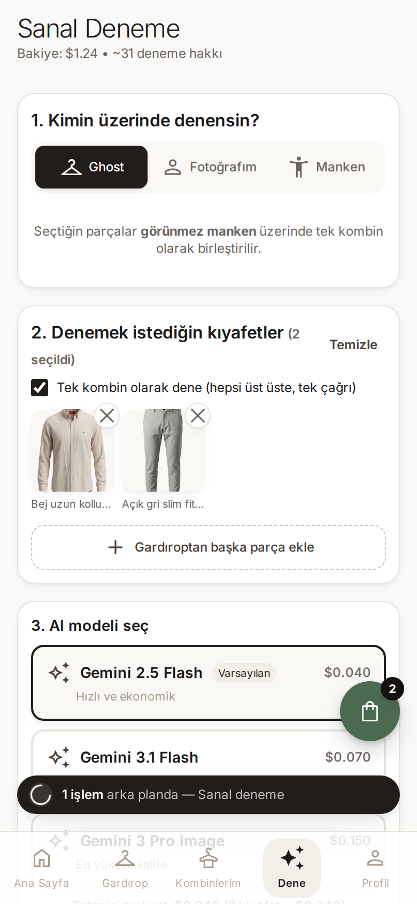 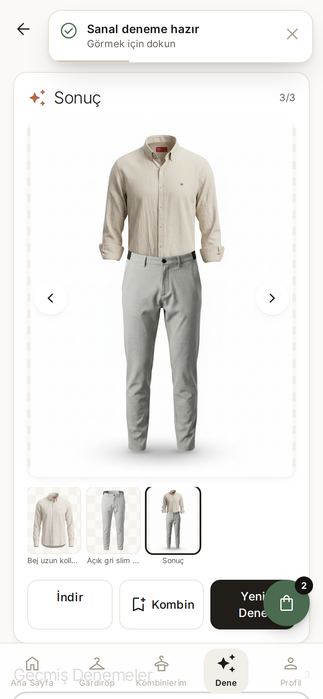

- The job runs on the server; a banner shows *"1 işlem arka planda"* (1 job in the background) and you can keep using the app while it renders.
- The result is the shirt and trousers worn by **nobody** — a floating, correctly draped outfit. The film strip below keeps every input frame plus the *Sonuç* (result), so you can compare.

### 3. Virtual mannequin result

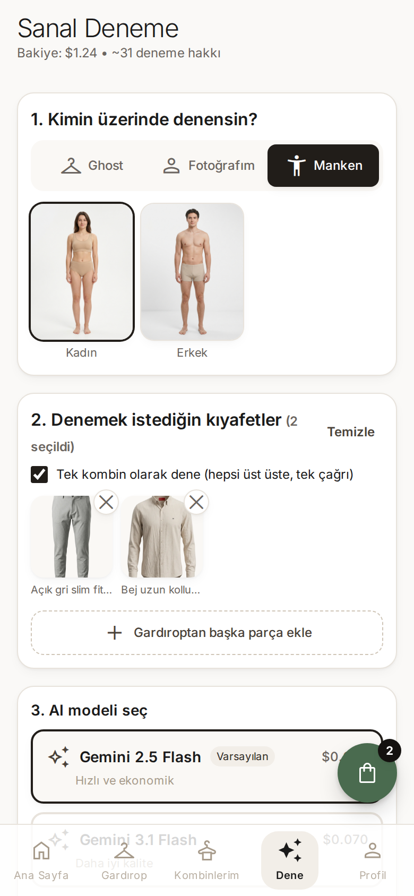 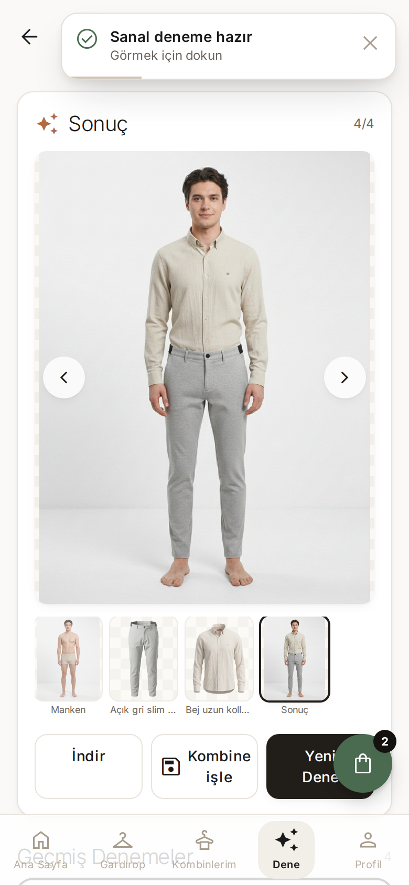

- Under the *Manken* tab you choose a *Kadın* (female) or *Erkek* (male) mannequin, and the same outfit is rendered on that body.
- Because this try-on was started from an outfit, the button says *"Kombine işle"* (write back into the outfit): the image is saved onto that outfit instead of creating a duplicate.
- The third option, *Fotoğrafım*, does the same thing with a photo of yourself.

## AI Outfit Recommender

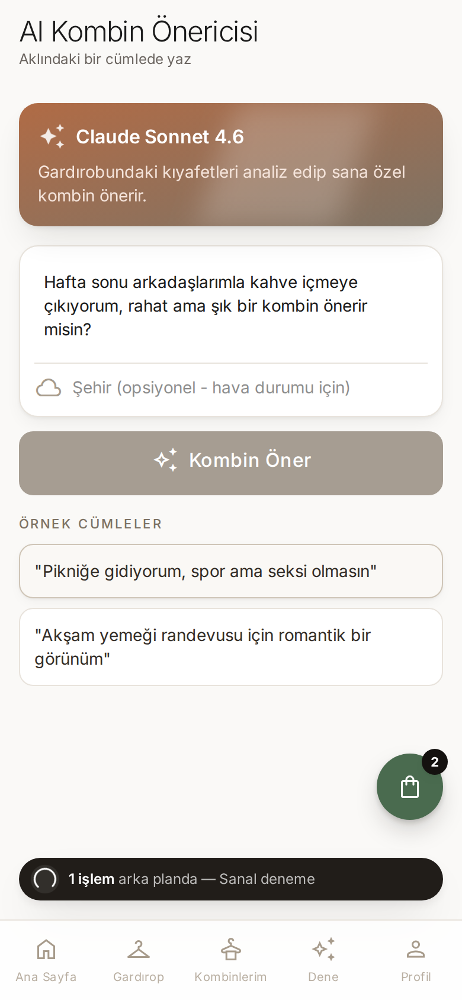 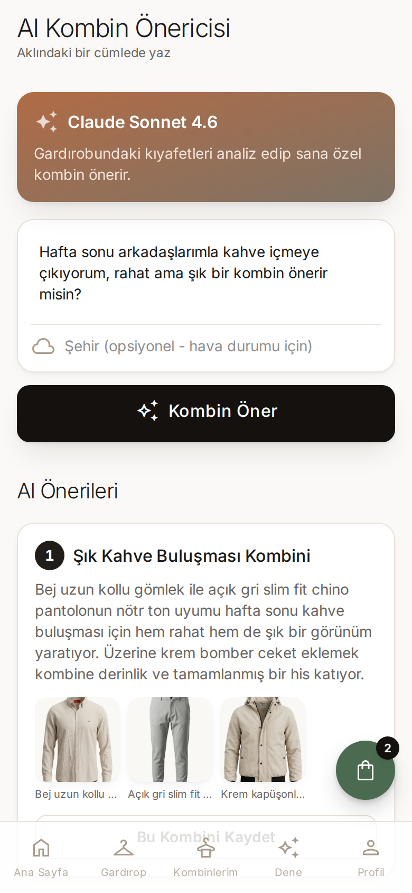

- Describe your plan in one sentence — here: *"I'm going out for coffee with friends this weekend, can you suggest something comfortable but stylish?"*
- The optional city field makes the suggestion weather-aware via OpenWeather.
- Claude answers with named outfits — *"Şık Kahve Buluşması Kombini"* (stylish coffee-meeting outfit) — explains **why** those pieces work together, and composes them **only** from clothes that are actually in your wardrobe.
- *"Bu Kombini Kaydet"* turns any suggestion into a saved outfit you can then edit on the canvas or try on.
- Full-page capture with all suggestions: [18b-ai-result-full.png](images/18b-ai-result-full.png)

## Statistics, Activity & Profile

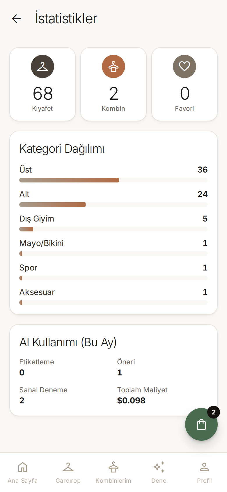 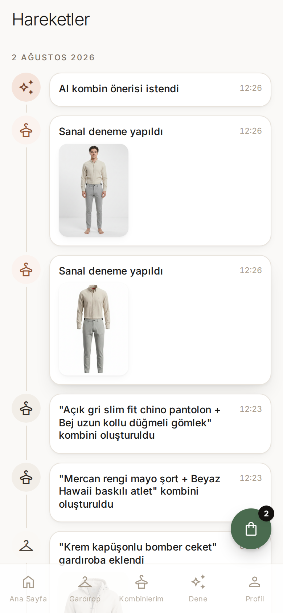 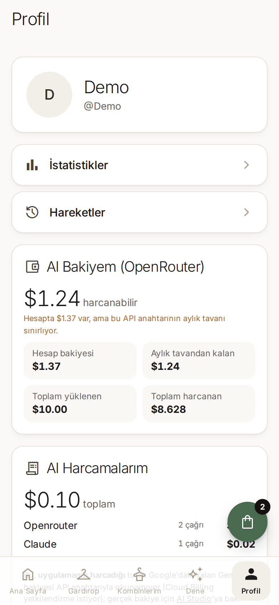

- **İstatistikler** — totals, a bar per category (*Üst* 36, *Alt* 24, *Dış Giyim* 5…) and this month's AI usage with its real cost.
- **Hareketler** — a date-grouped timeline of everything that happened: pieces added, try-ons rendered, recommendations requested, each with a thumbnail that opens in a lightbox.
- **Profil** — the credit dashboard: spendable balance, account balance, monthly cap, total loaded and total spent, plus a per-provider breakdown of what this app has spent. Admin accounts also get invite-code creation and credit top-ups here.

## Architecture

- **Mobile-first SPA** — a React single-page app with a phone-width layout and a bottom tab bar, served by Nginx. Scroll position and filters are restored when you navigate back, so long lists never jump to the top.
- **REST API + async job polling** — the Express backend exposes JSON endpoints; slow AI work (tagging, ghost mannequin, recommendations, try-on) runs as background jobs with a concurrency limit, so a 200-photo import cannot flood the machine. The frontend polls until a "ready" toast appears.
- **Two images per garment, forever** — the original photo and the ghost-mannequin render are both stored; the app shows the ghost version but the original can always be brought back or re-rendered.
- **Shared PostgreSQL** — separate dev and prod databases on one instance; schema migrations run automatically on backend startup.
- **Per-user uploads on a Docker volume** — originals, cut-outs and try-on results are stored per user on a persistent volume, outside the containers.
- **Credit accounting per AI call** — every provider call is priced in USD and charged against the user's balance, with monthly limits and admin top-ups.
- **Docker Compose behind Nginx** — separate dev and prod stacks; the reverse proxy routes `wardrobe.furkantekkartal.com` (prod) and `wardrobe-dev.furkantekkartal.com` (dev) to the right containers.

---

🇹🇷 Türkçe versiyon: [README.tr.md](README.tr.md)

*This document is part of the [ProjectReadmes](../) portfolio collection.*
