# Wardrobe

Yapay zekâ destekli dijital gardırop: kıyafetlerinizi fotoğraflayın → AI arka planı silip her parçayı otomatik etiketlesin → sticker tuvalinde kombinler oluşturun → canlı hava durumuyla AI kombin önerileri alın → kıyafetleri kendi fotoğrafınız üzerinde sanal olarak deneyin.

🇬🇧 English version: [README.md](README.md)

---

> ### 🚀 Canlı deneyin
>
> **URL:** [https://wardrobe.furkantekkartal.com](https://wardrobe.furkantekkartal.com)
>
> **Demo giriş:** kullanıcı adı `demo` · şifre `demo1234`
>
> **Not:** kayıt **yalnızca davetiyelidir**. Yeni bir hesap için uygulama sahibinden davet kodu gerekir; bu yüzden uygulamayı keşfetmek için lütfen demo hesabını kullanın.

---

## Özellikler

- **AI otomatik etiketleme (Claude)** — tek bir fotoğraf yükleyin; AI kıyafete isim verir, kategorisini seçer, ana ve yan renkleri tespit eder ve stil etiketleri üretir.
- **Otomatik arka plan silme** — her kıyafet fotoğrafı arka planından ayrılır (Photoroom / imgly); gardırop temiz bir ürün kataloğu gibi görünür.
- **Sticker kombin tuvali** — arka planı silinmiş kıyafetleri tuval üzerinde sürükleyerek kombin oluşturun: tek parmakla taşıma, iki parmakla boyutlandırma, katman kontrolleri.
- **Doğal dilde kombin önerici** — tek bir cümle yazın ("Arkadaşlarımla kahve içmeye çıkıyorum...") ve Claude, şehrinizdeki canlı hava durumunu (OpenWeather) dikkate alarak kendi gardırobunuzdan gerekçeli, eksiksiz kombinler önersin.
- **Sanal deneme** — kendi fotoğrafınızı seçin, kıyafetleri seçin, AI modelini seçin (FASHN / Gemini) ve kıyafetleri üzerinizde görün.
- **Kullanıcı başına AI kredi sistemi** — her AI çağrısının gerçek bir USD fiyatı vardır; her kullanıcının kredi bakiyesi ve aylık limiti bulunur.
- **Davetiyeli erişim ve yönetici araçları** — yöneticiler tek kullanımlık davet kodları üretir ve kullanıcı kredilerini yükler.
- **Yerleşik gözlemlenebilirlik** — istatistikler, hareket zaman çizelgesi ve canlı log görüntüleyici doğrudan uygulamanın içindedir.

## Teknoloji Yığını

| Katman | Teknoloji |
|---|---|
| Frontend | React 19, Vite 7, Tailwind CSS 4, React Router 7 |
| Backend | Node.js 20, Express 4, asenkron AI iş kuyruğu (job workers) |
| Veritabanı | PostgreSQL (ortak örnek, ayrı dev/prod veritabanları) |
| Kimlik doğrulama | JWT, davet kodlu kayıt |
| AI — etiketleme & kombin | Claude Sonnet |
| AI — sanal deneme | FASHN / Gemini (OpenRouter üzerinden) |
| AI — arka plan silme | Photoroom / imgly |
| Hava durumu | OpenWeather |
| Dağıtım | Nginx reverse proxy arkasında Docker Compose |

## Ekranlar

Tüm ekran görüntüleri canlı uygulamadan, mobil görünümde (390 px) alınmıştır — arayüz mobil öncelikli tasarlanmıştır.

## Giriş

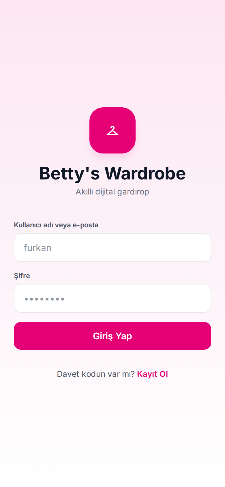

- Pembe markalı giriş ekranı: uygulama logosu ve *"Akıllı dijital gardırop"* sloganı.
- Kullanıcı adı **veya** e-posta ile ve şifreyle giriş yapılır.
- Alttaki *"Davet kodun var mı? Kayıt Ol"* bağlantısı kayıt ekranına götürür.
- Oturumlar JWT token ile yönetilir; giriş yapmış kullanıcılar doğrudan ana sayfaya yönlendirilir.

## Kayıt

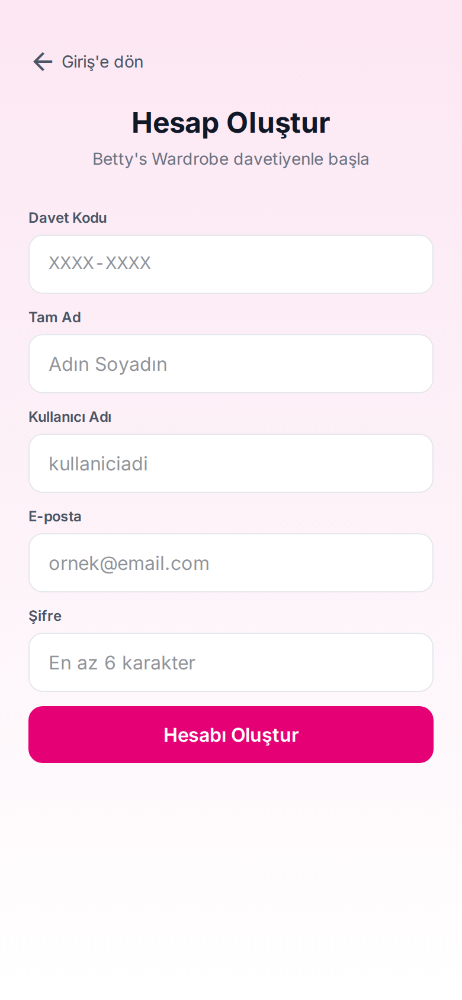

- *"Hesap Oluştur"* — kayıt yalnızca davetiyelidir: ilk alan davet kodudur (*Davet Kodu*, `XXXX-XXXX` biçiminde).
- Kod, sunucuda anlık olarak doğrulanır; yalnızca geçerli ve kullanılmamış kodlar kabul edilir.
- Kalan alanlar standarttır: tam ad, kullanıcı adı, e-posta ve en az 6 karakterlik şifre.
- Davet kodları tek kullanımlıktır ve yalnızca yönetici tarafından üretilebilir — uygulama böylece özel kalır.

## Ana Sayfa

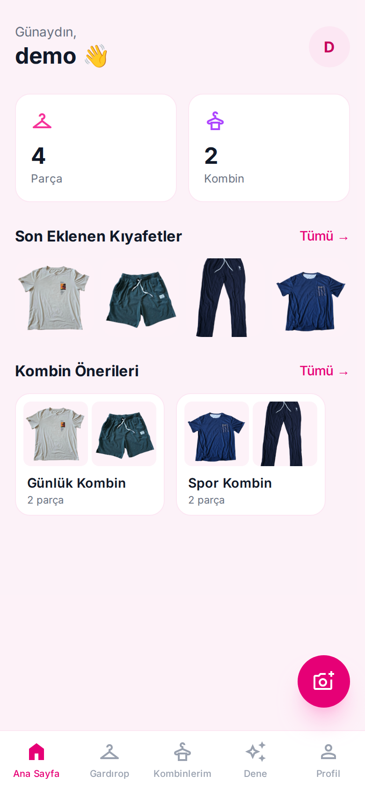

- Ana ekran kullanıcıyı günün saatine göre selamlar (*"İyi akşamlar, demo"*).
- İki istatistik kartı gardırobun boyutunu gösterir: 4 *Parça* ve 2 *Kombin*.
- *"Son Eklenen Kıyafetler"* en yeni parçaların ızgarasıdır — hepsinin arka planı çoktan silinmiştir.
- *"Kombin Önerileri"* kayıtlı kombin kartlarının yatay kaydırılan sırasıdır.
- Yüzen kamera düğmesi her yerden yeni kıyafet ekler; alt çubukta beş sekme vardır: *Ana Sayfa*, *Gardırop*, *Kombinlerim*, *Dene*, *Profil*.

## Gardırop

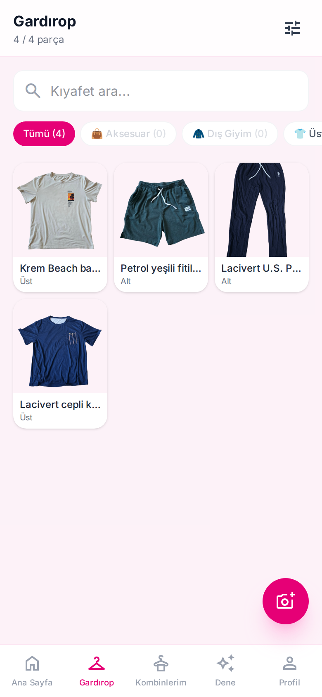

- Tüm dolap fotoğraf ızgarası olarak — *"4 / 4 parça"* tüm parçaların listelendiğini gösterir.
- Arama çubuğu (*"Kıyafet ara..."*) ve canlı sayaçlı kategori çipleri: *Tümü*, *Aksesuar*, *Dış Giyim*, *Üst*...
- Sağ üstteki filtre çekmecesi etiket ve renk filtreleri ekler.
- Her kart AI'nın ürettiği ismi ve kategoriyi gösterir — örneğin *"Krem Beach baskılı t-shirt"*, *Üst*.

## Kıyafet Detayı

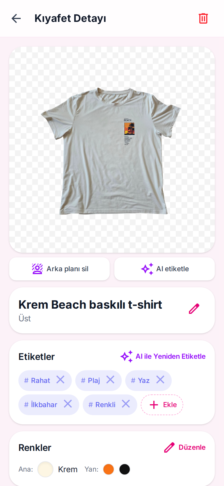

- Kıyafet şeffaf satranç deseni üzerinde gösterilir — otomatik arka plan silmenin kanıtı.
- İsim ve kategori AI'dan gelir ve yerinde düzenlenebilir.
- *Etiketler* AI'nın ürettiği stil çipleridir — burada *Rahat*, *Plaj*, *Yaz*, *İlkbahar*, *Renkli* — ekleme/silme ve *"AI ile Yeniden Etiketle"* düğmesiyle birlikte.
- *Renkler*: AI ana rengi (*Krem*) ve yan renk örneklerini tespit etmiştir.
- Ek eylemler: *"Arka planı sil"* ve *"AI etiketle"* istenildiğinde yeniden çalıştırılabilir.

## Kıyafet Ekle

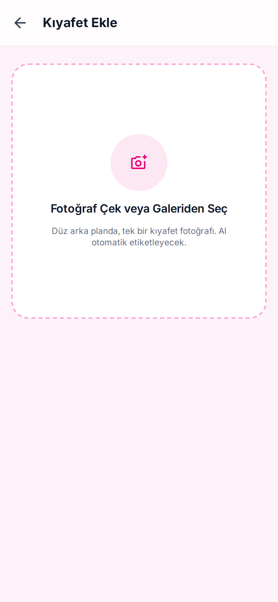

- *"Kıyafet Ekle"*: fotoğraf çekin veya galeriden seçin.
- İpucu her şeyi anlatıyor: *"Düz arka planda, tek bir kıyafet fotoğrafı. AI otomatik etiketleyecek."*
- Yükleme asenkron bir hattı başlatır: fotoğraf sıkıştırma → arka plan silme → Claude kıyafet analizi → etiket üretimi.
- İş sunucuda arka planda çalışır; arayüz aşamaları animasyonla gösterir ve biten parça gardıroba düşer.

## Kombinler

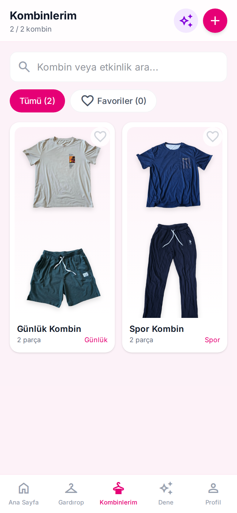

- *"Kombinlerim"* kayıtlı kombinleri, kesilmiş kıyafetlerden oluşan kolaj kartları olarak listeler.
- Her kart kombin adını, parça sayısını ve etkinlik etiketini gösterir — *Günlük*, *Özel gün*.
- *Tümü* ve *Favoriler* arasında filtrelenir; karttaki kalp favori durumunu değiştirir.
- Arama hem kombin adında hem etkinlikte çalışır.
- **+** düğmesi tuval editörünü açar; pırıltı düğmesi AI önericisine atlar.

## Kombin Tuvali

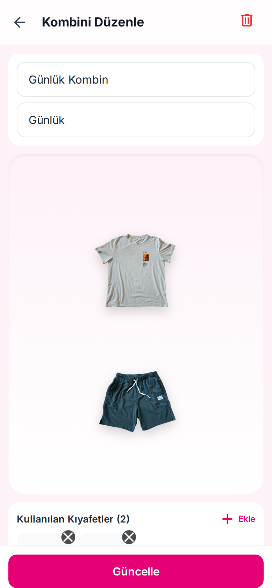

- İmza özellik: arka planı silinmiş kıyafetlerin sticker gibi davrandığı 3:4 oranında bir tuval.
- Her parça tek parmakla taşınır, iki parmakla boyutlandırılır, katman sırası değiştirilir — burada krem Beach baskılı tişört, petrol yeşili şortun üzerine yerleştirilmiş.
- Kombine bir isim (*"Günlük Kombin"*) ve etkinlik (*"Günlük"*) verilir.
- *"Kullanılan Kıyafetler (3)"* parçaları hızlı silme düğmeleriyle listeler; *Ekle* kategori filtreli seçiciyi açar.
- *Güncelle* kompozisyonu kaydeder; aynı ekran mevcut kombinleri de düzenler.

## AI Kombin Önericisi

Uygulamanın amiral gemisi AI özelliği. Planınızı tek cümleyle anlatırsınız; Claude gerçekten sahip olduğunuz kıyafetlerden kombin kurar.

### 1. Girdi

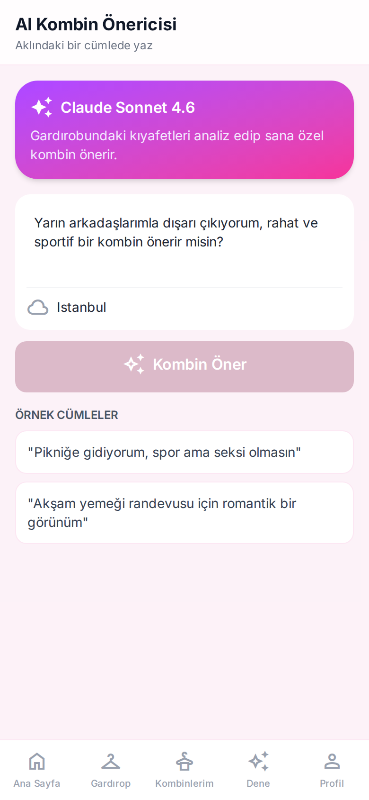

- *"AI Kombin Önericisi"* — *"Aklındaki bir cümlede yaz"*.
- Gradyan kart modeli belirtir: **Claude Sonnet** gardırobunuzu analiz edip size özel kombin önerir.
- Örnek istem: *"Yarın arkadaşlarımla dışarı çıkıyorum, rahat ve sportif bir kombin önerir misin?"*
- İsteğe bağlı şehir alanı (burada *Istanbul*) öneriyi OpenWeather üzerinden hava durumuna duyarlı hale getirir.
- Alttaki örnek cümleler (*"Pikniğe gidiyorum..."*) ilk kez kullananlara yol gösterir.

### 2. Sonuç

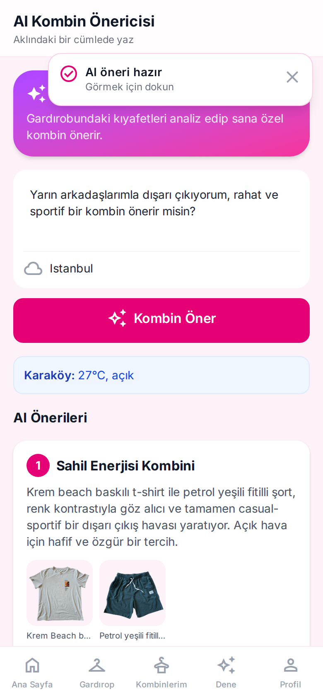

- İş asenkron çalışır; *"AI öneri hazır"* bildirimi düşer.
- Canlı hava durumu çipi kullanılan tahmini gösterir: **"Karaköy: 27°C, açık"**.
- AI isimli kombinler döndürür — ilki *"Sahil Enerjisi Kombini"*, tam gerekçesiyle: krem baskılı tişört ile petrol yeşili şortun renk kontrastı, açık hava için rahat ve sportif bir görünüm oluşturuyor.
- Her öneri yalnızca kullanıcının gardırobundaki gerçek parçalardan oluşur ve küçük görsellerle gösterilir.
- *"Bu Kombini Kaydet"* düğmesi herhangi bir öneriyi kayıtlı kombine dönüştürür.

## Sanal Deneme

Kendi fotoğrafınızı seçin, kıyafetleri seçin; AI o kıyafetleri üzerinizdeyken gösterir.

### 1. Kurulum

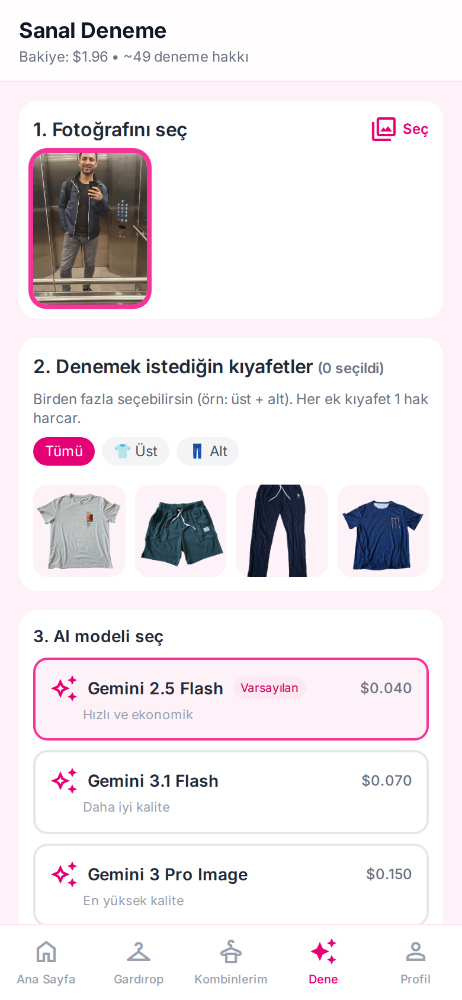

- *"Sanal Deneme"* — başlıkta kredi bakiyesi: *"Bakiye: $2.00 • ~50 deneme hakkı"*.
- 1. adım: kendi vücut fotoğraflarınızdan birini seçin (*"Fotoğrafını seç"*).
- 2. adım: denemek istediğiniz kıyafetleri seçin — çoklu seçim mümkündür (üst + alt) ve her ek kıyafet 1 hak harcar.
- 3. adım: AI modelini seçin — varsayılan *Gemini 2.5 Flash*, deneme başına $0.040 ile "hızlı ve ekonomik".

### 2. İşlem Sürerken

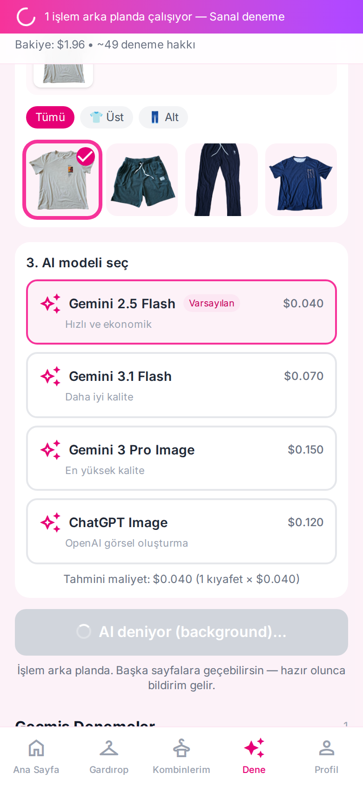

- Şeffaf fiyatlı model listesi: Gemini 2.5 Flash $0.040, Gemini 3.1 Flash $0.070, Gemini 3 Pro Image $0.150 ("en yüksek kalite"), ChatGPT Image $0.120.
- *"Tahmini maliyet"* başlamadan önce hesaplanır: 1 kıyafet için $0.040.
- İş arka planda çalışır — mor bant *"1 işlem arka planda çalışıyor"* der.
- Sayfadan ayrılıp uygulamayı kullanmaya devam edebilirsiniz; sonuç hazır olunca bildirim gelir.

### 3. Sonuç

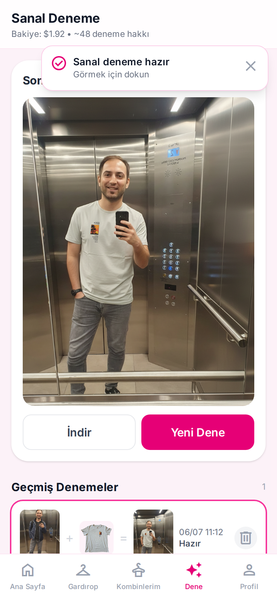

- Demo hesabındaki krem Beach tişört, kullanıcının kendi ayna fotoğrafına giydirilmiş — poz, oda ve ışık korunmuş.
- *"Sanal deneme hazır"* bildirimi düşer; bakiye $1.92'ye inmiştir (~48 hak).
- *İndir* görseli kaydeder; *Yeni Dene* yeni bir deneme başlatır.
- *"Geçmiş Denemeler"* "fotoğraf + kıyafet = sonuç" satırlarıyla, zaman damgalı ve silinebilir bir geçmiş tutar.

## İstatistikler

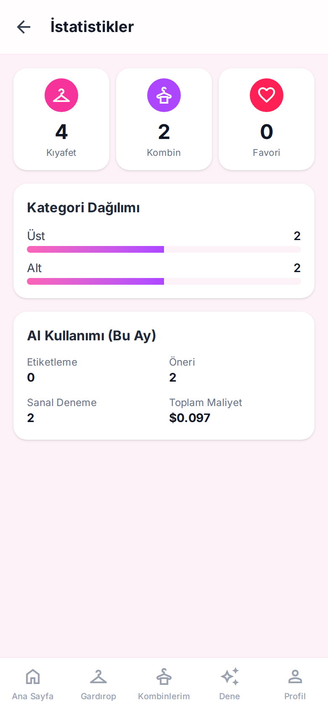

- *"İstatistikler"*: üstte toplamlar — 4 *Kıyafet*, 2 *Kombin*, 0 *Favori*.
- *"Kategori Dağılımı"* kategori başına bir çubuk çizer: Üst 2, Alt 2.
- *"AI Kullanımı (Bu Ay)"* etiketleme, öneri ve sanal deneme sayılarını — ve gerçek toplam maliyeti ($0.097) gösterir.
- Maliyet rakamı doğrudan backend'deki çağrı başına kredi muhasebesinden gelir.

## Hareketler

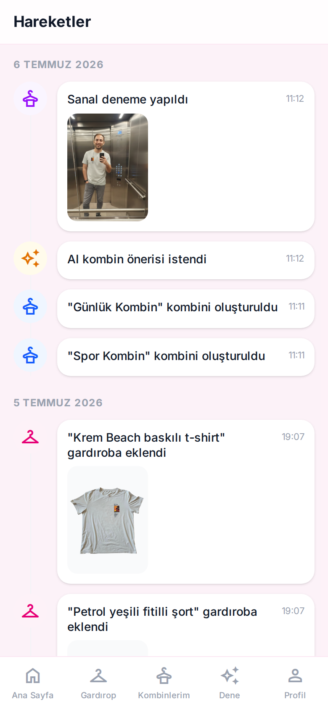

- *"Hareketler"*, hesapta olan her şeyin tarihe göre gruplanmış zaman çizelgesidir.
- Olay türleri arasında *"Sanal deneme yapıldı"*, *"AI kombin önerisi istendi"* ve *"... gardıroba eklendi"* vardır.
- Olaylar lightbox'ta açılan küçük görseller taşır — her kaydın hangi kıyafete veya sonuca ait olduğu görülür.
- Zaman damgaları bütün bir oturumu geriye doğru izlemeyi kolaylaştırır.

## Loglar

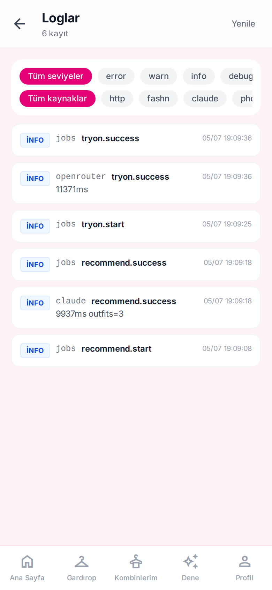

- *"Loglar"* — uygulamanın içinde gerçek bir log görüntüleyici; üretimde AI hatları çalıştıran tek kişilik bir geliştirici için çok kullanışlı.
- Seviyeye (*error / warn / info / debug*) ve kaynağa (*http, fashn, claude, photoroom...*) göre filtrelenir.
- Kayıtlar gerçek hat telemetrisini gösterir — örneğin `claude recommend.success 9937ms outfits=3` (öneri çağrısı ~10 sn sürmüş ve 3 kombin döndürmüş).
- Normal kullanıcılar kendi loglarını görür; yöneticiler kapsamı tüm kullanıcılara genişletebilir.

## Profil

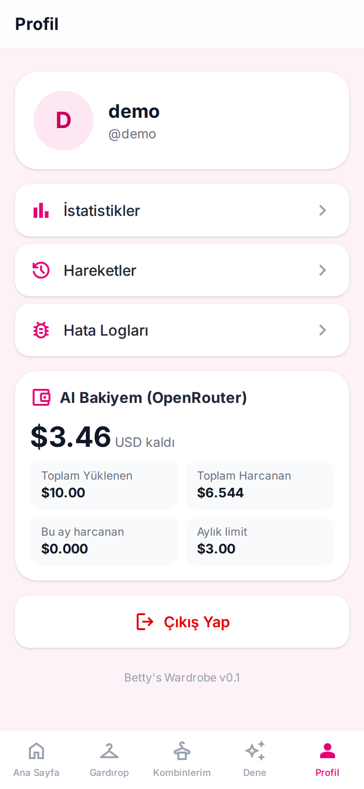

- Kullanıcı kartı avatarı, görünen adı ve kullanıcı adını gösterir (*demo @demo*).
- Hızlı bağlantılar *İstatistikler*, *Hareketler* ve *Hata Logları* sayfalarına götürür.
- *"AI Bakiyem (OpenRouter)"* kredi panosudur: $3.46 kaldı, toplam $10.00 yüklendi, $6.544 harcandı, aylık limit $3.00.
- *"Çıkış Yap"* oturumu kapatır.
- Yönetici hesapları burada ek bölümler görür (demo hesabında görünmez): davet kodu oluşturup paylaşma ve diğer kullanıcıların AI kredilerini yükleme.

## Mimari

- **Mobil öncelikli SPA** — telefon genişliğinde düzen ve alt sekme çubuğuna sahip, Nginx tarafından sunulan bir React tek sayfa uygulaması.
- **REST API + asenkron iş takibi** — Express backend JSON uç noktaları sunar; yavaş AI işleri (etiketleme, öneri, sanal deneme) arka plan işleri olarak çalışır ve frontend "hazır" bildirimi düşene kadar sorgular (polling). Kullanıcı iş sürerken gezinmeye devam edebilir.
- **Ortak PostgreSQL** — veriler ortak bir Postgres örneğinde, ayrı dev ve prod veritabanlarında tutulur; şema migrasyonları backend açılışında otomatik çalışır.
- **Docker volume üzerinde kullanıcı başına yüklemeler** — orijinal fotoğraflar, arka planı silinmiş kesimler ve deneme sonuçları konteynerlerin dışında, kalıcı bir volume'de kullanıcı bazında saklanır.
- **AI çağrısı başına kredi muhasebesi** — her sağlayıcı çağrısı (Claude, FASHN/Gemini, arka plan silme) USD olarak fiyatlandırılır ve kullanıcının bakiyesinden düşülür; aylık limitler ve yönetici yüklemeleri vardır.
- **Nginx arkasında Docker Compose** — ayrı dev ve prod yığınları; reverse proxy `wardrobe.furkantekkartal.com` (prod) ve `wardrobe-dev...` (dev) adreslerini doğru konteynerlere yönlendirir.

---

🇬🇧 English version: [README.md](README.md)

*Bu doküman [ProjectReadmes](../) portföy koleksiyonunun bir parçasıdır.*
